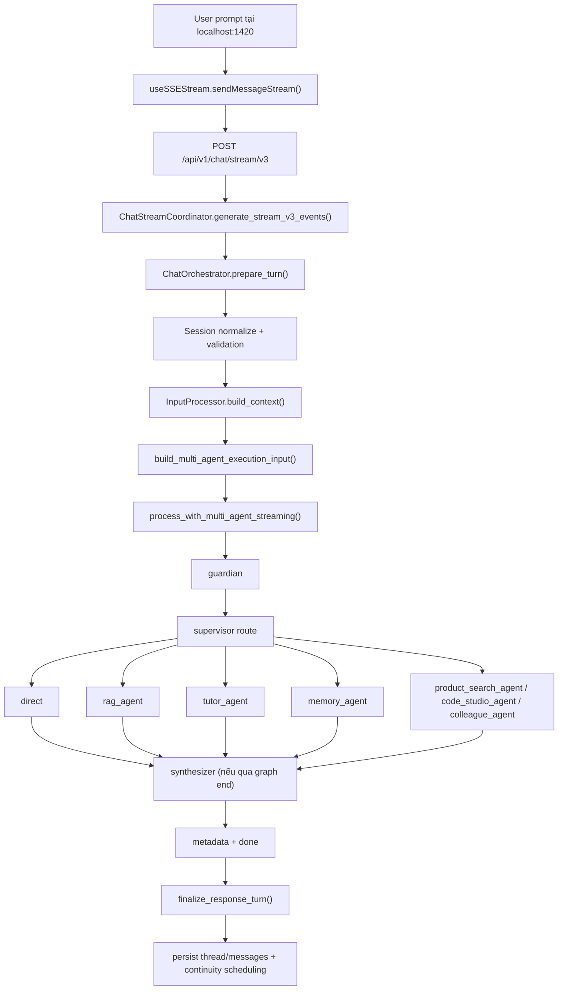

# Thinking System Flow Audit — 2026-03-30

## Mục tiêu

Tài liệu này mô tả **luồng hiện tại, theo code và runtime local**, khi người dùng gửi một prompt cho Wiii:

- từ `localhost:1420`
- qua API sync `/api/v1/chat` hoặc stream `/api/v1/chat/stream/v3`
- qua session, validation, context, supervisor, agent lane, tool/RAG
- tới answer, metadata, persistence, continuity
- và đặc biệt là: **thinking được sinh ở đâu, được stream thế nào, và bị lệch ở đâu**

Mục tiêu không phải mô tả kiến trúc lý tưởng, mà là chốt lại **current truth** để sửa thinking đúng gốc.

---

## Executive Summary

Hệ thống hiện tại có một business flow khá rõ:

1. frontend local chủ yếu dùng `/api/v1/chat/stream/v3`
2. backend normalize session + validate
3. `InputProcessor.build_context()` lắp ghép history + semantic memory + user facts + page/host context + LMS + mood
4. `ChatOrchestrator` chọn multi-agent hay fallback
5. `Supervisor` route sang một lane chính
6. lane đó chạy LLM/tool/RAG theo chiến lược riêng
7. `synthesizer` chỉ tổng hợp lại với graph lanes đi qua graph end
8. output được format, persist, rồi continuity được schedule nền

Điểm quan trọng nhất cho bài toán thinking:

- Wiii **không có một producer thinking duy nhất**.
- Direct lane đang khá gần mô hình interval thinking tốt.
- Tutor, Memory, và một phần RAG vẫn còn các kiểu leak khác nhau:
  - answer-like thinking
  - telemetry-like thinking
  - raw private-thought / English chain-of-thought leak
- frontend hiện không tạo ra thinking từ không khí, nhưng vẫn có vài chỗ **làm meta/status trông giống inner voice hơn mức nên có**.

Kết luận ngắn:

- vấn đề hiện tại không còn là god-file hay cycle nữa
- vấn đề thật sự nằm ở **thinking producer ownership**
- trước khi “nâng chất giọng suy tư”, phải **dọn nguồn phát thinking sai loại**

---

## Entry Points Thực Tế

### Frontend local

Primary path trên desktop/web local:

- `E:\Sach\Sua\AI_v1\wiii-desktop\src\api\chat.ts`
  - `sendMessageStream()` gọi `POST /api/v1/chat/stream/v3`
- `E:\Sach\Sua\AI_v1\wiii-desktop\src\hooks\useSSEStream.ts`
  - nhận SSE event rồi ghi vào `chat-store`

Lưu ý:

- với browser/login flow local, host đúng là `http://localhost:1420`
- không nên dùng `127.0.0.1:1420` nếu flow OAuth/redirect cần `window.location.origin`

### Backend sync

- `E:\Sach\Sua\AI_v1\maritime-ai-service\app\api\v1\chat.py`
  - `chat_completion()`

### Backend stream

- `E:\Sach\Sua\AI_v1\maritime-ai-service\app\api\v1\chat_stream.py`
  - `chat_stream_v3()`

---

## Luồng Chuẩn Từ Prompt Tới Phản Hồi

Sync path gần giống như vậy, nhưng thay vì SSE event từng nhịp, nó trả về một `InternalChatResponse` cuối qua:

- `ChatOrchestrator.process()`
- `OutputProcessor.validate_and_format()`
- presenter ở `chat.py`

---

## Stage-by-Stage Audit

## 0. API Transport

### Sync

File:

- `E:\Sach\Sua\AI_v1\maritime-ai-service\app\api\v1\chat.py`

Vai trò:

- auth + rate-limit
- canonicalize auth fields vào `ChatRequest`
- gọi support layer để chạy business flow
- serialize JSON response cuối

### Stream

File:

- `E:\Sach\Sua\AI_v1\maritime-ai-service\app\api\v1\chat_stream.py`

Vai trò:

- auth + rate-limit
- canonicalize auth fields
- wrap SSE stream với keepalive
- chuyển business flow sang `generate_stream_v3_events()`

Kết luận:

- hai endpoint **không phải hai business flow khác nhau**
- chúng là **hai transport khác nhau** cho cùng flow

---

## 1. Session Normalization và Turn Preparation

File:

- `E:\Sach\Sua\AI_v1\maritime-ai-service\app\services\chat_orchestrator.py`
- `E:\Sach\Sua\AI_v1\maritime-ai-service\app\services\chat_orchestrator_runtime.py`

Đầu vào:

- `ChatRequest`

Các bước:

1. normalize `thread_id` / `session_id`
2. resolve org + domain
3. `SessionManager.get_or_create_session(...)`
4. nếu first message:
   - có thể summarize session cũ ở background
   - load pronoun style cũ từ facts
5. validate input
6. persist user message
7. build context
8. detect/update pronoun style
9. nếu có pronoun mới thì persist nền

Ý nghĩa:

- đây là chỗ tạo `PreparedTurn`
- từ đây trở xuống sync và stream cùng chia sẻ một truth khá tốt

---

## 2. Validation

File:

- `E:\Sach\Sua\AI_v1\maritime-ai-service\app\services\input_processor.py`

Flow:

- ưu tiên `GuardianAgent` nếu có
- fallback sang `guardrails`
- có thể short-circuit thành blocked response
- blocked message có thể được log vào chat history

Thinking liên quan:

- stage này **không nên sinh public thinking**
- hiện tại đúng là nó chưa phải nguồn chính của gray rail

---

## 3. Context Assembly

File:

- `E:\Sach\Sua\AI_v1\maritime-ai-service\app\services\input_processor_context_runtime.py`

Đây là nơi lắp ghép gần như toàn bộ ngữ cảnh request:

### 3.1. Identity / LMS / host

- `user_id`
- `session_id`
- `message`
- `user_role`
- `user_name`
- LMS fields:
  - `lms_user_name`
  - `lms_module_id`
  - `lms_course_name`
  - `lms_language`
- page-aware context:
  - `page_context`
  - `student_state`
  - `available_actions`
- universal host context:
  - `host_context`
  - `host_capabilities`
  - `host_action_feedback`
  - `visual_context`
  - `widget_feedback`
  - `code_studio_context`

### 3.2. Semantic memory

Nếu semantic memory sẵn sàng:

- retrieve prioritized insights
- retrieve semantic context
- retrieve user facts
- compile `core_memory_block`

### 3.3. Parallel enrichment

Có thể chạy song song:

- learning graph
- memory summary
- session summaries

### 3.4. History

Nếu `chat_history` có:

- load recent messages
- build `conversation_history`
- build `history_list`
- cố lấy `user_name` từ history nếu chưa có

### 3.5. Conversation analysis / mood / multimodal

- conversation analyzer
- visual memory
- emotional state -> `mood_hint`
- `images` nếu request có multimodal

Kết luận:

- stage này chính là nơi “load character phụ thuộc user/session/page/host” theo nghĩa ngữ cảnh turn
- nó **chưa build system prompt cuối**, nhưng nó chuẩn bị hầu hết nguyên liệu cho prompt và routing

---

## 4. Build Execution Input

File:

- `E:\Sach\Sua\AI_v1\maritime-ai-service\app\services\chat_orchestrator_multi_agent.py`

`build_multi_agent_context_impl()` chuyển `ChatContext` + session state thành graph context:

- `user_name`
- `user_role`
- `conversation_history`
- `semantic_context`
- `langchain_messages`
- `conversation_summary`
- `core_memory_block`
- `is_follow_up`
- `conversation_phase`
- `total_responses`
- `name_usage_count`
- `recent_phrases`
- `mood_hint`
- `organization_id`
- `images`
- LMS identity
- page/host/visual/widget/code-studio context

Với stream path, nó thêm:

- `user_id`
- `user_facts`
- `pronoun_style`
- `history_list`
- preview preferences
- `request_id`

Ý nghĩa:

- đây là “request-local truth” truyền thẳng vào graph
- từ đây trở đi mỗi lane sẽ đọc ngữ cảnh chung này và tự build prompt riêng

---

## 5. Multi-Agent Execution

Files:

- `E:\Sach\Sua\AI_v1\maritime-ai-service\app\engine\multi_agent\graph.py`
- `E:\Sach\Sua\AI_v1\maritime-ai-service\app\engine\multi_agent\graph_builder_runtime.py`
- `E:\Sach\Sua\AI_v1\maritime-ai-service\app\engine\multi_agent\graph_process.py`

### Graph topology hiện tại

Nodes:

- `guardian`
- `supervisor`
- `rag_agent`
- `tutor_agent`
- `memory_agent`
- `direct`
- `code_studio_agent`
- `synthesizer`
- optional:
  - `product_search_agent`
  - `colleague_agent`
  - `parallel_dispatch`
  - `aggregator`

Routing:

- `guardian` -> `supervisor` hoặc `synthesizer`
- `supervisor` -> đúng 1 lane chính
- lane chính -> `synthesizer`
- `synthesizer` -> `END`

### Context injection ở graph level

Graph còn inject thêm một số prompt surfaces dùng chung:

- `host_context_prompt`
- `host_capabilities_prompt`
- `host_session_prompt`
- `operator_context_prompt`
- `living_context_prompt`
- `visual_context_prompt`
- `visual_cognition_prompt`
- `widget_feedback_prompt`
- `code_studio_context_prompt`

Đây là lớp “graph-level prompt overlays”.

---

## 6. Supervisor: Phân tích câu hỏi và quyết định lane

File:

- `E:\Sach\Sua\AI_v1\maritime-ai-service\app\engine\multi_agent\supervisor.py`

Flow:

1. apply routing hint nhanh nếu có
2. có thể dùng conservative fast path
3. nếu không, route bằng structured LLM output
4. low-level guardrails/rule-based fallback nếu LLM routing fail
5. set `routing_metadata`
6. set `thinking_effort`
7. visual intent có thể nâng `thinking_effort`

Kết quả supervisor sinh ra:

- `next_agent`
- `routing_metadata`
- `thinking_effort`
- `_house_routing_provider`

Điểm quan trọng:

- supervisor hiện **không nên là public thinking narrator chính**
- về contract bây giờ supervisor đã bớt nói hơn trước, nhưng route metadata vẫn tồn tại khá rõ trong final state

---

## 7. Character / Prompt / Persona thực sự được load ở đâu

## 7.1. PromptLoader

File:

- `E:\Sach\Sua\AI_v1\maritime-ai-service\app\prompts\prompt_loader.py`

Vai trò:

- load persona YAML
- load `wiii_identity`
- build system prompt theo role
- inject time context
- inject runtime character card / identity sections
- inject pronoun instruction
- inject style/directives/tools/examples

Nói cách khác:

- `PromptLoader` là nguồn persona nền
- nhưng **không phải lane nào cũng gọi `build_system_prompt()` theo cùng một cách**

## 7.2. Direct lane

File:

- `E:\Sach\Sua\AI_v1\maritime-ai-service\app\engine\multi_agent\direct_prompts.py`

Direct lane build prompt theo 2 mode lớn:

- short chatter / identity / house voice
- analytical direct prompt

Analytical prompt hiện đã được vá gần đây để:

- bỏ opening companion thừa
- thesis-first hơn
- bớt headings/bullet kiểu article
- giữ selfhood nhưng không quá relational

## 7.3. Tutor / Memory / RAG

Mỗi lane có prompt/bề mặt riêng:

- Tutor:
  - `tutor_surface.py`
  - `tutor_request_runtime.py`
- Memory:
  - build prompt riêng trong `memory_agent.py`
- RAG:
  - prompt nằm sâu hơn trong Corrective RAG pipeline

Kết luận:

- hệ thống **không có một prompt duy nhất**
- nó có một **persona nền**, rồi mỗi lane build prompt chuyên biệt trên cùng nền đó

---

## 8. Từng Lane xử lý thế nào

## 8.1. Direct lane

File:

- `E:\Sach\Sua\AI_v1\maritime-ai-service\app\engine\multi_agent\direct_node_runtime.py`

Flow thực tế:

1. lấy event queue nếu đang stream
2. tracer start
3. nếu là greeting fast path có thể trả nhanh
4. nếu không:
   - resolve intent shape
   - infer short chatter / identity / analytical / visual
   - chọn provider hiệu lực
   - lấy LLM qua `AgentConfigRegistry`
   - chọn tools bằng `_collect_direct_tools(...)`
   - runtime tool selection có thể cắt bớt tool list
   - bind tools
   - build system messages
   - build tool runtime context
   - chạy `_execute_direct_tool_rounds(...)`
5. lấy `response`, `thinking_content`, `tools_used` từ `extract_direct_response(...)`
6. sanitize response
7. nếu native/direct thinking hợp lệ thì surface
8. nếu chưa có `thinking_content`, resolve từ `public_thinking`
9. set:
   - `final_response`
   - `agent_outputs.direct`
   - `current_agent = direct`

### Direct lane hiện là lane gần “Claude-like interval thinking” nhất

Vì nó có:

- `thinking_start`
- `thinking_delta`
- `thinking_end`
- `action_text`
- tool call/result
- answer stream

và cuối cùng `thinking_content` được ghép lại từ `_public_thinking_fragments`.

---

## 8.2. RAG lane

File:

- `E:\Sach\Sua\AI_v1\maritime-ai-service\app\engine\multi_agent\agents\rag_node.py`
- `E:\Sach\Sua\AI_v1\maritime-ai-service\app\engine\agentic_rag\corrective_rag.py`
- `E:\Sach\Sua\AI_v1\maritime-ai-service\app\engine\agentic_rag\corrective_rag_stream_runtime.py`

Flow:

1. build context cho CRAG
2. nếu có event bus:
   - dùng `CorrectiveRAG.process_streaming()`
   - forward event qua queue
3. nếu không:
   - dùng `CorrectiveRAG.process()`
4. set:
   - `rag_output`
   - `sources`
   - `reasoning_trace`
   - `thinking_content`
   - `thinking`

Điểm nguy hiểm hiện tại:

- CRAG stream vẫn có thể phát event `type="thinking"` từ các bước query analysis / retrieval analysis
- `rag_node._process_with_streaming()` đang lấy các event đó, bọc lại thành `thinking_start/thinking_delta`
- `_sanitize_visible_rag_text()` mới chỉ làm mềm mặt ngoài, chưa triệt hẳn bản chất telemetry

Nói ngắn gọn:

- RAG lane vẫn có nguy cơ phát ra thinking kiểu:
  - “độ phức tạp”
  - “chủ đề”
  - “KB”
  - “confidence 100%”

nếu upstream event là technical telemetry.

---

## 8.3. Tutor lane

File:

- `E:\Sach\Sua\AI_v1\maritime-ai-service\app\engine\multi_agent\agents\tutor_node.py`

Flow:

1. build tutor request runtime
2. chọn tools + llm
3. chạy `_react_loop(...)`

Trong `_react_loop(...)`:

1. build tutor system prompt
2. inject conversation history
3. nếu có image thì inject multimodal blocks
4. lặp tối đa 4 vòng:
   - emit `thinking_start`
   - astream từ `llm_with_tools`
   - nếu no tool calls:
     - close thinking
     - extract final response + llm thinking
     - stream answer
     - break
   - nếu có tool calls:
     - stream `pre_tool_stream_text` vào `thinking_delta`
     - dispatch tool calls
     - emit tool_call / tool_result
     - close thinking
5. nếu hết vòng mà chưa có final response:
   - generate thêm final answer
6. ghép sources + rag/native thinking + llm thinking

Điểm quan trọng:

- Tutor lane hiện **rất dễ đưa answer draft vào thinking lane**
- `pre_tool_stream_text` có thể chính là prose giải thích
- `thinking_start.summary` của tutor nhiều lúc cũng answer-like hơn là meta-reasoning

Đây là lý do những prompt như `Giải thích Rule 15 là gì` trông như:

- gray rail đang “giải bài”
- answer lane chỉ là bản chính thức của cùng một prose

---

## 8.4. Memory lane

File:

- `E:\Sach\Sua\AI_v1\maritime-ai-service\app\engine\multi_agent\agents\memory_agent.py`

Flow:

1. retrieve existing facts
2. extract/store new facts
3. decide update actions
4. generate natural response bằng LLM

Stream-side:

- memory lane dùng narrator cho từng phase:
  - retrieve
  - verify
  - synthesize
- và đẩy `thinking_start/thinking_delta/thinking_end`

Sync-side:

- `_generate_response()` gọi LLM
- `extract_thinking_from_response(response.content)`
- nếu có `thinking`, nó set thẳng `state["thinking"]`

Điểm nguy hiểm:

- sync metadata hiện có thể lộ **raw private thought**
- ví dụ live probe `Mình tên Nam, nhớ giúp mình nhé` đã trả thinking dạng:
  - English
  - nhắc prompt rules
  - nhắc “no Chào”
  - nhắc “be cute”

Nói thẳng:

- đây là một **thinking leak nghiêm trọng**
- nó không phải “Wiii đang suy nghĩ”, mà là private prompt/internal drafting bị đẩy ra metadata

---

## 8.5. Product Search / Code Studio / Other lanes

Product Search, Code Studio, Search Subagents cũng có interval-style event tương tự:

- `thinking_start`
- `thinking_delta`
- tool events
- previews / artifacts / visuals

Nhưng đối với bài toán thinking hiện tại, ba lane đáng ưu tiên nhất vẫn là:

- `direct`
- `tutor`
- `rag`
- cộng thêm `memory` vì có leak riêng rất nặng

---

## 9. Sync Path vs Stream Path

## Sync path

File chính:

- `chat_orchestrator.py::process()`
- `graph_process.py::process_with_multi_agent_impl()`
- `output_processor.py`

Đầu ra sync:

- `message`
- `sources`
- `metadata`
  - `agent_type`
  - `provider/model`
  - `routing_metadata`
  - `thinking`
  - `thinking_content`
  - `reasoning_trace`

## Stream path

File chính:

- `chat_stream_coordinator.py`
- `graph_streaming.py`
- `graph_stream_runtime.py`
- `chat_stream_presenter.py`

Đầu ra stream:

- `status`
- `thinking_start`
- `thinking_delta`
- `thinking_end`
- `tool_call`
- `tool_result`
- `action_text`
- `answer`
- `preview`
- `artifact`
- `visual_*`
- `metadata`
- `done`

### Authority hiện tại

#### Answer authority

Về thiết kế đúng:

- canon nên là `final_response`

Về runtime stream:

- answer có thể được phát sớm từ node lane qua `answer_delta`
- cuối turn stream mới có `metadata`

Hiện tại answer authority đã tốt hơn trước, nhưng parity sync-vs-stream vẫn còn chịu ảnh hưởng bởi:

- lane-specific streaming
- tool/no-tool synthesis
- provider nondeterminism

#### Thinking authority

Thiết kế đang hướng tới:

- public canonical thinking = `thinking_delta` đã surface
- final `thinking_content` = aggregate của chính các delta đó

Files then chốt:

- `E:\Sach\Sua\AI_v1\maritime-ai-service\app\engine\multi_agent\public_thinking.py`
- `E:\Sach\Sua\AI_v1\maritime-ai-service\app\engine\multi_agent\graph_process.py`
- `E:\Sach\Sua\AI_v1\maritime-ai-service\app\engine\multi_agent\graph_stream_runtime.py`

Nhưng thực tế hiện tại:

- direct lane khá gần contract này
- tutor/memory/RAG vẫn còn bypass contract theo các cách khác nhau

---

## 10. Interval Thinking hiện tại có giống Claude / DeepSeek không?

## Điểm giống

Hệ hiện có đủ vật liệu để làm interval thinking tốt:

- mở một nhịp suy nghĩ
- phát reasoning fragment theo thời gian
- chèn tool/action giữa các nhịp
- rồi quay lại answer

Đây là phần giống triết lý:

- “thinking là timeline”
- không chỉ là một blob text cuối

## Điểm chưa giống

Hiện Wiii chưa đạt chất lượng “reason như người thật” vì 4 lý do:

1. **nhiều producer khác nhau**
   - narrator
   - native thinking
   - tool prelude
   - raw extracted thinking
   - CRAG telemetry

2. **không phải producer nào cũng sinh đúng loại text**
   - có producer tạo meta telemetry
   - có producer tạo answer draft
   - có producer tạo private prompt-thought

3. **sync và stream không phải lane nào cũng ghép cùng một truth**

4. **frontend vẫn còn chỗ nhìn status/meta như một phần journey**

Nói gọn:

- Wiii đã có “interval shell”
- nhưng chưa có “one true interval mind”

---

## 11. Live Probes Trên Runtime Local

Các probe này chạy trên `http://localhost:8000` với `X-API-Key: local-dev-key`.

## Probe A — `phân tích giá dầu hôm nay`

### Sync

- `agent_type = direct`
- `provider = google`
- `model = gemini-3.1-flash-lite-preview`
- `routing_metadata.intent = web_search`

Thinking preview:

> Với giá dầu, điều dễ sai nhất là nhầm giữa lực kéo nền và phần giá cộng thêm vì rủi ro ngắn hạn...

Đây là case direct analytical khá tốt.

### Stream

Event counts:

- `status = 9`
- `thinking_start = 2`
- `thinking_delta = 4`
- `thinking_end = 2`
- `tool_call = 1`
- `tool_result = 1`
- `action_text = 1`
- `preview = 5`
- `answer = 32`

Mẫu interval:

1. `thinking_start(attune)`
2. 2 delta analytical
3. tool call/result
4. `action_text`
5. `thinking_start(synthesize)`
6. 2 delta analytical
7. answer stream

Đây hiện là lane gần “Claude-like interval flow” nhất.

## Probe B — `Giải thích Rule 15 là gì`

### Sync

- `agent_type = tutor`
- routing đúng sang `tutor_agent`
- nhưng `thinking_preview` sync hiện lại chứa private-style English prompt-thought

### Stream

Event counts:

- `thinking_start = 2`
- `thinking_delta = 28`
- `tool_call = 2`
- `answer = 40`

Mẫu thinking stream hiện tại:

> Rule 15 trong COLREGs tập trung vào tình huống cắt mặt...

Vấn đề:

- đây không phải inner reasoning
- đây gần như là **answer draft đang phát vào gray rail**

## Probe C — `Mình tên Nam, nhớ giúp mình nhé`

### Sync

- `agent_type = memory`
- answer đúng lane
- nhưng `thinking_preview` sync lộ raw private thought tiếng Anh

### Stream

Memory stream lại dùng narrator và cho ra thinking kiểu:

> Chào Nam! Wiii rất vui được làm quen với bạn...

Vấn đề:

- stream-side thinking nghe như mini-answer/companion prose
- sync-side thinking lại lộ raw private draft
- nghĩa là memory lane hiện có **hai loại thinking đều sai**

---

## 12. Frontend render thinking như thế nào

Files:

- `E:\Sach\Sua\AI_v1\wiii-desktop\src\api\sse.ts`
- `E:\Sach\Sua\AI_v1\wiii-desktop\src\hooks\useSSEStream.ts`
- `E:\Sach\Sua\AI_v1\wiii-desktop\src\stores\chat-store.ts`
- `E:\Sach\Sua\AI_v1\wiii-desktop\src\components\chat\InterleavedBlockSequence.tsx`
- `E:\Sach\Sua\AI_v1\wiii-desktop\src\components\chat\ThinkingJourneyBanner.tsx`

Flow:

1. `parseSSEStream()` parse event
2. `useSSEStream` map event -> store mutation
3. `chat-store` tạo `streamingBlocks`
4. `InterleavedBlockSequence` gom các block thinking thành interval
5. `ReasoningInterval` render gray rail

Điểm tốt:

- `thinking_start.summary` hiện đã là `header_only`
- summary không còn tự fill body thinking như trước

Điểm còn lệch:

- `ThinkingJourneyBanner` khi build từ phases vẫn dùng:
  - `phase.statusMessages[last] || phase.thinkingContent || phase.node`
- nên nếu status quá mạnh hoặc phase thinking nghèo, caption journey vẫn có thể nghe kỹ thuật hơn nên có

Ngoài ra:

- `InterleavedBlockSequence` vẫn coi `action_text` và `tool_execution` là một phần trace/interval ecosystem
- đây không sai hoàn toàn, nhưng khiến cảm giác “thinking rail” và “operation rail” chưa tách dứt khoát

---

## 13. Vấn đề Thật Sự Ở Đâu?

Nếu đặt câu hỏi:

> “Wiii đang load character -> phân tích câu hỏi -> gọi tool -> phản hồi 1 -> gọi tool tiếp -> phản hồi 2 -> RAG nếu cần -> tổng hợp -> phản hồi cuối” có đúng không?

Câu trả lời là:

**Đúng một phần, nhưng thiếu hai sự thật quan trọng.**

### Sự thật 1: hệ không có một tuyến reasoning duy nhất

Thay vào đó nó có:

- route reasoning ở supervisor
- lane reasoning ở direct/tutor/rag/memory
- narrator reasoning
- tool prelude/thought
- extracted native thinking
- final aggregate thinking

Nên bug thinking không nằm ở một prompt duy nhất.

### Sự thật 2: vấn đề không còn ở “thiếu flow”, mà ở “sai authority”

Hệ đã có đủ step:

- load identity/persona
- build context
- choose lane
- bind tools
- loop tool nếu cần
- RAG nếu lane đó cần
- synthesize answer
- stream intervals

Nhưng nó chưa chốt sạch:

- ai được quyền phát public thinking
- loại text nào được coi là public thinking
- loại text nào chỉ là telemetry / draft / private CoT

---

## 14. Chốt Luồng Hệ Thống Hiện Tại

## Canonical flow

1. User gửi prompt ở `localhost:1420`
2. frontend gọi `/api/v1/chat/stream/v3`
3. backend auth + canonicalize request
4. `ChatOrchestrator.prepare_turn()`
5. session normalize
6. validation
7. persist user message
8. `InputProcessor.build_context()`
   - history
   - semantic memory
   - facts
   - page/host context
   - LMS context
   - mood/image context
9. build graph execution input
10. graph start:
    - guardian
    - supervisor route
11. execute lane:
    - direct / rag / tutor / memory / product / code studio / colleague
12. lane có thể:
    - gọi tool
    - stream `thinking_start/delta/end`
    - stream `tool_call/result`
    - stream `action_text`
    - stream `answer`
13. graph kết thúc
14. stream metadata + done hoặc sync JSON response
15. finalize response turn
16. schedule continuity / insights / background tasks

## What changes by lane

- `direct`: tool-first analytical/general/social, currently best public-thinking lane
- `rag`: CRAG retrieval/generation, but technical telemetry can leak into public thinking
- `tutor`: ReAct teaching loop, but answer draft often leaks into thinking lane
- `memory`: 4-phase memory pipeline, but sync and stream both have bad thinking leakage in different ways

---

## 15. Kết luận Kỹ Thuật

Hiện tại, nếu mục tiêu là sửa thinking “như người thật” thì **vấn đề thật sự không còn là flow tổng thể**. Flow tổng thể đã khá rõ.

Vấn đề thật sự là:

1. **RAG lane** chưa tách telemetry khỏi public thinking
2. **Tutor lane** chưa tách answer-draft khỏi public thinking
3. **Memory lane** đang có private-thought leak ở sync, narrator-answer leak ở stream
4. **Frontend journey layer** vẫn còn ưu tiên meta/status hơi cao ở một số trường hợp

Do đó, thứ tự đúng để sửa là:

1. chốt **allowed public thinking producers**
2. cấm các nguồn sau đi vào gray rail:
   - technical telemetry
   - answer draft
   - private extracted CoT
3. sau đó mới nâng chất lượng analytical / relational / tutoring reasoning

---

## 16. Recommendation rất cụ thể cho phase sửa tới

### P0

1. `rag_node.py`
   - không được convert raw CRAG analysis telemetry thành public thinking
   - chỉ cho retrieval/evidence sufficiency summary đi qua

2. `tutor_node.py`
   - `pre_tool_stream_text` không được đẩy thẳng vào public thinking nếu nó đã là answer prose
   - cần một lớp phân biệt reasoning fragment vs answer draft

3. `memory_agent.py`
   - sync path: không được set `state["thinking"]` từ raw extracted thinking nữa
   - stream path: narrator summary phải là meta-reasoning, không phải mini-answer

### P1

4. `ThinkingJourneyBanner.tsx`
   - đừng để `statusMessages` lấn `thinkingContent` trong caption khi đã có inner-voice thật

### P1 quality

5. sau khi dọn producer, mới tinh chỉnh từng mode:
   - analytical
   - relational
   - tutoring
   - memory acknowledgment

---

## 17. Bottom Line

Hệ thống hiện tại **đã có luồng đủ tốt để sửa thinking một cách đúng kỹ thuật**.

Nó không còn là:

- một mớ god-file khó lần
- một flow mơ hồ không biết prompt đi đâu

Mà bây giờ là một bài rõ ràng hơn nhiều:

> cùng một flow đúng, nhưng nhiều lane vẫn phát sai loại “thinking”.

Đó là lý do bước tiếp theo hợp lý nhất không phải “viết prompt hay hơn”, mà là:

**dọn P0 các nguồn thinking sai loại ở RAG, Tutor, Memory trước.**
