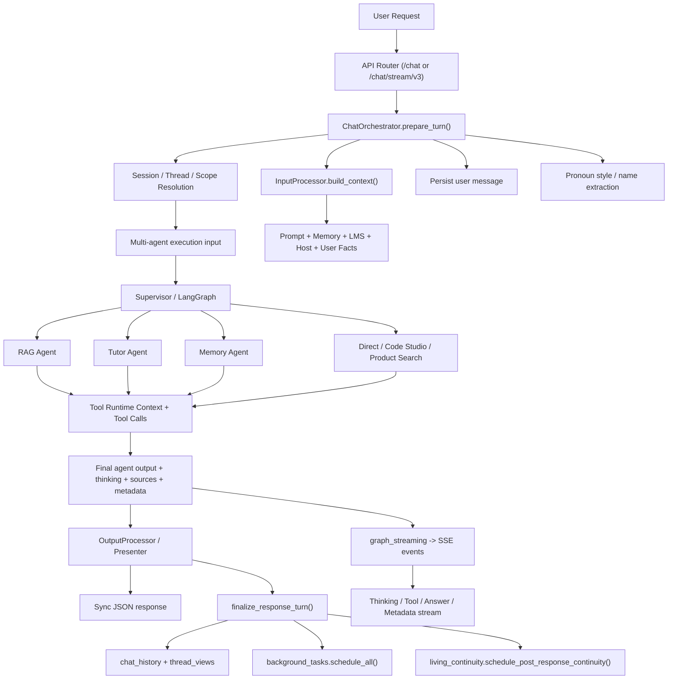

# Wiii Chat Flow Audit — End-to-End Backend Anatomy

> Date: 2026-03-27
> Scope: Deep audit of Wiii chat flow from API entry through routing, tools, memory/facts, prompt/character loading, streaming, persistence, and post-response continuity.
> Goal: Build an accurate mental model before the next round of `thinking` redesign and surface fixes.
> Environment audited: local codebase in `E:\Sach\Sua\AI_v1`, current branch/worktree state, Docker-backed runtime assumptions.

---

## 1. Executive Summary

Wiii's chat pipeline is not a single linear path. It is a layered system with at least 8 cooperating subsystems:

1. API entry and auth normalization
2. Turn preparation and session/thread resolution
3. Context assembly and semantic/user-memory retrieval
4. Multi-agent routing and node execution
5. Tool invocation with request-scoped runtime context
6. Output shaping into sync or SSE transport
7. Persistence of chat/thread/memory/facts
8. Post-response background continuity and LMS/living side effects

The most important conclusion for future `thinking` work is this:

**Wiii currently has multiple concurrent "thought-producing" layers, not one.**

Those layers are:

1. Narrator-generated reasoning beats
2. Agent/node-native reasoning or tool reflections
3. Stream transport lifecycle events (`thinking_start`, `thinking_delta`, `action_text`, `status`)
4. Final response metadata (`thinking`, `thinking_content`)

That architecture explains why `thinking` can feel duplicated, generic, or out of sync with the answer even when the answer itself is good.

Second major conclusion:

**Memory/facts and character/selfhood are threaded into the request much earlier and more broadly than they appear on the surface.**

Wiii's system prompt, semantic insights, user facts, pronoun style, LMS context, host context, living context, and org/domain overlays all converge before the agent responds. This means future `thinking` fixes must respect prompt composition and context injection, not just gray-rail rendering.

Third major conclusion:

**`graph.py` and `graph_streaming.py` are the architectural pressure centers.**

They currently combine:

1. graph orchestration
2. routing metadata
3. tool-phase narration
4. public thinking capture
5. direct/tool loops
6. code/visual session events
7. final metadata shaping

This makes them both the strongest leverage points and the most likely regression sources for future `thinking` work.

---

## 2. Audit Method

This audit was performed by tracing the live backend architecture through code, not by relying on old design docs alone.

Primary files inspected:

1. `maritime-ai-service/app/api/v1/chat.py`
2. `maritime-ai-service/app/api/v1/chat_stream.py`
3. `maritime-ai-service/app/api/v1/chat_completion_endpoint_support.py`
4. `maritime-ai-service/app/api/v1/chat_endpoint_presenter.py`
5. `maritime-ai-service/app/services/chat_response_presenter.py`
6. `maritime-ai-service/app/services/REQUEST_FLOW_CONTRACT.md`
7. `maritime-ai-service/app/services/chat_service.py`
8. `maritime-ai-service/app/services/chat_orchestrator.py`
9. `maritime-ai-service/app/services/input_processor.py`
10. `maritime-ai-service/app/services/output_processor.py`
11. `maritime-ai-service/app/services/background_tasks.py`
12. `maritime-ai-service/app/services/living_continuity.py`
13. `maritime-ai-service/app/services/chat_stream_coordinator.py`
14. `maritime-ai-service/app/repositories/chat_history_repository.py`
15. `maritime-ai-service/app/repositories/thread_repository.py`
16. `maritime-ai-service/app/engine/semantic_memory/core.py`
17. `maritime-ai-service/app/engine/semantic_memory/context.py`
18. `maritime-ai-service/app/engine/semantic_memory/extraction.py`
19. `maritime-ai-service/app/prompts/prompt_loader.py`
20. `maritime-ai-service/app/engine/character/character_card.py`
21. `maritime-ai-service/app/engine/tools/__init__.py`
22. `maritime-ai-service/app/engine/tools/rag_tools.py`
23. `maritime-ai-service/app/engine/tools/memory_tools.py`
24. `maritime-ai-service/app/engine/tools/runtime_context.py`
25. `maritime-ai-service/app/engine/multi_agent/agent_config.py`
26. `maritime-ai-service/app/engine/multi_agent/state.py`
27. `maritime-ai-service/app/engine/multi_agent/graph.py`
28. `maritime-ai-service/app/engine/multi_agent/supervisor.py`
29. `maritime-ai-service/app/engine/multi_agent/graph_streaming.py`
30. `maritime-ai-service/app/engine/multi_agent/stream_utils.py`
31. `maritime-ai-service/app/engine/multi_agent/agents/rag_node.py`
32. `maritime-ai-service/app/engine/multi_agent/agents/tutor_node.py`
33. `maritime-ai-service/app/engine/multi_agent/agents/memory_agent.py`
34. `maritime-ai-service/app/engine/reasoning/reasoning_narrator.py`
35. `maritime-ai-service/app/services/llm_selectability_service.py`
36. `maritime-ai-service/app/engine/llm_runtime_metadata.py`

This report focuses on the **authoritative backend flow**. Frontend rendering is referenced only when necessary to explain why backend events matter to user-visible `thinking`.

---

## 3. High-Level Architecture

---

## 4. Sync Flow: `/api/v1/chat`

### 4.1 Entry

`app/api/v1/chat.py` receives the request, normalizes auth-derived fields, and delegates to `process_chat_completion_request(...)` in `chat_completion_endpoint_support.py`.

That support layer does very little business logic itself:

1. validates pinned provider selectability if a provider was explicitly chosen
2. gets `ChatService`
3. calls `ChatService.process_message(...)`

### 4.2 Service Layer

`app/services/chat_service.py` is a wiring hub. It constructs:

1. graph and memory dependencies
2. input/output processors
3. background runner
4. orchestrator
5. tool registry

The real sync request flow begins in `ChatOrchestrator.process(...)`.

### 4.3 Turn Preparation

`ChatOrchestrator.prepare_turn(...)` is one of the most important functions in the backend. It performs:

1. request scope resolution
   - user id
   - org id
   - domain id
   - thread/session id
2. session retrieval via `SessionManager.get_or_create_session(...)`
3. optional summarization of previous session on first message
4. loading prior pronoun style from semantic facts
5. validation via `InputProcessor.validate(...)`
6. immediate persistence of the user message
7. context assembly via `InputProcessor.build_context(...)`
8. optional name extraction
9. asynchronous pronoun-style persistence back into semantic memory

This means **by the time the agent graph starts, the turn is already materially shaped by prior memory and request scope**.

### 4.4 Context Assembly

`InputProcessor.build_context(...)` merges:

1. user request fields
2. LMS/user/page/host/visual/widget/code-studio context
3. semantic memory insights
4. recent semantic context
5. user facts
6. learning graph context
7. session summaries and conversation summaries

Important design note:

`build_context(...)` intentionally keeps user facts and semantic context separate. It retrieves semantic context with `include_user_facts=False`, then fetches user facts explicitly afterward. This is a deliberate guard against **triple-injecting the same personal data** into prompts.

### 4.5 Multi-Agent Execution

`ChatOrchestrator._process_with_multi_agent(...)` transforms the prepared turn into an execution input and calls `process_with_multi_agent(...)` in `graph.py`.

The returned multi-agent payload is mapped into:

1. answer text
2. source objects
3. tools used
4. reasoning trace
5. `thinking`
6. `thinking_content`
7. routing metadata
8. authoritative provider/model metadata when available

### 4.6 Output Shaping

`OutputProcessor.validate_and_format(...)` performs the last backend shaping step for sync responses.

It:

1. validates the response object
2. normalizes sources
3. keeps `thinking` and `thinking_content` in metadata
4. returns `InternalChatResponse`

Then `chat_response_presenter.py` exposes those fields as public API metadata.

### 4.7 Finalization

After the answer exists, `finalize_response_turn(...)` runs.

It:

1. updates session anti-repetition state
2. persists the assistant message to `chat_history`
3. upserts `thread_views`
4. schedules background memory/profile/reflection tasks
5. schedules living continuity and LMS insight work

This means sync chat completion is only the visible half of the turn. Persistence and continuity continue after the response path returns.

---

## 5. Streaming Flow: `/api/v1/chat/stream/v3`

### 5.1 Entry

`app/api/v1/chat_stream.py` delegates to `generate_stream_v3_events(...)` in `chat_stream_coordinator.py`.

### 5.2 Coordinator Responsibilities

`generate_stream_v3_events(...)` is the authoritative streaming coordinator. It:

1. emits an initial hidden `status` event
2. prepares the turn using the same `ChatOrchestrator.prepare_turn(...)`
3. chooses multi-agent or fallback sync path
4. builds multi-agent execution input
5. runs `process_with_multi_agent_streaming(...)`
6. accumulates final answer text as `answer` deltas stream out
7. finalizes the turn with `finalize_response_turn(...)`

The streaming path therefore shares the **same preparation and persistence contract** as sync, but the response transport is completely different.

### 5.3 Event Taxonomy

`app/engine/multi_agent/stream_utils.py` defines the core SSE taxonomy:

1. `status`
2. `thinking`
3. `thinking_start`
4. `thinking_delta`
5. `thinking_end`
6. `tool_call`
7. `tool_result`
8. `action_text`
9. `answer`
10. `sources`
11. `metadata`
12. `visual_open`, `visual_patch`, `visual_commit`, `visual_dispose`
13. `code_open`, `code_delta`, `code_complete`
14. `done`
15. `error`

This taxonomy matters because **gray rail quality is partly a backend event-model problem, not just a wording problem**.

### 5.4 graph_streaming as Merge Layer

`graph_streaming.py` is effectively a transport-side composer. It merges:

1. bus events emitted from inside nodes/tools
2. graph node outputs
3. fallback narrator reasoning when native bus content is absent
4. final response and metadata

It also tracks:

1. which nodes already streamed `thinking_start` or `thinking_delta`
2. which nodes already streamed `answer_delta`
3. whether status events should be hidden from public reasoning via `details.visibility = "status_only"`

### 5.5 Architectural Consequence

The important consequence is:

**streaming can display reasoning from more than one producer for the same logical step.**

Those producers may include:

1. narrator-generated fallback reasoning
2. node-native bus reasoning
3. tool-driven acknowledgments
4. explicit `action_text`

This is one of the deepest root causes behind unstable or duplicated visible thinking.

---

## 6. Prompt and Character Loading

### 6.1 PromptLoader as Prompt Composer

`app/prompts/prompt_loader.py` is not a simple YAML reader. It is the **main prompt composition engine**.

`build_system_prompt(...)` can combine:

1. base persona YAML
2. dynamic runtime character card
3. time context
4. user fact section
5. pronoun adaptation
6. tool instructions
7. living/soul state
8. org persona overlay
9. domain overlay
10. visual/host/widget instructions

### 6.2 Character Card Path

`app/engine/character/character_card.py` is the runtime selfhood compiler.

It loads:

1. `wiii_identity.yaml`
2. `wiii_soul.yaml`

Then `build_wiii_runtime_prompt(...)` turns that into a runtime prompt block covering:

1. core truths
2. personality traits
3. relationship style
4. voice
5. reasoning style
6. quirks
7. optional runtime notes from living systems

### 6.3 Why This Matters for Thinking

This means `thinking` quality is not only determined by:

1. node prompts
2. reasoning narrator

It is also strongly influenced by:

1. the shape of the runtime character card
2. whether user facts are injected too mechanically
3. pronoun-style instructions
4. living/narrative overlays

If future `thinking` changes ignore `PromptLoader` and only patch rail rendering, Wiii will still drift.

---

## 7. Tool Invocation Flow

### 7.1 Tool Registration

`app/engine/tools/__init__.py` initializes the global tool registry. Depending on feature flags and injected dependencies, it can include:

1. RAG tools
2. memory tools
3. utility tools
4. web search tools
5. product search tools
6. LMS tools
7. character tools
8. visual tools
9. `tool_think`
10. `tool_report_progress`

### 7.2 Runtime Context

`app/engine/tools/runtime_context.py` is the key bridge that makes tool execution request-aware.

`ToolRuntimeContext` carries:

1. `event_bus_id`
2. `request_id`
3. `session_id`
4. `organization_id`
5. `user_id`
6. `user_role`
7. `node`
8. `tool_name`
9. `tool_call_id`
10. arbitrary metadata

This context is bound via `contextvars`, which lets tools:

1. emit bus events back into the active stream
2. include correlation metadata in tool result events
3. pass request metadata into sandbox execution and logging

### 7.3 RAG Tool Example

`app/engine/tools/rag_tools.py` demonstrates the pattern clearly:

1. per-request state is stored in contextvars
2. `tool_knowledge_search(...)` calls CorrectiveRAG
3. retrieved sources, native thinking, reasoning trace, confidence are written back into request-local state
4. agents later pull those results to shape public answer and metadata

### 7.4 Memory Tool Example

`app/engine/tools/memory_tools.py` uses the same per-request strategy for memory save/read/list/delete behavior.

### 7.5 Why Tool Flow Matters for Thinking

Tools are not just backend helpers. They can emit events into the same stream the user perceives as Wiii "thinking".

That is powerful, but dangerous:

1. tool acknowledgments can sound like thought
2. progress tools can open new thinking blocks
3. tool results can shift the visible cadence of the conversation

This is one of the main reasons `thinking` cannot be treated as pure LLM prose.

---

## 8. Agent Routing and Execution

### 8.1 AgentConfigRegistry

`app/engine/multi_agent/agent_config.py` resolves:

1. provider
2. model tier
3. node-specific overrides
4. auto-provider routing against runtime selectability

This makes the actual model serving a node potentially different from the user's pinned or configured provider if failover is active.

### 8.2 Supervisor

`app/engine/multi_agent/supervisor.py` decides which agent path to take.

Core outputs include:

1. intent
2. final agent
3. routing metadata
4. provider hints / house routing information

### 8.3 Main Node Families

The main node families currently inspected are:

1. `direct`
2. `rag_agent`
3. `tutor_agent`
4. `memory_agent`
5. `product_search_agent`
6. `code_studio_agent`

The direct path is especially important because many short/social/identity/knowledge turns can still end up there.

---

## 9. Tutor Agent Deep Dive

`app/engine/multi_agent/agents/tutor_node.py` is one of the clearest examples of why Wiii's flow is rich but hard to reason about.

### 9.1 Tutor Prompt Build

`_build_system_prompt(...)` composes:

1. prompt loader base system prompt
2. role/tool instructions
3. visual instructions
4. thinking-chain instructions for high-effort turns
5. skill/capability context

### 9.2 Tutor Process

`process(...)`:

1. chooses provider/effort overrides
2. resolves visual intent
3. selects tools for the turn
4. builds tool runtime context
5. executes `_react_loop(...)`
6. stores response, sources, tools_used, thinking into state

### 9.3 Tutor ReAct Loop

`_react_loop(...)` is effectively a mini-agent loop inside the node.

It:

1. pushes `thinking_start`
2. pushes narrator summary into `thinking_delta`
3. streams LLM content before tool calls
4. emits `tool_call` and `tool_result`
5. may emit tool acknowledgments back into `thinking_delta`
6. uses `tool_think` as raw thought injection into thinking
7. uses `tool_report_progress` to close and reopen reasoning blocks
8. later streams answer via `answer_delta`

### 9.4 Tutor Thinking Consequence

Tutor alone can generate public "thought" from at least 5 sources:

1. narrator iteration beat summary
2. pre-tool streamed LLM text
3. explicit `tool_think`
4. post-tool acknowledgment text
5. final native `thinking` extracted from the LLM response

This is a textbook example of why current Wiii `thinking` feels layered rather than singular.

---

## 10. Memory Agent Deep Dive

`app/engine/multi_agent/agents/memory_agent.py` runs a 4-phase pipeline:

1. retrieve existing facts
2. extract new facts
3. classify ADD/UPDATE/DELETE/NOOP
4. respond naturally

### 10.1 Retrieve

It loads existing user facts from semantic memory.

### 10.2 Extract

It reuses the semantic memory fact extractor with existing-facts context so it can avoid re-adding already-known information.

### 10.3 Decide

`MemoryUpdater` classifies changes and may trigger deletes against the semantic memory store.

### 10.4 Respond

Finally, it generates a natural answer to the user that reflects what changed.

### 10.5 Memory-Agent Thinking Consequence

The memory agent also uses the narrator directly for:

1. retrieve beat
2. extract beat
3. verify beat
4. synthesis beat

This means even memory operations are already mixed with public-facing reasoning narration.

---

## 11. Semantic Memory and User Facts

### 11.1 Core Engine

`SemanticMemoryEngine` in `semantic_memory/core.py` delegates to:

1. context retriever
2. fact extractor
3. insight provider

### 11.2 Interaction Storage

`store_interaction(...)` persists both:

1. user message
2. AI response

as semantic memory message-type entries.

### 11.3 Fact Extraction

`FactExtractor.extract_user_facts(...)` uses a lightweight LLM to extract structured user facts.

`store_user_fact_upsert(...)` then:

1. validates fact type
2. embeds the fact
3. checks semantic duplicates
4. falls back to type-based update
5. inserts a new USER_FACT entry if needed

### 11.4 Retrieval

`ContextRetriever.retrieve_context(...)` retrieves semantic memories via embedding similarity over:

1. messages
2. summaries

`retrieve_insights_prioritized(...)` separately prioritizes educational insight types such as knowledge gaps and learning styles.

### 11.5 Important Consequence

There are at least 3 memory-like channels that can influence a turn:

1. semantic context memories
2. user facts
3. prioritized insights

They are related but not identical. Future `thinking` work must not assume "memory" is a single blob.

---

## 12. Chat and Thread Persistence

### 12.1 chat_history

`ChatHistoryRepository` is the authoritative transcript store.

It:

1. saves user and assistant messages
2. retrieves recent messages
3. maintains session records

### 12.2 thread_views

`ThreadRepository` maintains the conversation index used for thread lists and sync.

It stores:

1. latest user message
2. latest assistant message
3. preview text
4. title
5. org scoping
6. message count
7. timestamps

### 12.3 Persistence Timing

User message persistence happens during `prepare_turn(...)`.

Assistant message persistence happens in `finalize_response_turn(...)`.

This means a turn is not atomically persisted in one shot; it is persisted in **two phases**.

That is important for debugging partially failed turns and for reasoning about sync/stream parity.

---

## 13. Background Tasks and Continuity

### 13.1 background_tasks.schedule_all

The background runner schedules:

1. semantic interaction storage
2. insight extraction and storage
3. memory summarization
4. profile/stat updates
5. optional reflection

### 13.2 living_continuity.schedule_post_response_continuity

This second background layer schedules:

1. routine tracking
2. sentiment analysis
3. living continuity state updates
4. LMS insight generation

### 13.3 Episode Persistence

`living_continuity.py` can insert a semantic memory `episode` directly into `semantic_memories` after sentiment analysis.

This is important because it creates a second path into long-term memory beyond the ordinary semantic interaction write path.

### 13.4 Consequence

Even if the immediate answer path looks stateless, Wiii is already writing multiple kinds of continuity data after a turn:

1. semantic interaction
2. extracted facts
3. summarized memory
4. reflection
5. sentiment episode
6. LMS insights

This makes post-response audits crucial when debugging selfhood drift or long-term memory effects.

---

## 14. Provider Selection and Runtime Metadata

### 14.1 Provider Selectability

`llm_selectability_service.py` decides whether a provider is:

1. `selectable`
2. `disabled`
3. `hidden`

Reasons include:

1. `busy`
2. `host_down`
3. `model_missing`
4. `capability_missing`
5. `verifying`

### 14.2 Runtime Model Reporting

`llm_runtime_metadata.py` tries to resolve the effective provider/model from:

1. `_execution_provider` / `_execution_model`
2. `provider` / `model`
3. pool fallback
4. configured provider/model

This is why the provider/model shown in final metadata can drift if upstream nodes do not record authoritative execution metadata correctly.

---

## 15. Thinking Architecture: What Actually Happens

This section is the most important one for the future `thinking` redesign.

### 15.1 There is not one thinking path

Wiii backend currently has several distinct reasoning paths:

1. narrator fast/structured summaries
2. node-native thought content
3. bus event fragments
4. final state `thinking`
5. final state `thinking_content`

### 15.2 `thinking_content` Path

In `graph.py`, `_resolve_public_thinking_content(...)` tries to choose public reasoning by priority:

1. `_public_thinking_fragments`
2. existing `thinking_content`
3. native `thinking`
4. fallback string

Those public fragments are captured by `_capture_public_thinking_event(...)`, but only from `thinking_delta` events.

This means:

1. the quality of final public thinking depends heavily on what was emitted as `thinking_delta`
2. `thinking_start.summary` may still influence the visible stream even though it is not the final authoritative `thinking_content`

### 15.3 Narrator is still a major producer

`reasoning_narrator.py` still contains a fast reasoning fallback layer:

1. turn kind inference
2. supervisor summary generation
3. emotional/identity/visual/knowledge/relational summaries
4. action-text generation

Even though many old template arrays were removed, the narrator remains a **policy engine** for public thought shape.

### 15.4 Stream path adds another layer

`graph_streaming.py` still has `_render_fallback_narration(...)` and node-specific fallback reasoning emission.

So the live stream can contain:

1. narrator fallback blocks
2. bus-native deltas
3. tool acknowledgments
4. action text

before the final metadata ever gets produced.

### 15.5 Why this matters

This architecture explains several recurring issues seen earlier in the project:

1. duplicated gray-rail beats
2. generic fallback prose appearing across unrelated prompts
3. drift between final metadata `thinking_content` and live interval reasoning
4. different agents sounding like different "Wiii"s

---

## 16. Key Structural Findings

### 16.1 `graph.py` is a God file

Local measurement shows:

1. `graph.py` is 8137 lines
2. it contains orchestration, narration fallback, tool loops, public thinking capture, direct logic, code studio logic, visual lifecycle handling, and metadata shaping

This is the single most important structural hotspot for future `thinking` work.

### 16.2 Streaming is not a thin transport layer

`graph_streaming.py` is not just serialization. It is itself a reasoning/presentation layer.

That increases the chance of:

1. sync vs stream drift
2. double narration
3. one layer fixing thinking while another reintroduces it

### 16.3 Prompt composition is distributed

Prompt behavior is not owned by a single component.

It is distributed across:

1. `PromptLoader`
2. runtime character card
3. node-specific prompt builders
4. reasoning narrator prompt construction
5. tool instruction injection
6. domain/org/living overlays

This makes "just fix the prompt" an incomplete strategy.

### 16.4 Persistence is multi-channel

A single turn can write to:

1. `chat_history`
2. `thread_views`
3. `semantic_memories`
4. user facts
5. summaries
6. reflection tables
7. episode-like living continuity records

This matters for any future "Wiii soul" change because state can continue changing after the answer is already shown.

---

## 17. Risks for Future Thinking Work

### 17.1 Risk: fixing rail wording without fixing producer multiplicity

If the team only patches narrator wording, the user may still see:

1. duplicated intervals
2. action text as faux-thought
3. tool reflection masquerading as inner voice

### 17.2 Risk: fixing final metadata but not live stream

The sync API may look correct while the UI still looks wrong, because the user reads the stream rail, not only the final `thinking_content`.

### 17.3 Risk: memory or living changes mutate prompt tone unexpectedly

Since facts, living context, org overlays, and character notes all enter prompt composition, a memory/living rollout can change `thinking` tone without touching the narrator at all.

### 17.4 Risk: provider failover changes style mid-architecture

Since provider selection is runtime-aware and per-node, different nodes may still produce very different visible reasoning styles if metadata or routing is inconsistent.

---

## 18. Recommended Refactor Cuts Before the Next Thinking Redesign

These are not full implementation tasks yet. They are the cleanest audit-backed cuts.

### Cut 1. Separate "public thinking authority" from "stream producer"

Create one authoritative backend contract for:

1. interval fragments
2. final public thinking
3. hidden operational reasoning

Today those concerns are partially mixed.

### Cut 2. Extract direct/tutor/tool-reasoning lifecycle out of `graph.py`

The functions around:

1. `_build_direct_reasoning_summary`
2. `_capture_public_thinking_event`
3. `_resolve_public_thinking_content`
4. tool-round narration helpers

should be isolated into a dedicated reasoning-surface module.

### Cut 3. Make sync and stream share one public-thinking resolver

Right now sync and stream can converge differently.

The next design should make one canonical transformation:

`internal reasoning sources -> public interval reasoning -> final thinking_content`

### Cut 4. Treat `action_text` as a separate semantic class forever

Do not let `action_text` drift back into the same conceptual bucket as inner voice. It is a transition surface, not the same thing as thought.

### Cut 5. Add acceptance fixtures at the backend event level

Future tests should not only assert final answer correctness. They should assert:

1. which event types were produced
2. their order
3. whether public fragments came from narrator or node
4. whether final `thinking_content` matches the interval path

---

## 19. Final Verdict

Wiii's backend is already a sophisticated living conversation engine, but it is sophisticated in a **stacked** way, not yet in a **cleanly layered** way.

The current system does many things well:

1. strong context assembly
2. rich memory and fact persistence
3. request-scoped tool runtime context
4. broad post-response continuity
5. powerful streaming event model

But for `thinking`, the same richness becomes the main problem:

1. too many producers
2. too many transformation points
3. too many ways for style and semantics to drift

The good news is that the audit makes the next target clear:

**The next round of `thinking` work should focus first on producer unification and public-thinking authority, not on adding more memory or more clever prompt wording.**

If that is done well, later work on Wiii soul, interval thinking, and richer selfhood will have a much more stable base.

---

## 20. Quick File Map for the Next Thinking Sprint

Most important files to revisit when the team starts the next `thinking` rewrite:

1. `maritime-ai-service/app/engine/multi_agent/graph.py`
2. `maritime-ai-service/app/engine/multi_agent/graph_streaming.py`
3. `maritime-ai-service/app/engine/reasoning/reasoning_narrator.py`
4. `maritime-ai-service/app/engine/multi_agent/agents/tutor_node.py`
5. `maritime-ai-service/app/engine/multi_agent/agents/rag_node.py`
6. `maritime-ai-service/app/engine/multi_agent/agents/memory_agent.py`
7. `maritime-ai-service/app/prompts/prompt_loader.py`
8. `maritime-ai-service/app/engine/character/character_card.py`
9. `maritime-ai-service/app/services/chat_orchestrator.py`
10. `maritime-ai-service/app/services/chat_stream_coordinator.py`

These ten files describe most of the real power and most of the real fragility in Wiii's current conversation architecture.
