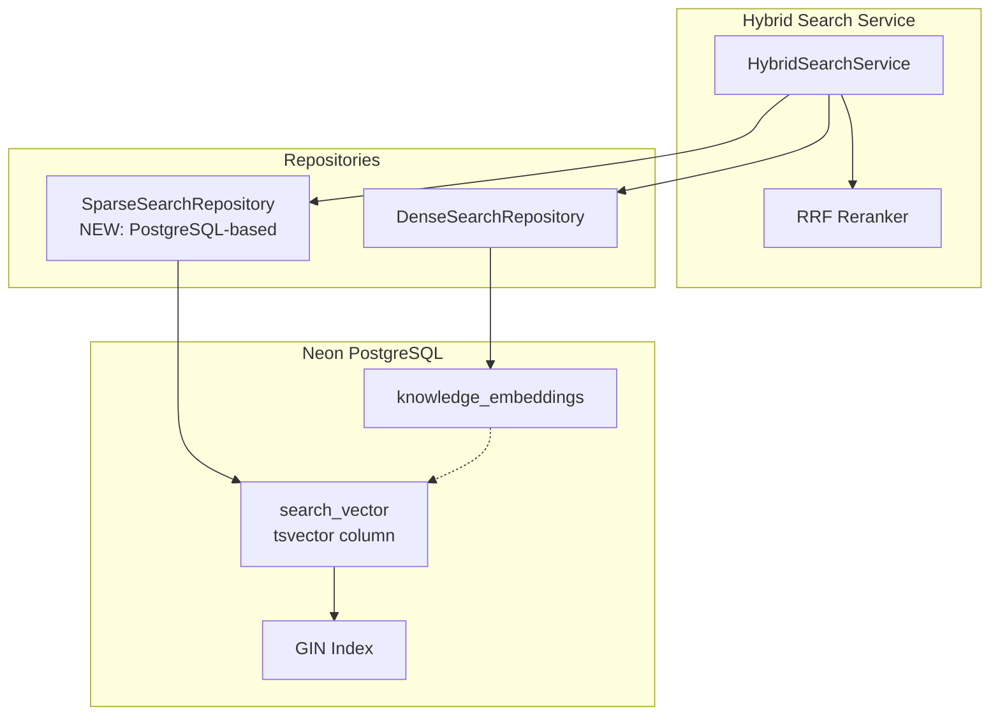
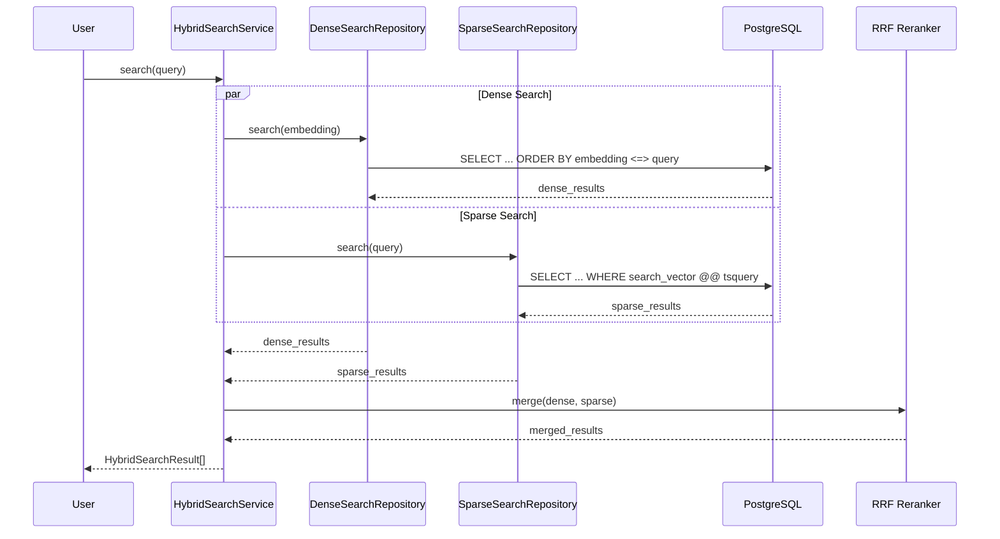

# Design Document: Sparse Search Migration to PostgreSQL

## Overview

This design document describes the migration of Sparse Search functionality from Neo4j to Neon PostgreSQL. The migration consolidates all search functionality into a single database, simplifying architecture while preserving Neo4j for future Learning Graph features.

### Current Architecture
```
┌─────────────────────────────────────────────────────────────┐
│                    HYBRID SEARCH SERVICE                     │
├─────────────────────────────────────────────────────────────┤
│  Dense Search (Neon)  ←──RRF──→  Sparse Search (Neo4j)      │
│  pgvector similarity         Full-text index                │
└─────────────────────────────────────────────────────────────┘
```

### Target Architecture
```
┌─────────────────────────────────────────────────────────────┐
│                    HYBRID SEARCH SERVICE                     │
├─────────────────────────────────────────────────────────────┤
│  Dense Search (Neon)  ←──RRF──→  Sparse Search (Neon)       │
│  pgvector similarity         tsvector full-text             │
└─────────────────────────────────────────────────────────────┘
│                                                              │
│  Neo4j (Reserved for Future)                                 │
│  └── Learning Graph for LMS integration                      │
└─────────────────────────────────────────────────────────────┘
```

## Architecture

### Component Diagram



### Data Flow



## Components and Interfaces

### 1. Database Schema Changes

```sql
-- Add tsvector column to knowledge_embeddings
ALTER TABLE knowledge_embeddings 
ADD COLUMN search_vector tsvector;

-- Create GIN index for fast full-text search
CREATE INDEX idx_knowledge_search_vector 
ON knowledge_embeddings USING GIN(search_vector);

-- Create trigger to auto-generate search_vector on insert/update
CREATE OR REPLACE FUNCTION update_search_vector()
RETURNS TRIGGER AS $$
BEGIN
    NEW.search_vector := to_tsvector('simple', COALESCE(NEW.content, ''));
    RETURN NEW;
END;
$$ LANGUAGE plpgsql;

CREATE TRIGGER trg_update_search_vector
BEFORE INSERT OR UPDATE ON knowledge_embeddings
FOR EACH ROW EXECUTE FUNCTION update_search_vector();

-- Populate existing rows
UPDATE knowledge_embeddings 
SET search_vector = to_tsvector('simple', COALESCE(content, ''));
```

### 2. SparseSearchRepository (PostgreSQL-based)

```python
@dataclass
class SparseSearchResult:
    """Result from sparse (keyword) search - unchanged interface."""
    node_id: str
    title: str
    content: str
    source: str
    category: str
    score: float

class SparseSearchRepository:
    """PostgreSQL-based sparse search using tsvector."""
    
    def __init__(self):
        self._pool = None
        self._available = False
        self._init_pool()
    
    async def search(
        self,
        query: str,
        limit: int = 10
    ) -> List[SparseSearchResult]:
        """
        Search using PostgreSQL full-text search.
        
        Uses ts_rank for scoring with number boosting.
        """
        pass
    
    def is_available(self) -> bool:
        """Check PostgreSQL connectivity."""
        pass
```

### 3. Query Building

```python
def _build_tsquery(self, query: str) -> str:
    """
    Build PostgreSQL tsquery from natural language query.
    
    Handles:
    - Vietnamese and English text
    - Stop word removal
    - OR between terms for broader matching
    """
    stop_words = {"là", "gì", "the", "what", "is", "a", "an", ...}
    words = [w for w in query.lower().split() if w not in stop_words]
    
    # Build OR query: word1 | word2 | word3
    return " | ".join(words) if words else query
```

### 4. Number Boosting

```python
def _apply_number_boost(
    self, 
    results: List[SparseSearchResult],
    query: str
) -> List[SparseSearchResult]:
    """
    Boost results containing rule numbers from query.
    
    E.g., "Rule 15" query boosts results with "15" in content.
    """
    numbers = re.findall(r'\b(\d+)\b', query)
    
    for result in results:
        for num in numbers:
            if num in result.content:
                result.score += NUMBER_BOOST_FACTOR
    
    return sorted(results, key=lambda x: x.score, reverse=True)
```

## Data Models

### knowledge_embeddings Table (Updated)

| Column | Type | Description |
|--------|------|-------------|
| id | UUID | Primary key |
| content | TEXT | Document content |
| embedding | float8[] | 768-dim vector for dense search |
| search_vector | tsvector | **NEW** Full-text search vector |
| document_id | VARCHAR | Parent document ID |
| page_number | INTEGER | Page number |
| chunk_index | INTEGER | Chunk index |
| content_type | VARCHAR | Content type |
| confidence_score | FLOAT | Confidence score |
| metadata | JSONB | Additional metadata |

## Correctness Properties

*A property is a characteristic or behavior that should hold true across all valid executions of a system-essentially, a formal statement about what the system should do. Properties serve as the bridge between human-readable specifications and machine-verifiable correctness guarantees.*

### Property 1: Search results contain required fields
*For any* search query, all returned SparseSearchResult objects SHALL contain non-null node_id, content, and score fields with score >= 0.
**Validates: Requirements 3.4, 4.3, 6.2**

### Property 2: Results are ranked by score descending
*For any* search query returning multiple results, the results SHALL be ordered by score in descending order.
**Validates: Requirements 3.1**

### Property 3: Number boosting increases score
*For any* search query containing a number N, results containing N in their content SHALL have higher scores than results without N (given equal base ts_rank scores).
**Validates: Requirements 3.3**

### Property 4: Tsvector auto-generation on insert
*For any* row inserted into knowledge_embeddings with non-empty content, the search_vector column SHALL be automatically populated with a non-null tsvector.
**Validates: Requirements 2.4**

### Property 5: Graceful fallback on sparse search failure
*For any* hybrid search where sparse search fails, the system SHALL return dense-only results without throwing an exception.
**Validates: Requirements 1.3, 1.4, 5.4**

### Property 6: Vietnamese text search returns results
*For any* Vietnamese search query matching content in the database, the search SHALL return at least one result.
**Validates: Requirements 3.2**

## Error Handling

| Error Scenario | Handling Strategy |
|----------------|-------------------|
| PostgreSQL connection failure | Return empty results, log error, set is_available=False |
| Invalid tsquery syntax | Sanitize query, fallback to simple text match |
| Empty search results | Return empty list (not error) |
| Timeout | Return partial results if available |

## Testing Strategy

### Unit Tests
- Test query building with various inputs
- Test number extraction and boosting
- Test result mapping to SparseSearchResult

### Property-Based Tests (Hypothesis)
- **Property 1**: Generate random search results, verify all have required fields
- **Property 2**: Generate random scored results, verify ordering
- **Property 3**: Generate queries with numbers, verify boosting
- **Property 4**: Insert random content, verify search_vector populated
- **Property 5**: Simulate failures, verify graceful fallback
- **Property 6**: Generate Vietnamese queries, verify results

### Integration Tests
- Test full hybrid search flow
- Test migration script
- Test backward compatibility with existing code

### Testing Framework
- **Property-based testing**: Hypothesis (Python)
- **Unit testing**: pytest
- **Minimum iterations**: 100 per property test
