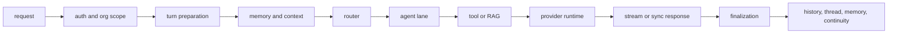

# Wiii Pipeline Simplification Plan

Status: Proposed implementation plan
Date: 2026-04-28
Tracking issue: #172
Owner: Wiii maintainers

## Executive Summary

Wiii's active runtime is already Wiii-owned. Normal chat execution flows through
`ChatOrchestrator`, `WiiiRunner`, provider routing, agent lanes, tool/RAG
surfaces, and SSE V3 finalization. LangGraph is no longer an active runtime
dependency, but graph-shaped names and historical compatibility files still make
the system harder for humans and agents to reason about.

This plan is intentionally non-destructive. It defines the current lifecycle,
marks remaining LangGraph/history/compat surfaces, and sets a phased path for
removing old assumptions without breaking frontend chat, memory continuity,
tool calls, provider fallback, or tenant isolation.

## Current Authoritative Lifecycle



### Sync chat path

```text
POST /api/v1/chat
-> RequireAuth
-> _canonicalize_chat_request_from_auth
-> chat_completion_endpoint_support.process_chat_completion_request
-> ChatService.process_message
-> ChatOrchestrator.process
-> prepare_turn
-> build_multi_agent_execution_input
-> process_with_multi_agent_impl
-> WiiiRunner.run
-> output processing and response presenter
-> finalize_response_turn
```

### Streaming chat path

```text
POST /api/v1/chat/stream/v3
-> RequireAuth
-> _canonicalize_stream_request_from_auth
-> chat_stream_coordinator.generate_stream_v3_events
-> ChatOrchestrator.prepare_turn
-> build_multi_agent_execution_input
-> process_with_multi_agent_streaming
-> WiiiRunner.run_streaming
-> StreamEvent serialization to SSE V3
-> done/error guard
-> finalize_response_turn
```

### Runtime core

`WiiiRunner` owns the active orchestration loop:

```text
guardian
-> supervisor
-> selected lane
-> optional handoff or continuation
-> synthesizer
-> output guardrails
```

The runtime still emits graph-compatible event shapes in some places because
the frontend and tests expect the existing SSE V3 contract. That compatibility
must be preserved until a versioned stream contract replaces it.

## Active Boundaries

| Boundary | Active owner | Notes |
|---|---|---|
| HTTP/auth/org | `app/api/v1/*`, `app/api/deps.py`, org middleware | Request identity and tenant scope are resolved before runtime execution. |
| Turn preparation | `ChatOrchestrator.prepare_turn` | User message persistence, session, request scope, validation, context. |
| Memory input | `InputProcessor`, semantic memory services, context helpers | Reads facts/history before routing. Writes happen after response unless explicit. |
| Router | `supervisor_node`, `runtime_routes`, `route_decision` | Structured routing must stay bounded so normal chat is not slowed by planner paths. |
| Agent lanes | `app/engine/multi_agent/agents/**`, direct/code/product/tutor/RAG nodes | Lanes should own domain behavior, not transport or provider details. |
| Tool/RAG | `engine/tools/**`, CorrectiveRAG, GraphRAG, MCP/host bridges | Tool events need one audit/event contract before broad cleanup. |
| Provider runtime | `llm_pool*`, `llm_route_runtime`, `llm_failover_runtime`, providers | Provider/model health, fallback, timeouts, and capabilities are a separate layer. |
| Stream transport | `chat_stream_coordinator`, `chat_stream_presenter`, `chat_stream_transport` | SSE V3 stays stable until FE accepts a versioned replacement. |
| Finalization | `ChatOrchestrator.finalize_response_turn`, continuity services | Assistant save, thread view, memory/background work, Living continuity. |

## LangGraph, History, And Compatibility Inventory

This table classifies references found in the current tree. It is not a delete
list; it is a safety map for future PRs.

| Class | Files or patterns | Current interpretation | Action |
|---|---|---|---|
| Active Wiii runtime with historical wording | `multi_agent/runner.py` | WiiiRunner says it replaces LangGraph and keeps compatible stream semantics. | Keep behavior. Rename wording only after tests cover stream parity. |
| Runner-backed graph shells | `multi_agent/graph.py`, `graph_process.py`, `graph_streaming.py`, `graph_stream_*` | Mostly compatibility modules around WiiiRunner and SSE. | Do not delete. Inventory callers, then rename one shell per PR. |
| Deprecated subgraph builders | `multi_agent/subagents/*/graph.py`, related `__init__.py` comments | LangGraph imports removed; builders are deprecated compatibility stubs or direct async helpers. | Remove only after negative public-surface tests and import checks pass. |
| GraphRAG and knowledge graph | `agentic_rag`, `GraphRAG`, Neo4j references | Knowledge graph, not LangGraph. | Out of scope for LangGraph cleanup. |
| Historical comments and docs | `core/langsmith.py`, `agentic_rag/corrective_rag.py`, `reflection_parser.py`, `mcp/*`, architecture docs | Old wording or design references. | Update as documentation cleanup, not runtime cleanup. |
| Text cleanup filters | `public_thinking.py`, `reasoning/*` filter lists containing `langgraph` | Prevents visible framework jargon leaking to users. | Keep until replacement filter contract exists. |
| Provider compatibility wording | `llm_providers/unified_client.py` | Mentions LangChain/LangGraph compatibility. | Update wording after provider route contract is finalized. |

## 2026-04-29 LangChain Exit Status

LangGraph is no longer the active orchestrator. LangChain/LangChain Core are
still present as compatibility surfaces for provider objects, tool binding,
RAG/CRAG helper calls, and older message builders. Treat this as a staged
framework exit, not a one-shot dependency deletion.

Completed first slice:

- Added a Wiii-native chat runtime contract for OpenAI-compatible message
  payloads and assistant response objects.
- Added a native provider/model handle so direct no-tool turns can use NVIDIA
  or other OpenAI-compatible providers without constructing a LangChain
  `BaseChatModel`.
- Switched the direct no-tool native stream path to return Wiii-native
  assistant messages instead of LangChain `AIMessage`.
- Added native dict message support for direct prompt building and direct
  response extraction.
- Kept tool/RAG lanes on the legacy adapter until their behavior has focused
  smoke tests.

Completed second slice:

- Direct no-tool turns now try the Wiii-native provider handle first even when
  the request did not explicitly pin a provider; provider resolution comes from
  settings and grouped agent runtime profiles.
- Native OpenAI-compatible streams now receive the same first-token timeout
  guard used by the legacy stream path, so the UI can recover instead of
  waiting silently on a stuck provider stream.
- Native stream success/failure updates the existing model-health registry.
  Timeout/rate-limit/server failures temporarily mark a concrete provider/model
  degraded.
- NVIDIA native model selection now skips a degraded Flash/Pro model and uses
  the healthy sibling model when available.

Completed third slice:

- Added framework-free native system, user, and tool-result message objects
  with the same duck-typed surface the existing runtime expects.
- Direct tool rounds can now append native tool-result and synthesis messages
  when the route is native, while legacy LangChain tool loops keep the old
  `ToolMessage`/`HumanMessage` path.
- Direct node execution passes the native message mode through to the tool
  loop, giving future native tool-call adapters a stable switch point.
- Added focused tests so native tool-result messages serialize to
  OpenAI-compatible payloads and direct tool rounds can synthesize without
  constructing LangChain message classes in native mode.

Completed fourth slice:

- Added Wiii-owned tool schema serialization from existing tool objects into
  OpenAI-compatible `type=function` payloads.
- Native provider handles now support `bind_tools(...)` and preserve normalized
  tool-choice hints without constructing LangChain model wrappers.
- Native provider handles now support `ainvoke(...)` through the existing
  OpenAI-compatible client layer, returning Wiii-native assistant messages with
  direct-loop-friendly `tool_calls`.
- Direct forced-tool turns can now select the native provider handle when the
  route is native, while optional-tool turns stay on the legacy path until
  native streaming with tool schemas is covered.

Completed fifth slice:

- Native OpenAI-compatible streaming now sends bound tool schemas and
  normalized tool-choice hints when a native handle has tools attached.
- Native stream responses now accumulate streamed function-call chunks across
  deltas and return direct-loop-compatible `tool_calls` without emitting
  duplicate tool events.
- Direct optional-tool turns can now select the native provider handle while
  identity, emotional support, and house/social chatter stay on the protected
  legacy path.
- The stream first-chunk guard keeps a single iterator instance, preventing
  duplicate first chunks from custom async iterators.

Remaining LangChain work should be split into small PRs:

- Provider pool: replace `LLMPool`/`BaseChatModel` as the default provider
  route with a Wiii-owned provider adapter and health/fallback contract.
- Tool runtime: replace `StructuredTool`, `@tool`, `ToolMessage`, and tool
  call result objects with Wiii tool-call events plus provider-specific
  serializers.
- RAG/CRAG: migrate `ainvoke`/`astream` helper calls to native provider
  adapters after golden RAG smoke cases exist.
- Memory/context: move history and budget message builders to Wiii-native
  message blocks while preserving identity, relationship, and fact memory
  behavior.

Do not remove LangChain dependencies from packaging until all four areas above
have passing smoke gates. The current safe direction is to make new hot-path
runtime code native first, then retire compatibility adapters only when their
callers disappear.

## Target Runtime Shape

Wiii should converge on a runtime that is explicit and boring in the best way:

```text
WiiiTurnRequest
-> WiiiRunContext
-> WiiiTurnState
-> WiiiRuntimeStep
-> WiiiStreamEvent
-> WiiiTurnLedger
```

The public API and SSE payloads do not need to change immediately. The target
is internal clarity first, compatibility removal second.

## Phased Plan

### Phase 1: Inventory and guardrails

Scope:

- Add a tracked inventory command for LangGraph/history/compat references.
- Classify each hit as active Wiii runtime, compatibility shell, historical
  comment, GraphRAG/knowledge graph, or deletion candidate.
- Add negative tests that active app code does not import `langgraph`.

Exit criteria:

- Maintainers can see why a graph-shaped file exists.
- No runtime behavior changes.

### Phase 2: Golden pipeline tests

Scope:

- Direct social chat.
- Memory recall.
- Memory write candidate.
- RAG zero-doc fallback.
- Tutor response.
- Tool call with result.
- Provider fallback.
- Stream interruption/finalization.
- Provider unavailable.
- Host/context injection.

Each scenario should assert:

- sync behavior where applicable
- SSE V3 event sequence where applicable
- persisted assistant turn
- no raw internal framework wording in user-visible output

Exit criteria:

- CI has a small required runtime smoke suite.
- Refactor PRs can prove Wiii still chats.

### Phase 3: Introduce native contracts behind adapters

Scope:

- Add `WiiiTurnRequest` and `WiiiRunContext`.
- Wrap current `AgentState` with `WiiiTurnState` accessors.
- Add internal `WiiiStreamEvent` categories while preserving SSE V3 mapping.
- Mark graph event constructors as compatibility aliases.

Exit criteria:

- New runtime code uses Wiii names.
- Old FE and tests continue to pass.

### Phase 4: Rename compatibility shells

Scope:

- Rename runner-backed `graph_*` modules only after callers are mapped.
- Keep import aliases for one release window.
- Move tests from source-inspection anchors to behavior assertions.

Exit criteria:

- `graph_*` no longer means "active framework graph".
- No public chat or stream contract changes.

### Phase 5: Tool and provider boundary simplification

Scope:

- Keep the newly merged provider reliability layer as the provider foundation.
- Move tool call/result events toward one runtime event surface.
- Keep provider selection model-aware and capability-aware.
- Ensure router/structured-output paths cannot slow simple direct chat.

Exit criteria:

- Tool, RAG, provider, and stream events have clear ownership.
- Agent lanes do not need provider-specific branching.

### Phase 6: Delete retired compatibility only after proof

Scope:

- Remove deprecated subgraph builders that only raise deprecation errors.
- Remove old docs that state LangGraph is active.
- Remove compatibility aliases only after downstream imports are gone.

Exit criteria:

- No active `import langgraph`, `from langgraph`, `StateGraph`,
  `MemorySaver`, `CompiledStateGraph`, `get_multi_agent_graph`, or
  `build_multi_agent_graph` references remain outside explicit historical docs.

### Completed fifth slice: Native optional tools

Implemented in the Phase 5 runtime slice:

- Native OpenAI-compatible streaming now forwards bound tool schemas and
  normalized `tool_choice` instead of silently falling back to LangChain for
  optional-tool turns.
- Streaming tool-call deltas are accumulated into final assistant `tool_calls`
  before the direct loop executes tools, matching the provider contract for
  chunked function arguments.
- Direct optional-tool turns can use the native provider path while
  identity/emotional/social house turns remain on the protected natural voice
  lane.
- The native first-chunk guard keeps a single stream iterator instance so the
  first answer/tool chunk is not duplicated or lost.

### Completed sixth slice: Native RAG/CRAG socket

Implemented in the first Phase 6 runtime slice:

- Agentic RAG now builds framework-free native message objects through a single
  `make_agentic_rag_messages()` helper rather than importing LangChain message
  classes across RAG/CRAG callsites.
- `resolve_agentic_rag_llm()` can prefer an `AgentConfigRegistry` native
  provider handle when the OpenAI-compatible client is actually configured, and
  falls back to the shared pool when native credentials are absent.
- `ainvoke_agentic_rag_llm()` pins native handles to their provider name so the
  failover socket does not accidentally replace a native NVIDIA/OpenAI-compatible
  request with an unrelated LangChain primary.
- CRAG fallback, translation, web-context generation, HyDE, query analysis,
  query rewriting, retrieval grading, and answer verification now use the shared
  RAG socket instead of constructing LangChain messages locally.
- CRAG streaming has a native OpenAI-compatible branch for configured native
  handles, then falls back to legacy `astream()` and finally buffered invoke.
- CRAG streaming now has chunk/total timeout guards so a dead stream can fall
  back instead of leaving the frontend stuck on "đang suy nghĩ".

Why this order:

- CRAG research emphasizes a lightweight retrieval evaluator plus corrective
  actions when retrieved documents are weak; Self-RAG emphasizes adaptive
  retrieval and critique rather than unconditional fixed retrieval. Wiii keeps
  those retrieval/verification policies intact while replacing the model socket
  underneath first.
- Hosted retrieval systems such as OpenAI file search expose semantic/keyword
  search, vector stores, result limits, citations, and metadata filters as
  explicit contracts. Wiii's native RAG direction should mirror that clarity:
  retrieval contract first, model socket second, UI stream evidence always.

## Migration Rules For Agents

- Do not rename and change behavior in the same PR.
- Do not delete `GraphRAG`, Neo4j, knowledge graph, or learning graph files as
  part of LangGraph cleanup.
- Do not change SSE event names without a frontend migration plan.
- Do not move memory writes from post-response into the hot path without tests.
- Do not make structured routing mandatory for direct social chat.
- Every runtime PR must include rollback notes and exact verification commands.

## Verification For This Plan

Documentation-only verification:

```powershell
git diff --check
git status --short
```

Suggested inventory commands for future implementation PRs:

```powershell
Get-ChildItem maritime-ai-service -Recurse -File |
  Select-String -Pattern '^(import langgraph|from langgraph)'

Get-ChildItem maritime-ai-service -Recurse -File |
  Select-String -Pattern '\b(MemorySaver|CompiledStateGraph|StateGraph)\b'

Get-ChildItem maritime-ai-service -Recurse -File |
  Select-String -Pattern '\b(get_multi_agent_graph|build_multi_agent_graph)\b'
```

## Rollback

Revert this documentation PR. It changes no runtime behavior, database schema,
provider configuration, stream payload, or frontend state.

## Bottom Line

Wiii can remove the remaining LangGraph mental model, but the safe sequence is:

```text
map -> test -> introduce Wiii-native contracts -> rename -> delete
```

The current priority is not more deletion. The priority is giving every human
and AI agent the same map so the next runtime changes make Wiii feel alive,
stable, and understandable rather than merely smaller.
