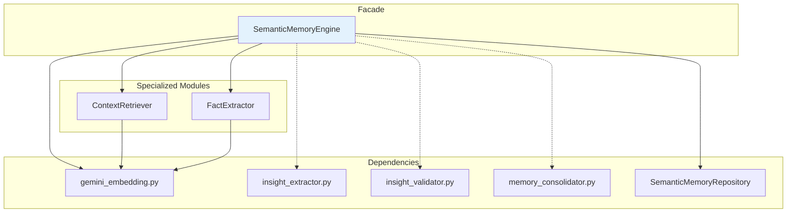

# Semantic Memory - User Context Engine

> Vector-based memory for user facts, context, and conversation history.

**Location:** `app/engine/semantic_memory/`  
**Pattern:** Facade + Specialized Modules

---

## 📁 Files

```
semantic_memory/
├── __init__.py      # Exports
├── core.py          # SemanticMemoryEngine (818 lines)
├── context.py       # ContextRetriever (280 lines)
└── extraction.py    # FactExtractor (500 lines)
```

---

## 🏗️ Architecture



---

## 🔗 Relationships

### Used BY (Incoming)

| Consumer | File | Import |
|----------|------|--------|
| **Services** | `chat_service.py` | `SemanticMemoryEngine` |
| **Services** | `chat_context_builder.py` | `SemanticMemoryEngine` |
| **Engine** | `multi_agent/memory_agent.py` | `SemanticMemory` |
| **Tools** | `memory_tools.py` | (runtime) |

### Uses (Outgoing)

| File | Uses | From |
|------|------|------|
| `core.py` | `GeminiOptimizedEmbeddings` | `engine/gemini_embedding.py` |
| `core.py` | `InsightExtractor` | `engine/insight_extractor.py` |
| `core.py` | `InsightValidator` | `engine/insight_validator.py` |
| `core.py` | `MemoryConsolidator` | `engine/memory_consolidator.py` |
| `core.py` | `SemanticMemoryRepository` | `repositories/` |

---

## ⚠️ Audit Findings (2025-12-14)

| Finding | Severity | Status | Notes |
|---------|----------|--------|-------|
| `semantic_memory.py` wrapper | 🟢 OK | ✅ Needed | Used by `chat_service.py` for backward compat |
| DEPRECATED `store_user_fact()` | 🟢 OK | ✅ **Fixed** | Added `warnings.warn()`, callers updated to use `_upsert()` |
| Lazy imports | 🟢 OK | ✅ Good | InsightExtractor/Validator loaded on-demand |
| Dead code | 🟢 OK | ✅ None | All methods used by consumers |
| Dead code | 🟢 OK | ✅ None | All methods used by consumers |

### SOTA Compliance ✅

| Pattern | Status | Description |
|---------|--------|-------------|
| **Facade Pattern** | ✅ Yes | `SemanticMemoryEngine` delegates to specialized modules |
| **Modular Design** | ✅ Yes | Separated into core, context, extraction |
| **Vector-based Memory** | ✅ Yes | pgvector + Gemini embeddings |
| **Semantic Deduplication** | ✅ Yes | Fact type upsert logic |
| **Memory Cap (FIFO)** | ✅ Yes | MAX_USER_FACTS = 50 |

---

## 📊 Metrics

| File | Lines | Functions |
|------|-------|-----------|
| `core.py` | 818 | 25+ |
| `extraction.py` | ~500 | 10+ |
| `context.py` | ~280 | 8+ |
| **Total** | **~1,600** | **43+** |

---

## 📝 Related

- [Parent: engine](../README.md)
- [Tools (memory_tools)](../tools/README.md)
- [Multi-Agent (memory_agent)](../multi_agent/README.md)
