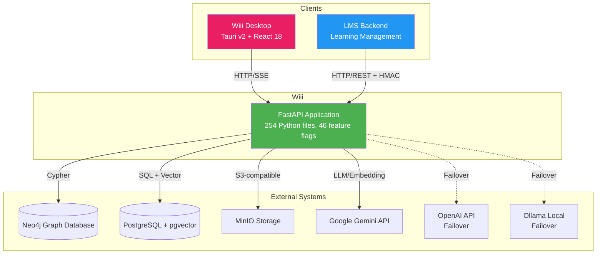
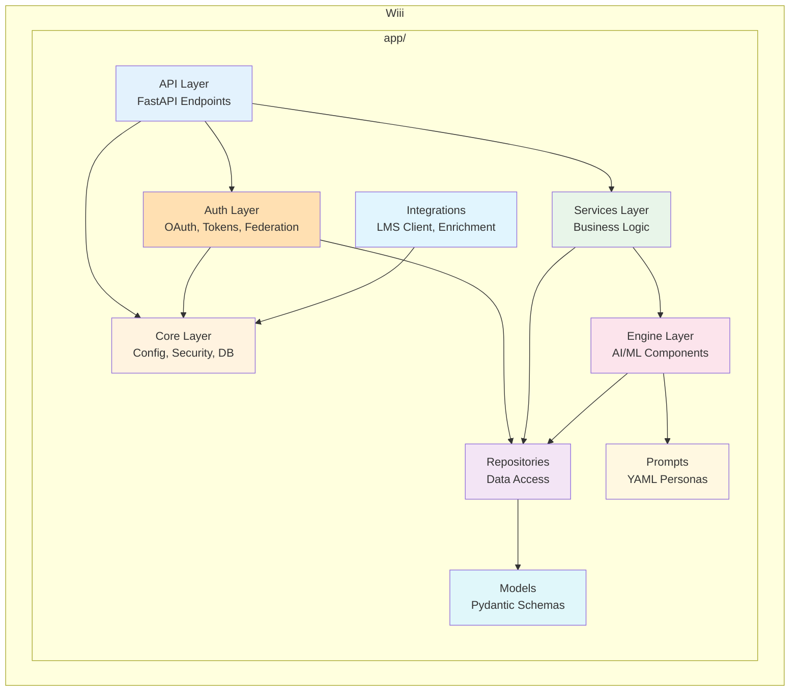
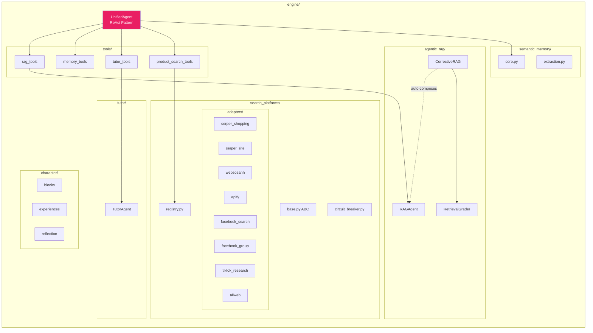
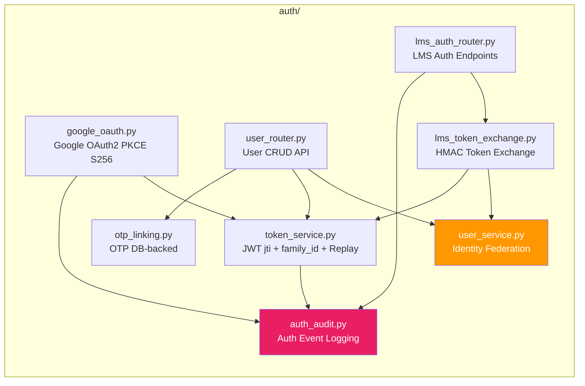
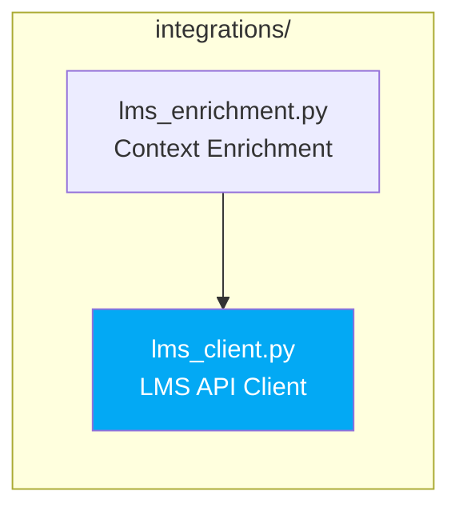
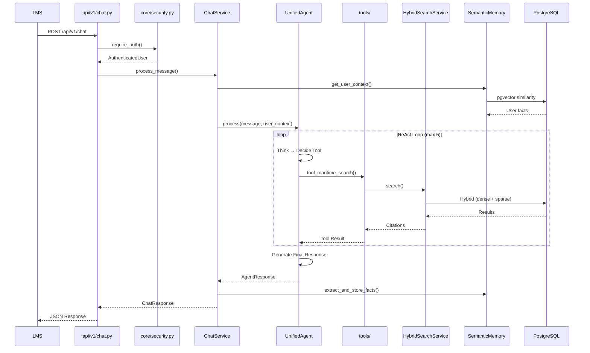
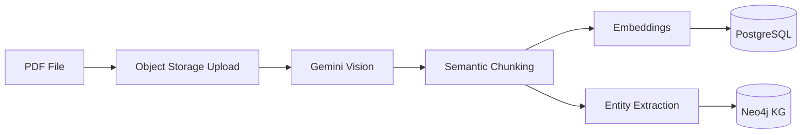
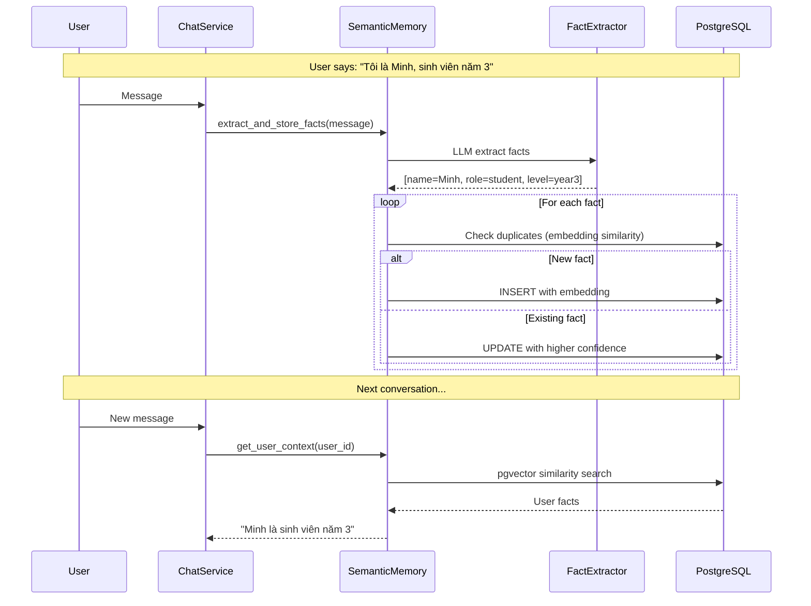
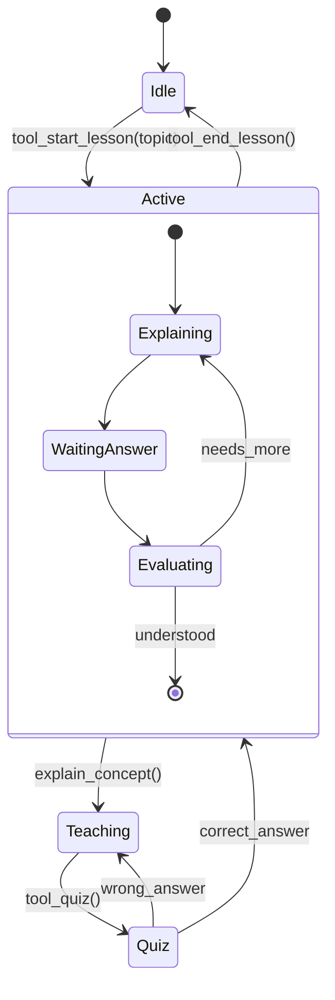
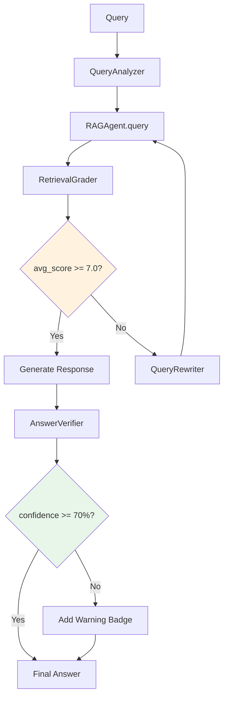

# Wiii - Architecture Map

> Master architecture document following **C4 Model + arc42** best practices.

**Last Updated:** 2026-02-26
**Status:** ✅ Complete
**Version:** 7.0 (Post-Sprint 209 — Soul AGI Foundation v1.0, 310+ files, 9703 tests)


---

## 📋 Table of Contents

1. [System Context](#1-system-context-c4-level-1)
2. [Container View](#2-container-view-c4-level-2)
3. [Component View](#3-component-view-c4-level-3)
4. [Folder Structure](#4-folder-structure)
5. [Request Flow](#5-request-flow)
6. [Cross-Cutting Concerns](#6-cross-cutting-concerns)
7. [Architecture Decisions](#7-architecture-decisions)
8. [Audit Summary](#8-audit-summary)

---

## 1. System Context (C4 Level 1)



**Actors:**
- **Wiii Desktop**: Tauri v2 + React 18 desktop app (11 Zustand stores, 1346 tests)
- **LMS Backend**: Sends chat requests via REST + HMAC token exchange
- **Neo4j**: Knowledge Graph for domain-specific knowledge
- **PostgreSQL**: Vector embeddings, user memory, chat history, org data (12 migrations)
- **MinIO**: PDF storage, image assets (S3-compatible)
- **Gemini/OpenAI/Ollama**: Multi-provider LLM failover chain

---

## 2. Container View (C4 Level 2)



---

## 3. Component View (C4 Level 3)

### Engine Layer Components



### Auth Layer Components



### Integrations Layer Components



---

## 4. Folder Structure & Responsibilities

### 📂 Detailed Folder Functions

| Folder | Chức năng | Key Files | Exports |
|--------|-----------|-----------|---------|
| **`app/api/`** | HTTP endpoints, routing (18 routers) | `chat.py`, `chat_stream.py`, `admin.py`, `health.py`, `organizations.py`, `websocket.py`, `webhook.py` | FastAPI routers |
| **`app/core/`** | Config, security, DB, middleware (15 files) | `config.py`, `security.py`, `database.py`, `middleware.py`, `org_context.py`, `org_filter.py`, `org_settings.py`, `constants.py`, `observability.py` | Settings, Auth, OrgContext |
| **`app/auth/`** | Authentication & Identity Federation (8 files) | `google_oauth.py`, `token_service.py`, `user_service.py`, `user_router.py`, `lms_token_exchange.py`, `lms_auth_router.py`, `auth_audit.py`, `otp_linking.py` | OAuth, JWT, Federation, Audit |
| **`app/services/`** | Business logic (REFACTORED) | `chat_service.py` (facade), `chat_orchestrator.py` (pipeline), `graph_streaming.py`, `stream_utils.py` | See Services below |
| **`app/engine/`** | AI/ML components, agents (60+ files) | `unified_agent.py`, tools/, agentic_rag/, multi_agent/, search_platforms/, character/ | Agents, Tools, Search |
| **`app/engine/search_platforms/`** | Product Search Platform Adapters | `base.py` (ABC), `registry.py` (singleton), `circuit_breaker.py`, `adapters/` (8 adapters), `oauth/` | SearchPlatformAdapter, SearchPlatformRegistry |
| **`app/engine/search_platforms/adapters/`** | Individual platform adapters (8 adapters) | `serper_shopping.py`, `serper_site.py`, `websosanh.py`, `apify.py`, `facebook_search.py`, `facebook_group.py`, `tiktok_research.py`, `allweb.py` | Adapter implementations |
| **`app/engine/search_platforms/adapters/browser_base.py`** | Playwright browser scraping base | `BrowserBaseAdapter` | Browser automation for search |
| **`app/engine/multi_agent/agents/product_search_node.py`** | Product Search agent node | `product_search_agent()` | Feature-gated WiiiRunner node for product search |
| **`app/integrations/`** | LMS Integration Layer | `lms_client.py`, `lms_enrichment.py` | LMS API client, context enrichment |
| **`app/repositories/`** | Database access layer (15 repos) | `semantic_memory_repo.py`, `neo4j_repo.py`, `organization_repository.py`, `thread_repository.py`, `scheduler_repository.py` | CRUD operations |
| **`app/models/`** | Pydantic schemas, DTOs | `schemas.py`, `semantic_memory.py`, `organization.py` | Data models |
| **`app/models/organization.py`** | Org + OrgSettings + OrgBranding + OrgPermissions | `Organization`, `OrgSettings`, `OrgBranding`, `OrgPermissions` | Multi-tenant models |
| **`app/domains/`** | Domain plugin system | `base.py`, `registry.py`, `loader.py`, `router.py`, `maritime/`, `traffic_law/` | DomainPlugin, DomainRegistry |
| **`app/prompts/`** | AI persona configuration | `prompt_loader.py`, agents/*.yaml | System prompts |
| **`app/core/org_filter.py`** | Multi-tenant org filtering helpers | `get_effective_org_id()`, `org_where_clause()`, `org_where_positional()` | Org-aware SQL filters |
| **`app/core/org_settings.py`** | Org settings cascade + permissions | Settings resolution per org | OrgSettings cascade |

### 📂 Services Layer (20+ files)

| File | Purpose | Lines | Pattern |
|------|---------|-------|--------|
| **`chat_service.py`** | Thin facade, wires dependencies | ~310 | Facade |
| **`chat_orchestrator.py`** | 6-stage pipeline orchestration | ~320 | Pipeline |
| **`graph_streaming.py`** | SSE event lifecycle + graph-level streaming | ~450 | Critical Streaming |
| **`stream_utils.py`** | StreamEvent factory functions | ~200 | Factory |
| **`session_manager.py`** | Session CRUD, anti-repetition state | ~230 | Singleton |
| **`input_processor.py`** | Validation, Guardian, context | ~380 | Processor |
| **`output_processor.py`** | Response formatting, sources | ~220 | Processor |
| **`thinking_post_processor.py`** | Centralized thinking extraction (v8) | ~180 | Post-Processor |
| **`background_tasks.py`** | Async task runner | ~260 | Task Runner |
| `chat_context_builder.py` | Context assembly | ~100 | Builder |
| `chat_response_builder.py` | Response assembly | ~100 | Builder |
| `hybrid_search_service.py` | Dense + Sparse search | ~400 | Service |
| `multimodal_ingestion_service.py` | PDF pipeline | ~600 | Service |
| `graph_rag_service.py` | GraphRAG with Neo4j | ~200 | Service |
| `scheduled_task_executor.py` | Async scheduled task polling | ~300 | Background |
| `notification_dispatcher.py` | WebSocket/Telegram dispatch | ~200 | Dispatcher |
| **`conversation_window.py`** | Sliding window context management (15 turns) | ~250 | Context |
| **`context_manager.py`** | Token budget allocation (4-layer) | ~300 | Budget |

### 📂 Engine Subfolders (app/engine/)

| Subfolder | Chức năng | Key Components |
|-----------|-----------|----------------|
| **`agentic_rag/`** | Corrective RAG system (Composition Pattern) | `rag_agent.py`, `corrective_rag.py` (auto-composes RAGAgent), grader, verifier |
| **`multi_agent/`** | WiiiRunner orchestration | `runner.py`, `graph.py`, `supervisor.py`, `agents/`, `graph_streaming.py` |
| **`tools/`** | LangChain tools (RAG, Memory, Tutor, Product Search) | `rag_tools.py`, `memory_tools.py`, `tutor_tools.py`, `product_search_tools.py` |
| **`semantic_memory/`** | Vector-based user memory + cross-platform sync | `core.py`, `extraction.py`, `context.py`, `cross_platform.py` |
| **`search_platforms/`** | Product search plugin architecture (8 platform adapters) | `base.py` (ABC), `registry.py`, `circuit_breaker.py`, `adapters/`, `oauth/` |
| **`character/`** | Character system (per-user isolated) | `blocks.py`, `experiences.py`, `reflection.py` |
| **`tutor/`** | State machine tutoring | `tutor_agent.py` |
| **`agents/`** | Agent base classes, registry | `base.py`, `config.py`, `registry.py` |
| **`llm_providers/`** | Multi-provider LLM layer | `unified_client.py`, `gemini.py`, `openai.py`, `ollama.py` |

**Key Engine Files:**

| File | Chức năng | CHỈ THỊ |
|------|-----------|----------|
| `llm_pool.py` | **NEW** SOTA LLM Singleton Pool (3 shared instances) | MEMORY OPT |
| `llm_factory.py` | Centralized LLM creation with 4-tier thinking | SỐ 28 |
| `unified_agent.py` | Main ReAct agent (uses DEEP tier thinking) | SỐ 13, 28 |

---

### 🔗 File-to-File Relationships

```
┌────────────────────────────────────────────────────────────────────────────────┐
│                           IMPORT DEPENDENCY MAP                                │
├────────────────────────────────────────────────────────────────────────────────┤
│                                                                                │
│  api/v1/chat.py ─────────────────────────────────────────────────────────────┐ │
│       │                                                                       │ │
│       ├─► core/security.py (require_auth)                                     │ │
│       ├─► core/config.py (settings)                                           │ │
│       └─► services/chat_service.py ──────────────────────────────────────────┤ │
│               │                                                               │ │
│               ├─► engine/unified_agent.py ───────────────────────────────────┤ │
│               │       │                                                       │ │
│               │       ├─► engine/tools/*.py (get_all_tools)                   │ │
│               │       │       ├─► rag_tools → agentic_rag/rag_agent.py        │ │
│               │       │       ├─► memory_tools → semantic_memory/core.py      │ │
│               │       │       └─► tutor_tools → tutor/tutor_agent.py          │ │
│               │       │                                                       │ │
│               │       └─► prompts/prompt_loader.py (build_system_prompt)      │ │
│               │               └─► prompts/agents/*.yaml                       │ │
│               │                                                               │ │
│               ├─► engine/semantic_memory/core.py ────────────────────────────┤ │
│               │       └─► repositories/semantic_memory_repository.py          │ │
│               │               └─► models/semantic_memory.py                   │ │
│               │                                                               │ │
│               └─► repositories/chat_history_repository.py                     │ │
│                       └─► models/database.py                                  │ │
│                                                                               │ │
└────────────────────────────────────────────────────────────────────────────────┘
```

### 🔗 Cross-Layer Dependencies

| From Layer | To Layer | Key Imports |
|------------|----------|-------------|
| `api/` → `core/` | security, config | `require_auth()`, `settings` |
| `api/` → `services/` | business logic | `ChatService`, `IngestionService` |
| `services/` → `engine/` | AI processing | `UnifiedAgent`, `SemanticMemory` |
| `services/` → `repositories/` | data access | `*Repository` classes |
| `engine/` → `repositories/` | storage | `SemanticMemoryRepository` |
| `engine/` → `prompts/` | persona | `PromptLoader` |
| `repositories/` → `models/` | schemas | Pydantic models |

### 🔗 Tools ↔ Components Mapping

| Tool | Component | Purpose |
|------|-----------|---------|
| `tool_maritime_search` | `RAGAgent` | Search maritime knowledge |
| `tool_get_topic_details` | `RAGAgent` | Get detailed explanations |
| `tool_search_cross_references` | `RAGAgent` | Find related content |
| `tool_search_images` | `RAGAgent` | Find relevant images |
| `tool_save_user_info` | `SemanticMemory` | Store user facts |
| `tool_get_user_info` | `SemanticMemory` | Retrieve user context |
| `tool_remember_preference` | `SemanticMemory` | Save preferences |
| `tool_start_lesson` | `TutorAgent` | Begin learning session |
| `tool_continue_lesson` | `TutorAgent` | Progress in lesson |
| `tool_lesson_status` | `TutorAgent` | Check session state |
| `tool_end_lesson` | `TutorAgent` | Complete session |
| `tool_search_serper_shopping` | `SerperShoppingAdapter` | Google Shopping product search |
| `tool_search_websosanh` | `WebSosanhAdapter` | WebSosanh.vn price comparison |
| `tool_search_facebook` | `FacebookSearchAdapter` | Facebook Marketplace/Groups search |
| `tool_search_tiktok` | `TikTokResearchAdapter` | TikTok Shop product search |
| `product_search_tools.py` | `SearchPlatformRegistry` | Platform-based product search (7 tools, 5 platforms) |

### Audit Status (Post-Sprint 161)

| Layer | Folder | Files | README | Status |
|-------|--------|-------|--------|--------|
| API | `app/api/` | 18 | ✅ | 18 routers (chat, stream, admin, orgs, auth, users, webhook, ws) |
| Core | `app/core/` | 15 | ✅ | +org_context, org_filter, org_settings, middleware, constants, observability |
| Auth | `app/auth/` | 8 | ✅ | OAuth, JWT, Federation, LMS Token Exchange, Auth Audit, OTP DB |
| Services | `app/services/` | 20+ | ✅ | +graph_streaming, stream_utils, conversation_window, context_manager |
| Engine | `app/engine/` | 60+ | ✅ | +search_platforms (8 adapters), character, llm_providers |
| Integrations | `app/integrations/` | 3 | ✅ | NEW: LMS client, enrichment |
| Repos | `app/repositories/` | 15 | ✅ | +organization, thread, scheduler, user_preferences |
| Models | `app/models/` | 8 | ✅ | +organization.py (OrgSettings, OrgBranding, OrgPermissions) |
| Domains | `app/domains/` | 12 | ✅ | Plugin system: maritime, traffic_law, _template |
| Prompts | `app/prompts/` | 8 | ✅ | +domain overlay prompts |

### Root Folders

| Folder | Purpose | Files | Key Contents |
|--------|---------|-------|--------------|
| `archive/` | Legacy/backup code | 10 | Old implementations |
| `scripts/` | Dev utilities | 50+ | test_*.py, migrations, ingestion |
| `tests/` | Automated tests (329+ files, 6731+ tests) | 4 dirs | unit/, integration/, property/, e2e/ |
| `alembic/` | DB migrations | 15 | Schema evolution (011: org_id, 010: auth_method, 025-027: auth hardening) |
| `docs/` | Documentation | 4 dirs | architecture/, api/, schemas/ |

---

## 5. Request Flow

### Chat Request (Primary Flow)



### PDF Ingestion Flow



### Memory Flow (Semantic Memory)



### Tutor Flow (Learning Sessions)



### CRAG Flow (Corrective RAG)



### Pronoun Adaptation Flow

```mermaid
graph LR
    Msg[User: "Mình muốn hỏi..."] --> Detect[detect_pronoun_style]
    Detect --> Style[ai_self=mình<br/>user_called=cậu]
    Style --> Prompt[build_system_prompt]
    Prompt --> LLM[Gemini]
    LLM --> Resp["AI: Hay quá! Mình sẽ giúp cậu..."]
```

### Complete System Integration

```mermaid
graph TB
    subgraph "Frontend"
        Desktop[Wiii Desktop<br/>Tauri v2 + React 18]
        LMS[LMS Backend]
    end

    subgraph "API Layer (18 routers)"
        Chat[/api/v1/chat]
        Stream[/api/v1/chat/stream/v3]
        Admin[/api/v1/admin]
        AuthAPI[/api/v1/auth]
        OrgAPI[/api/v1/organizations]
        UserAPI[/api/v1/users]
    end

    subgraph "Auth Layer"
        OAuth[Google OAuth]
        TokenSvc[Token Service]
        UserSvc[User Service]
        LMSExchange[LMS Token Exchange]
    end

    subgraph "Services Layer"
        CS[ChatService]
        GStr[GraphStreaming]
        HS[HybridSearchService]
        GS[GraphRAGService]
        IS[IngestionService]
        CW[ConversationWindow]
        CM[ContextManager]
    end

    subgraph "Engine Layer"
        UA[UnifiedAgent]

        subgraph "Tools"
            RAG[rag_tools<br/>4 tools]
            MEM[memory_tools<br/>3 tools]
            TUT[tutor_tools<br/>4 tools]
            PST[product_search_tools<br/>7 tools]
        end

        subgraph "Core Components"
            CRAG[CorrectiveRAG]
            SM[SemanticMemory]
            TA[TutorAgent]
            PL[PromptLoader]
            SP[SearchPlatformRegistry<br/>8 adapters]
            CHAR[Character System]
        end
    end

    subgraph "Integrations"
        LMSC[LMS Client]
        LMSE[LMS Enrichment]
    end

    subgraph "Data Layer"
        PG[(PostgreSQL<br/>+ pgvector)]
        NEO[(Neo4j<br/>Knowledge Graph)]
        SB[(MinIO<br/>Storage)]
    end

    Desktop --> Chat & Stream
    LMS --> Chat & AuthAPI
    Desktop --> AuthAPI & OrgAPI & UserAPI

    AuthAPI --> OAuth & TokenSvc & LMSExchange
    OrgAPI --> UserSvc
    UserAPI --> UserSvc

    Chat --> CS
    Stream --> CS
    CS --> GStr
    Admin --> IS

    CS --> UA
    CS --> CW & CM
    UA --> RAG & MEM & TUT & PST
    UA --> PL

    RAG --> CRAG
    MEM --> SM
    TUT --> TA
    PST --> SP

    CRAG --> HS
    CRAG --> GS
    HS --> PG
    GS --> NEO
    SM --> PG
    IS --> SB & PG & NEO

    LMSExchange --> UserSvc
    LMSE --> LMSC

    style UA fill:#E91E63,color:white
    style CRAG fill:#2196F3,color:white
    style SM fill:#4CAF50,color:white
    style SP fill:#FF9800,color:white
    style GStr fill:#9C27B0,color:white
```

---

## 6. Cross-Cutting Concerns

### Authentication (Triple: API Key + JWT + LMS HMAC)

```
Path 1: API Key
  X-API-Key → core/security.py → AuthenticatedUser
      ├── user_id: from X-User-ID header
      ├── role: from X-User-Role header
      ├── session_id: from X-Session-ID header
      └── organization_id: from X-Organization-ID header (optional)

Path 2: Google OAuth + JWT (Sprint 176: PKCE S256 + jti + family_id)
  Google OAuth (PKCE S256) → auth/google_oauth.py → auth/token_service.py → JWT (jti claim)
      └── Bearer token → core/security.py → AuthenticatedUser
      └── Refresh: family_id tracking + replay detection → purge family on reuse

Path 3: LMS Token Exchange (HMAC-signed)
  LMS Backend → POST /auth/lms/token (HMAC-SHA256) → auth/lms_token_exchange.py → JWT

Audit: All auth events → auth/auth_audit.py → auth_events table (fire-and-forget)
```

### Configuration (53 feature flags)

```python
# app/core/config.py (key flags — see CLAUDE.md for full list)
use_multi_agent: bool = True            # WiiiRunner multi-agent runtime (default)
enable_corrective_rag: bool = True      # CRAG loop
deep_reasoning_enabled: bool = True     # <thinking> tags
enable_multi_tenant: bool = False       # Multi-org data isolation
enable_unified_client: bool = False     # AsyncOpenAI SDK
enable_mcp_server: bool = False         # MCP tool exposure
enable_agentic_loop: bool = False       # Generalized ReAct
enable_product_search: bool = False     # Product search agent
enable_structured_outputs: bool = True  # Constrained decoding
enable_character_tools: bool = True     # Character introspection
active_domains: list = ["maritime", "traffic_law"]
```

### Prompt Management

```
prompts/
├── base/_shared.yaml      # Inheritance base
├── agents/
│   ├── tutor.yaml        # Student persona
│   ├── assistant.yaml    # Teacher/Admin
│   ├── rag.yaml          # RAG agent
│   └── memory.yaml       # Memory agent
└── prompt_loader.py      # Dynamic loading
    ├── detect_pronoun_style()
    └── build_system_prompt()
```

---

## 7. Architecture Decisions

### ADR-001: ReAct vs Multi-Agent

| Decision | ReAct (UnifiedAgent) as default |
|----------|--------------------------------|
| **Context** | Need flexible agent orchestration |
| **Decision** | Use manual ReAct loop over heavyweight orchestration frameworks |
| **Rationale** | Simpler, more control, faster iteration |
| **Status** | ✅ Active |

### ADR-002: TutorAgent Integration

| Decision | TutorAgent as Tools |
|----------|---------------------|
| **Context** | Need structured learning sessions |
| **Decision** | Expose TutorAgent via tutor_tools.py |
| **Rationale** | SOTA tool pattern, state management |
| **Status** | ✅ Active |

### ADR-003: Hybrid Search

| Decision | Dense + Sparse with RRF |
|----------|------------------------|
| **Context** | Need accurate maritime retrieval |
| **Decision** | Combine pgvector + tsvector |
| **Rationale** | Best recall for technical docs |
| **Status** | ✅ Active |

### ADR-004: API Transparency (CHỈ THỊ SỐ 28)

| Decision | Structured ReasoningTrace in API |
|----------|--------------------------------|
| **Context** | SOTA providers (ChatGPT, Claude, Gemini) expose thinking |
| **Decision** | Return `reasoning_trace` with steps, durations, confidence |
| **Rationale** | Transparency, explainability, debugging |
| **Files** | `reasoning_tracer.py`, `corrective_rag.py`, `state.py`, `rag_node.py`, `graph.py`, `chat_orchestrator.py`, `schemas.py`, `chat.py` |
| **Status** | ✅ Active (2025-12-15) |

---

## 8. Audit Summary (2026-02-20, Post-Sprint 161)

### Dead Code Removed

| File | Lines | Reason |
|------|-------|--------|
| `thinking_generator.py` | 244 | CHỈ THỊ SỐ 29 v2: Replaced by native Gemini thinking |
| `entity_extractor.py` | 358 | Duplicate of kg_builder_agent |
| TutorAgent init | ~5 | Now via tutor_tools |

### REFACTORED (2025-12-14)

| Item | Before | After |
|------|--------|-------|
| `chat_service.py` | 1263 lines | 310 lines (facade) |
| Services files | 11 | 16 (+5 new modules) |
| Pattern | Monolithic | Pipeline + Processors |

### ADDED (2025-12-15)

| Feature | Files Modified | CHỈ THỊ |
|---------|---------------|---------|
| **SOTA Native-First Thinking** | `corrective_rag.py` | SỐ 29 v2 |
| ReasoningTrace Flow | 5 files | SỐ 28 |
| Memory Agent DI | `graph.py` | SOTA Pattern |
| **`thinking_content` (SOTA)** | 8 files | SỐ 28 |

### ADDED (2025-12-16)

| Feature | Files Modified | CHỈ THỊ |
|---------|---------------|---------|
| **Centralized ThinkingPostProcessor** | `thinking_post_processor.py` (NEW), `output_processor.py` | SỐ 29 v8 |
| **Vietnamese `<thinking>` tags** | `rag_agent.py` | SỐ 29 v8 |
| Cleanup unused YAML config | `_shared.yaml`, `prompt_loader.py` | SỐ 29 v8 |

### ADDED (2025-12-17)

| Feature | Files Modified | Pattern |
|---------|---------------|--------|
| **LLM Singleton Pool** | `llm_pool.py` (NEW) | SOTA Memory Optimization |
| Memory reduction | 10 components refactored | ~600MB → ~120MB |
| Startup optimization | `main.py` | LLMPool.initialize() |

**Refactored Components (use shared LLM pool):**
- `query_analyzer.py`, `query_rewriter.py` → `get_llm_light()`
- `retrieval_grader.py`, `answer_verifier.py` → `get_llm_moderate()`
- `unified_agent.py` → `get_llm_deep()`
- `supervisor.py`, `guardian_agent.py`, `memory_summarizer.py`, `insight_extractor.py`, `memory_consolidator.py` → `get_llm_light()`

### FIXED (2025-12-18)

| Issue | Files Fixed | Solution |
|-------|------------|----------|
| **Gemini 2.5 Flash Content Block** | 16 files, 25 locations | `extract_thinking_from_response()` |
| `'list' object has no attribute 'strip'` | LLM response handlers | Consistent content extraction |
| LLM grading fallback | RetrievalGrader, AnswerVerifier | 88% confidence restored |

**Key Utility:**
- `app/services/output_processor.py::extract_thinking_from_response()`
- Handles Gemini 2.5 Flash's content block format when `thinking_enabled=True`
- Returns `(text_content, thinking_content)` tuple

> **`thinking` (v8)**: Vietnamese prose from `<thinking>` tags in response. Pattern: unified_agent.py.
> **`thinking_content`**: Structured summary from `ReasoningTracer.build_thinking_summary()`.
> **`reasoning_trace`**: Full step-by-step trace with confidence scores.

### Deprecated Fixed

| Method | Fix |
|--------|-----|
| `store_user_fact()` | Added warnings.warn() |

### ADDED (2025-12-19) - RAG Latency Optimization Phase 3.5-3.6

| Feature | Files Modified | Pattern |
|---------|---------------|---------|
| **LLM Mini-Judge Pre-grading** | `mini_judge_grader.py` (NEW) | SOTA Binary Relevance |
| **Adaptive Token Budgets** | `adaptive_token_budget.py` (NEW) | Query complexity-based |
| **SOTA Direct Feedback** | `retrieval_grader.py` | Remove redundant LLM call |

**Performance Improvements:**
- Phase 3.5 Mini-Judge: 60-70% LLM calls saved (vs 20% with bi-encoder)
- Phase 3.6 Direct Feedback: 33s → 14s grading (-57%)
- Combined: ~75% reduction in grading latency

**New Files in `agentic_rag/`:**
```
agentic_rag/
├── mini_judge_grader.py       # [NEW] SOTA binary relevance (LIGHT LLM)
├── adaptive_token_budget.py   # [NEW] Query complexity-based budgets
├── thinking_adapter.py        # [NEW] Cache hit adaptation
├── adaptive_router.py         # [NEW] Pipeline path selection
├── tiered_grader.py           # [DEPRECATED] Bi-encoder approach
└── corrective_rag.py          # [UPDATED] Semantic caching integration
```

**Key Methods Added:**
- `MiniJudgeGrader.pre_grade_batch()` - Parallel binary relevance with LIGHT LLM
- `RetrievalGrader._build_feedback_direct()` - Zero-latency rule-based feedback
- `AdaptiveTokenBudget.calculate_budget()` - Query complexity analysis

### Project Stats (Post-Sprint 161)

| Metric | Count |
|--------|-------|
| Python source files | 297+ |
| Test files | 329+ |
| Unit tests | 6,731+ |
| API routers | 18 |
| Feature flags | 57 |
| Alembic migrations | 15 |
| Repositories | 15 |
| Domain plugins | 2 (maritime, traffic_law) |
| Search platform adapters | 8 |
| WiiiRunner nodes | 8 core/feature nodes (Guardian, Supervisor, RAG, Tutor, Memory, Direct, Code Studio, ProductSearch) plus optional subagent dispatch |

### Desktop App (wiii-desktop/) Stats

| Metric | Count |
|--------|-------|
| Zustand stores | 11 (settings, chat, connection, domain, ui, auth, org, avatar, stream, context, theme) |
| Test files | 54 |
| Vitest tests | 1,346 |
| API modules | 15 |
| Lib utilities | 28 |
| Components | 30+ |

### Future Work

| Item | Status |
|------|--------|
| RLS (Row-Level Security) | Phase 2 follow-up to Sprint 160 app-level isolation |
| MCP Client integration | Feature-gated, awaiting external MCP servers |
| Bounding Box Extraction | Needs PyMuPDF + MinIO PDF |

---

## 📚 Related Documents

- [SYSTEM_ARCHITECTURE.md](SYSTEM_ARCHITECTURE.md) - Detailed design
- [contextual-rag.md](contextual-rag.md) - RAG patterns
- [tool-registry.md](tool-registry.md) - Tool management
