# Wiii System Flow Diagram

**Version:** 5.1 (Post-Sprint 124 — Per-User Character Blocks)
**Updated:** 2026-02-18
**Product:** Wiii by The Wiii Lab
**Architecture:** Multi-Domain Agentic RAG with Plugin System, LLM-First Routing, MCP, Multi-Channel Gateway

---

## 1. High-Level Architecture

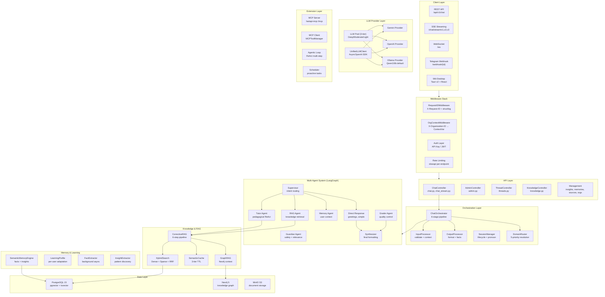
```mermaid
flowchart TB
    subgraph Clients["Client Layer"]
        REST["REST API<br/>/api/v1/chat"]
        SSE["SSE Streaming<br/>/chat/stream/v1,v2,v3"]
        WS["WebSocket<br/>/ws"]
        TG["Telegram Webhook<br/>/webhook/{id}"]
        DESK["Wiii Desktop<br/>Tauri v2 + React"]
    end

    subgraph Middleware["Middleware Stack"]
        RID["RequestIDMiddleware<br/>X-Request-ID + structlog"]
        ORG["OrgContextMiddleware<br/>X-Organization-ID → ContextVar"]
        AUTH["Auth Layer<br/>API Key / JWT"]
        RATE["Rate Limiting<br/>slowapi per-endpoint"]
    end

    subgraph API["API Layer"]
        CHAT["ChatController<br/>chat.py, chat_stream.py"]
        ADMIN["AdminController<br/>admin.py"]
        THREAD["ThreadController<br/>threads.py"]
        KNOW["KnowledgeController<br/>knowledge.py"]
        MGMT["Management<br/>insights, memories, sources, orgs"]
    end

    subgraph Core["Orchestration Layer"]
        ORCH["ChatOrchestrator<br/>6-stage pipeline"]
        INPUT["InputProcessor<br/>validate + context"]
        OUTPUT["OutputProcessor<br/>format + facts"]
        SESSION["SessionManager<br/>lifecycle + pronoun"]
        DOMAIN["DomainRouter<br/>5-priority resolution"]
    end

    subgraph Agents["Multi-Agent System (LangGraph)"]
        GUARD["Guardian Agent<br/>safety + relevance"]
        SUP["Supervisor<br/>intent routing"]
        RAG["RAG Agent<br/>knowledge retrieval"]
        TUTOR["Tutor Agent<br/>pedagogical ReAct"]
        MEM["Memory Agent<br/>user context"]
        DIRECT["Direct Response<br/>greetings, simple"]
        GRADE["Grader Agent<br/>quality control"]
        SYNTH["Synthesizer<br/>final formatting"]
    end

    subgraph Knowledge["Knowledge & RAG"]
        CRAG["CorrectiveRAG<br/>6-step pipeline"]
        HYBRID["HybridSearch<br/>Dense + Sparse + RRF"]
        CACHE["SemanticCache<br/>3-tier TTL"]
        GRAPH["GraphRAG<br/>Neo4j context"]
    end

    subgraph Memory["Memory & Learning"]
        SMEM["SemanticMemoryEngine<br/>facts + insights"]
        LPROF["LearningProfile<br/>per-user adaptation"]
        FACT["FactExtractor<br/>background async"]
        INSIGHT["InsightExtractor<br/>pattern discovery"]
    end

    subgraph LLM["LLM Provider Layer"]
        POOL["LLM Pool (3-tier)<br/>Deep/Moderate/Light"]
        UNIFIED["UnifiedLLMClient<br/>AsyncOpenAI SDK"]
        GEMINI["Gemini Provider"]
        OPENAI["OpenAI Provider"]
        OLLAMA["Ollama Provider<br/>Qwen3:8b default"]
    end

    subgraph Storage["Data Layer"]
        PG["PostgreSQL 15<br/>pgvector + tsvector"]
        NEO["Neo4j 5<br/>knowledge graph"]
        MINIO["MinIO S3<br/>document storage"]
    end

    subgraph Extensions["Extension Layer"]
        MCP_S["MCP Server<br/>fastapi-mcp /mcp"]
        MCP_C["MCP Client<br/>MCPToolManager"]
        ALOOP["Agentic Loop<br/>ReAct multi-step"]
        SCHED["Scheduler<br/>proactive tasks"]
    end

    Clients --> Middleware
    Middleware --> API
    CHAT --> ORCH
    ORCH --> INPUT
    ORCH --> DOMAIN
    ORCH --> Agents
    ORCH --> OUTPUT

    SUP --> RAG & TUTOR & MEM & DIRECT
    RAG --> CRAG
    TUTOR --> CRAG
    CRAG --> HYBRID & CACHE & GRAPH
    HYBRID --> PG

    GRADE --> SYNTH
    DIRECT --> SYNTH

    SMEM --> PG
    GRAPH --> NEO

    POOL --> GEMINI & OPENAI & OLLAMA
    UNIFIED --> GEMINI & OPENAI & OLLAMA
```

---

## 2. Multi-Channel Entry Points

All channels converge to `ChatOrchestrator.process()` via `ChannelMessage.to_chat_request()`.

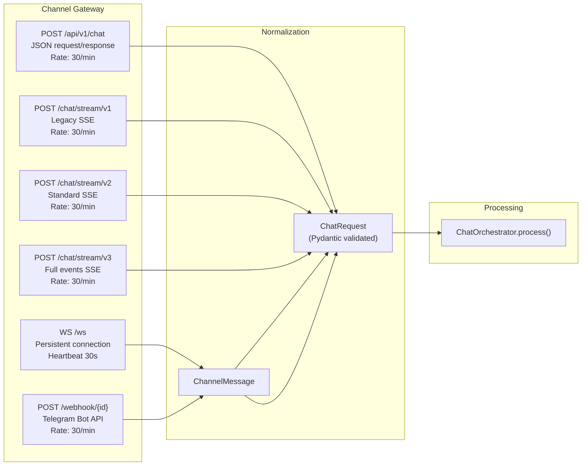
```mermaid
flowchart LR
    subgraph Channels["Channel Gateway"]
        REST["POST /api/v1/chat<br/>JSON request/response<br/>Rate: 30/min"]
        SSE1["POST /chat/stream/v1<br/>Legacy SSE<br/>Rate: 30/min"]
        SSE2["POST /chat/stream/v2<br/>Standard SSE<br/>Rate: 30/min"]
        SSE3["POST /chat/stream/v3<br/>Full events SSE<br/>Rate: 30/min"]
        WS["WS /ws<br/>Persistent connection<br/>Heartbeat 30s"]
        TG["POST /webhook/{id}<br/>Telegram Bot API<br/>Rate: 30/min"]
    end

    subgraph Normalize["Normalization"]
        CM["ChannelMessage"]
        CR["ChatRequest<br/>(Pydantic validated)"]
    end

    subgraph Process["Processing"]
        ORCH["ChatOrchestrator.process()"]
    end

    REST --> CR
    SSE1 & SSE2 & SSE3 --> CR
    WS --> CM --> CR
    TG --> CM --> CR
    CR --> ORCH
```

**SSE V3 Event Types** (Desktop uses V3):
| Event | Source | Content |
|-------|--------|---------|
| `status` | Supervisor routing, Grader scores, pipeline steps | Pipeline progress |
| `thinking` | AI reasoning from agent nodes | Raw AI thinking |
| `thinking_start` | Node entry (Guardian, RAG, Tutor, etc.) | Vietnamese node label |
| `thinking_end` | Node exit | Duration in ms |
| `answer` | Synthesizer output, RAG partial | Response tokens |
| `tool_call` | Tutor/RAG ReAct loop | Tool name + args |
| `tool_result` | Tool execution result | Result data |
| `done` | Stream complete | Sources, metadata |
| `error` | Any stage failure | Error message |

---

## 3. Middleware & Auth Stack

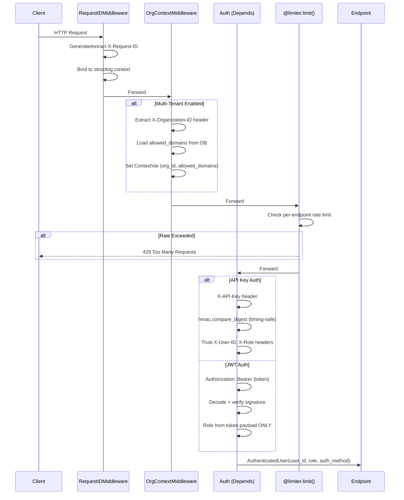
```mermaid
sequenceDiagram
    participant C as Client
    participant RID as RequestIDMiddleware
    participant ORG as OrgContextMiddleware
    participant AUTH as Auth (Depends)
    participant RATE as @limiter.limit()
    participant EP as Endpoint

    C->>RID: HTTP Request
    RID->>RID: Generate/extract X-Request-ID
    RID->>RID: Bind to structlog context
    RID->>ORG: Forward

    alt Multi-Tenant Enabled
        ORG->>ORG: Extract X-Organization-ID header
        ORG->>ORG: Load allowed_domains from DB
        ORG->>ORG: Set ContextVar (org_id, allowed_domains)
    end
    ORG->>RATE: Forward

    RATE->>RATE: Check per-endpoint rate limit
    alt Rate Exceeded
        RATE-->>C: 429 Too Many Requests
    end

    RATE->>AUTH: Forward
    alt API Key Auth
        AUTH->>AUTH: X-API-Key header
        AUTH->>AUTH: hmac.compare_digest (timing-safe)
        AUTH->>AUTH: Trust X-User-ID, X-Role headers
    else JWT Auth
        AUTH->>AUTH: Authorization: Bearer {token}
        AUTH->>AUTH: Decode + verify signature
        AUTH->>AUTH: Role from token payload ONLY
    end

    AUTH->>EP: AuthenticatedUser(user_id, role, auth_method)
```

**Rate Limits by Endpoint Category:**
| Category | Rate | Endpoints |
|----------|------|-----------|
| Chat | 30/min | `/chat`, `/chat/stream/*` |
| Read | 60/min | `/threads`, `/insights/*`, `/memories/*`, `/sources/*`, `/stats` |
| Write/Delete | 30/min | `DELETE /threads/*`, `DELETE /memories/*`, `PATCH /threads/*` |
| Admin | 10-60/min | `/admin/*` (ingest=10, stats=60) |
| Organizations | 10-30/min | `/organizations/*` |
| Health | No limit | `/health`, `/health/db`, `/health/ollama` |

---

## 4. ChatOrchestrator Pipeline (6 Stages)

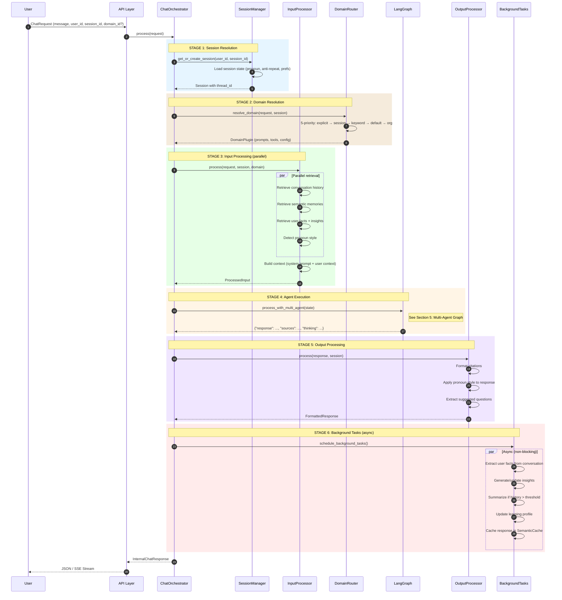
```mermaid
sequenceDiagram
    autonumber
    participant U as User
    participant API as API Layer
    participant O as ChatOrchestrator
    participant S as SessionManager
    participant I as InputProcessor
    participant DR as DomainRouter
    participant G as LangGraph
    participant OP as OutputProcessor
    participant BG as BackgroundTasks

    U->>API: ChatRequest (message, user_id, session_id, domain_id?)
    API->>O: process(request)

    rect rgb(230, 245, 255)
        Note over O,S: STAGE 1: Session Resolution
        O->>S: get_or_create_session(user_id, session_id)
        S->>S: Load session state (pronoun, anti-repeat, prefs)
        S-->>O: Session with thread_id
    end

    rect rgb(245, 235, 220)
        Note over O,DR: STAGE 2: Domain Resolution
        O->>DR: resolve_domain(request, session)
        DR->>DR: 5-priority: explicit → session → keyword → default → org
        DR-->>O: DomainPlugin (prompts, tools, config)
    end

    rect rgb(230, 255, 230)
        Note over O,I: STAGE 3: Input Processing (parallel)
        O->>I: process(request, session, domain)
        par Parallel retrieval
            I->>I: Retrieve conversation history
            I->>I: Retrieve semantic memories
            I->>I: Retrieve user facts + insights
            I->>I: Detect pronoun style
        end
        I->>I: Build context (system prompt + user context)
        I-->>O: ProcessedInput
    end

    rect rgb(255, 245, 230)
        Note over O,G: STAGE 4: Agent Execution
        O->>G: process_with_multi_agent(state)
        Note right of G: See Section 5: Multi-Agent Graph
        G-->>O: {"response": ..., "sources": ..., "thinking": ...}
    end

    rect rgb(240, 230, 255)
        Note over O,OP: STAGE 5: Output Processing
        O->>OP: process(response, session)
        OP->>OP: Format citations
        OP->>OP: Apply pronoun style to response
        OP->>OP: Extract suggested questions
        OP-->>O: FormattedResponse
    end

    rect rgb(255, 235, 235)
        Note over O,BG: STAGE 6: Background Tasks (async)
        O->>BG: schedule_background_tasks()
        par Async (non-blocking)
            BG->>BG: Extract user facts from conversation
            BG->>BG: Generate/update insights
            BG->>BG: Summarize if history > threshold
            BG->>BG: Update learning profile
            BG->>BG: Cache response in SemanticCache
        end
    end

    O-->>API: InternalChatResponse
    API-->>U: JSON / SSE Stream
```

---

## 5. Multi-Agent Graph (LangGraph)

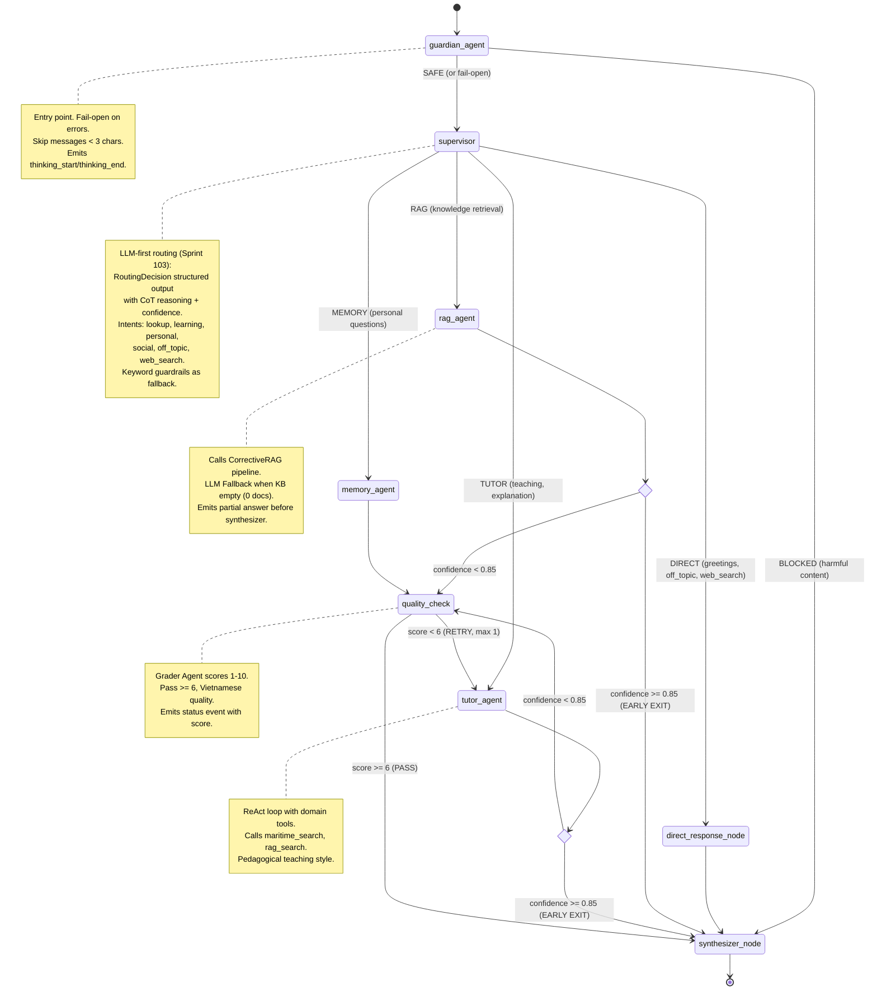
```mermaid
stateDiagram-v2
    [*] --> guardian_agent

    guardian_agent --> supervisor: SAFE (or fail-open)
    guardian_agent --> synthesizer_node: BLOCKED (harmful content)

    supervisor --> direct_response_node: DIRECT (greetings, off_topic, web_search)
    supervisor --> memory_agent: MEMORY (personal questions)
    supervisor --> tutor_agent: TUTOR (teaching, explanation)
    supervisor --> rag_agent: RAG (knowledge retrieval)

    direct_response_node --> synthesizer_node

    state rag_check <<choice>>
    rag_agent --> rag_check
    rag_check --> synthesizer_node: confidence >= 0.85 (EARLY EXIT)
    rag_check --> quality_check: confidence < 0.85

    state tutor_check <<choice>>
    tutor_agent --> tutor_check
    tutor_check --> synthesizer_node: confidence >= 0.85 (EARLY EXIT)
    tutor_check --> quality_check: confidence < 0.85

    memory_agent --> quality_check

    quality_check --> synthesizer_node: score >= 6 (PASS)
    quality_check --> tutor_agent: score < 6 (RETRY, max 1)

    synthesizer_node --> [*]

    note right of guardian_agent
        Entry point. Fail-open on errors.
        Skip messages < 3 chars.
        Emits thinking_start/thinking_end.
    end note

    note right of supervisor
        LLM-first routing (Sprint 103):
        RoutingDecision structured output
        with CoT reasoning + confidence.
        Intents: lookup, learning, personal,
        social, off_topic, web_search.
        Keyword guardrails as fallback.
    end note

    note right of rag_agent
        Calls CorrectiveRAG pipeline.
        LLM Fallback when KB empty (0 docs).
        Emits partial answer before synthesizer.
    end note

    note right of tutor_agent
        ReAct loop with domain tools.
        Calls maritime_search, rag_search.
        Pedagogical teaching style.
    end note

    note right of quality_check
        Grader Agent scores 1-10.
        Pass >= 6, Vietnamese quality.
        Emits status event with score.
    end note
```

**Agent State** (`AgentState` TypedDict):
| Field | Type | Purpose |
|-------|------|---------|
| `messages` | `list[BaseMessage]` | LangGraph message history |
| `query` | `str` | Original user query |
| `context` | `str` | Built context from InputProcessor |
| `domain_id` | `str` | Resolved domain plugin ID |
| `thinking` | `str` | Accumulated AI reasoning |
| `agent_outputs` | `dict` | Per-agent output storage |
| `tool_call_events` | `list` | Tool events for streaming |
| `confidence` | `float` | 0-1 confidence score |
| `sources` | `list[Citation]` | Retrieved sources |
| `next_agent` | `str` | Supervisor routing decision |
| `retry_count` | `int` | Grader retry counter (max 1) |

---

## 6. Domain Plugin System

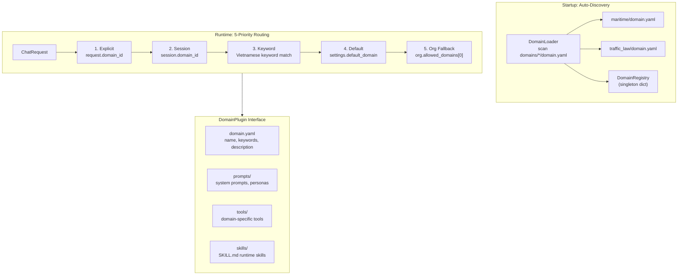
```mermaid
flowchart TB
    subgraph Discovery["Startup: Auto-Discovery"]
        LOADER["DomainLoader<br/>scan domains/*/domain.yaml"]
        LOADER --> M_YAML["maritime/domain.yaml"]
        LOADER --> T_YAML["traffic_law/domain.yaml"]
        LOADER --> REG["DomainRegistry<br/>(singleton dict)"]
    end

    subgraph Resolution["Runtime: 5-Priority Routing"]
        REQ["ChatRequest"] --> P1
        P1["1. Explicit<br/>request.domain_id"] --> P2
        P2["2. Session<br/>session.domain_id"] --> P3
        P3["3. Keyword<br/>Vietnamese keyword match"] --> P4
        P4["4. Default<br/>settings.default_domain"] --> P5
        P5["5. Org Fallback<br/>org.allowed_domains[0]"]
    end

    subgraph Plugin["DomainPlugin Interface"]
        YAML["domain.yaml<br/>name, keywords, description"]
        PROMPTS["prompts/<br/>system prompts, personas"]
        TOOLS["tools/<br/>domain-specific tools"]
        SKILLS["skills/<br/>SKILL.md runtime skills"]
    end

    Resolution --> Plugin
```

**Domain YAML Example** (`maritime/domain.yaml`):
```yaml
id: maritime
name: "Hàng hải"
description: "Luật hàng hải quốc tế"
keywords: ["colreg", "solas", "marpol", "hàng hải", "tàu"]
default_tools: ["maritime_search", "rag_search"]
```

**Plugin Discovery Flow:**
1. `DomainLoader.load_all()` at startup scans `app/domains/*/domain.yaml`
2. Each YAML creates a `YamlDomainPlugin` instance
3. Registered in `DomainRegistry` singleton (thread-safe, startup-only writes)
4. `DomainRouter.resolve()` called per-request with org-aware filtering
5. Skills loaded from both plugin dir and `{workspace_root}/skills/{domain_id}/`

---

## 7. Corrective RAG Pipeline

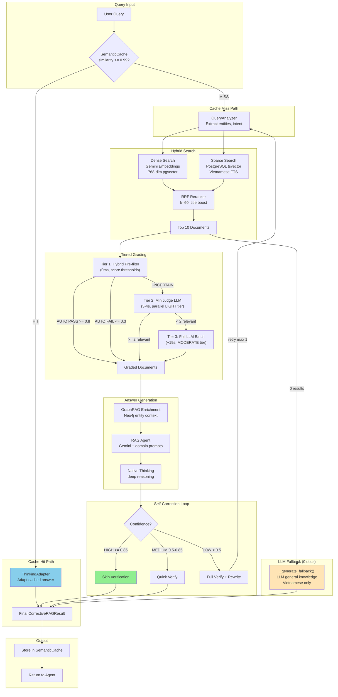
```mermaid
flowchart TB
    subgraph Input["Query Input"]
        Q["User Query"] --> CACHE{"SemanticCache<br/>similarity >= 0.99?"}
    end

    subgraph CacheHit["Cache Hit Path"]
        CACHE -->|HIT| ADAPT["ThinkingAdapter<br/>Adapt cached answer"]
        ADAPT --> RESULT
    end

    subgraph CacheMiss["Cache Miss Path"]
        CACHE -->|MISS| ANALYZE["QueryAnalyzer<br/>Extract entities, intent"]
    end

    subgraph Retrieval["Hybrid Search"]
        ANALYZE --> DENSE["Dense Search<br/>Gemini Embeddings<br/>768-dim pgvector"]
        ANALYZE --> SPARSE["Sparse Search<br/>PostgreSQL tsvector<br/>Vietnamese FTS"]
        DENSE --> RRF["RRF Reranker<br/>k=60, title boost"]
        SPARSE --> RRF
        RRF --> DOCS["Top 10 Documents"]
    end

    subgraph Grading["Tiered Grading"]
        DOCS --> T1["Tier 1: Hybrid Pre-filter<br/>(0ms, score thresholds)"]
        T1 -->|AUTO PASS >= 0.8| GRADED
        T1 -->|AUTO FAIL <= 0.3| GRADED
        T1 -->|UNCERTAIN| T2["Tier 2: MiniJudge LLM<br/>(3-4s, parallel LIGHT tier)"]
        T2 -->|>= 2 relevant| GRADED["Graded Documents"]
        T2 -->|< 2 relevant| T3["Tier 3: Full LLM Batch<br/>(~19s, MODERATE tier)"]
        T3 --> GRADED
    end

    subgraph Generation["Answer Generation"]
        GRADED --> GRAPHRAG["GraphRAG Enrichment<br/>Neo4j entity context"]
        GRAPHRAG --> GEN["RAG Agent<br/>Gemini + domain prompts"]
        GEN --> THINKING["Native Thinking<br/>deep reasoning"]
    end

    subgraph Verification["Self-Correction Loop"]
        THINKING --> CONF{"Confidence?"}
        CONF -->|HIGH >= 0.85| SKIP["Skip Verification"]
        CONF -->|MEDIUM 0.5-0.85| QUICK["Quick Verify"]
        CONF -->|LOW < 0.5| FULL["Full Verify + Rewrite"]
        FULL -->|retry max 1| ANALYZE
        SKIP & QUICK --> RESULT
    end

    subgraph Fallback["LLM Fallback (0 docs)"]
        DOCS -->|0 results| FB["_generate_fallback()<br/>LLM general knowledge<br/>Vietnamese only"]
        FB --> RESULT["Final CorrectiveRAGResult"]
    end

    subgraph Output["Output"]
        RESULT --> STORE["Store in SemanticCache"]
        STORE --> RETURN["Return to Agent"]
    end

    style ADAPT fill:#87CEEB
    style SKIP fill:#90EE90
    style FB fill:#FFE4B5
```

**SemanticCache 3-Tier TTL:**
| Confidence | TTL | Purpose |
|------------|-----|---------|
| >= 0.90 | 4 hours | High-quality answers |
| >= 0.70 | 2 hours | Standard answers |
| < 0.70 | 30 minutes | Low-confidence, refresh soon |

---

## 8. Streaming Architecture (SSE V3)

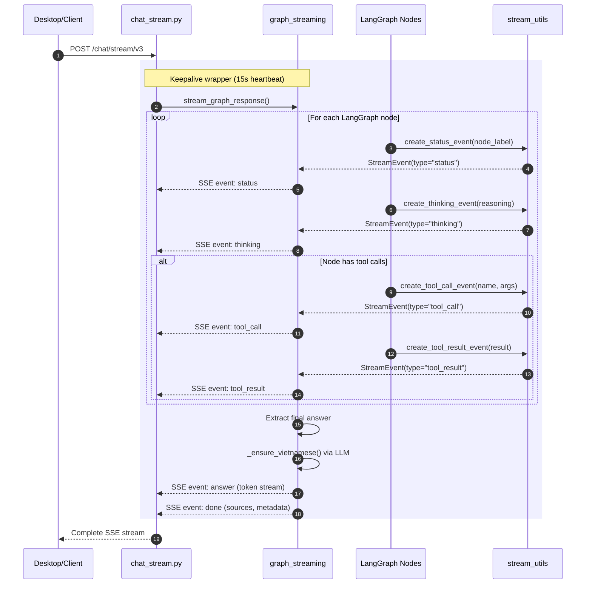
```mermaid
sequenceDiagram
    autonumber
    participant C as Desktop/Client
    participant API as chat_stream.py
    participant GS as graph_streaming
    participant G as LangGraph Nodes
    participant S as stream_utils

    C->>API: POST /chat/stream/v3

    rect rgb(240, 240, 255)
        Note over API,GS: Keepalive wrapper (15s heartbeat)
        API->>GS: stream_graph_response()

        loop For each LangGraph node
            G->>S: create_status_event(node_label)
            S-->>GS: StreamEvent(type="status")
            GS-->>API: SSE event: status

            G->>S: create_thinking_event(reasoning)
            S-->>GS: StreamEvent(type="thinking")
            GS-->>API: SSE event: thinking

            alt Node has tool calls
                G->>S: create_tool_call_event(name, args)
                S-->>GS: StreamEvent(type="tool_call")
                GS-->>API: SSE event: tool_call

                G->>S: create_tool_result_event(result)
                S-->>GS: StreamEvent(type="tool_result")
                GS-->>API: SSE event: tool_result
            end
        end

        GS->>GS: Extract final answer
        GS->>GS: _ensure_vietnamese() via LLM
        GS-->>API: SSE event: answer (token stream)
        GS-->>API: SSE event: done (sources, metadata)
    end

    API-->>C: Complete SSE stream
```

**Thinking Lifecycle Events (Sprint 64):**
```
thinking_start {label: "Kiểm tra an toàn"}     ← Guardian entry
thinking_end   {duration_ms: 150}               ← Guardian exit
thinking_start {label: "Phân tích câu hỏi"}    ← Supervisor entry
status         {content: "Routing to RAG"}      ← Routing decision
thinking_end   {duration_ms: 2000}              ← Supervisor exit
thinking_start {label: "Tìm kiếm kiến thức"}   ← RAG Agent entry
thinking       {content: "AI reasoning..."}     ← RAG thinking
thinking_end   {duration_ms: 5000}              ← RAG exit
answer         {content: "partial answer"}      ← RAG partial (if available)
thinking_start {label: "Tổng hợp câu trả lời"} ← Synthesizer entry
answer         {content: "final tokens..."}     ← Streamed answer
thinking_end   {duration_ms: 3000}              ← Synthesizer exit
done           {sources: [...]}                 ← Complete
```

**Node Label Mapping** (`_NODE_LABELS`):
| Node Name | Vietnamese Label |
|-----------|-----------------|
| `guardian_agent` | Kiem tra an toan |
| `supervisor` | Phan tich cau hoi |
| `rag_agent` | Tim kiem kien thuc |
| `tutor_agent` | Giang day |
| `memory_agent` | Truy xuat bo nho |
| `quality_check` | Kiem tra chat luong |
| `synthesizer_node` | Tong hop cau tra loi |
| `direct_response_node` | Tra loi truc tiep |

---

## 9. Memory & Personalization Flow

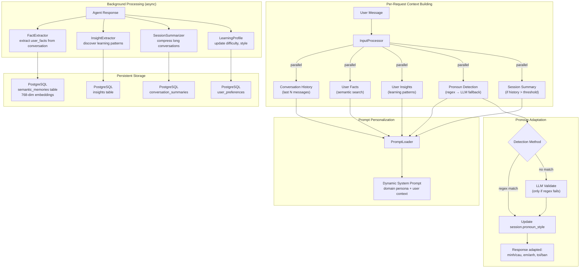
```mermaid
flowchart TB
    subgraph Input["Per-Request Context Building"]
        MSG["User Message"] --> IP["InputProcessor"]
        IP --> |parallel| HIST["Conversation History<br/>(last N messages)"]
        IP --> |parallel| FACTS["User Facts<br/>(semantic search)"]
        IP --> |parallel| INS["User Insights<br/>(learning patterns)"]
        IP --> |parallel| PRON["Pronoun Detection<br/>(regex → LLM fallback)"]
        IP --> |parallel| SUMM["Session Summary<br/>(if history > threshold)"]
    end

    subgraph Personalize["Prompt Personalization"]
        HIST & FACTS & INS & PRON & SUMM --> PL["PromptLoader"]
        PL --> SP["Dynamic System Prompt<br/>domain persona + user context"]
    end

    subgraph Background["Background Processing (async)"]
        RESP["Agent Response"] --> FE["FactExtractor<br/>extract user_facts from conversation"]
        RESP --> IE["InsightExtractor<br/>discover learning patterns"]
        RESP --> SS["SessionSummarizer<br/>compress long conversations"]
        RESP --> LP["LearningProfile<br/>update difficulty, style"]
    end

    subgraph Storage["Persistent Storage"]
        FE --> PG_MEM["PostgreSQL<br/>semantic_memories table<br/>768-dim embeddings"]
        IE --> PG_INS["PostgreSQL<br/>insights table"]
        SS --> PG_SUM["PostgreSQL<br/>conversation_summaries"]
        LP --> PG_PREF["PostgreSQL<br/>user_preferences"]
    end

    subgraph Pronoun["Pronoun Adaptation"]
        PRON --> DETECT{"Detection Method"}
        DETECT -->|regex match| STYLE["Update session.pronoun_style"]
        DETECT -->|no match| LLM_V["LLM Validate<br/>(only if regex fails)"]
        LLM_V --> STYLE
        STYLE --> ADAPT["Response adapted:<br/>minh/cau, em/anh, toi/ban"]
    end
```

**Memory Types in `semantic_memories` table:**
| Type | Source | Usage |
|------|--------|-------|
| `user_fact` | FactExtractor (background) | User preferences, stated info |
| `insight` | InsightExtractor (background) | Learning patterns, strengths/weaknesses |
| `conversation_summary` | SessionSummarizer (background) | Compressed history for context window |
| `preference` | User settings API | Explicit user preferences |

---

## 10. LLM Provider Architecture

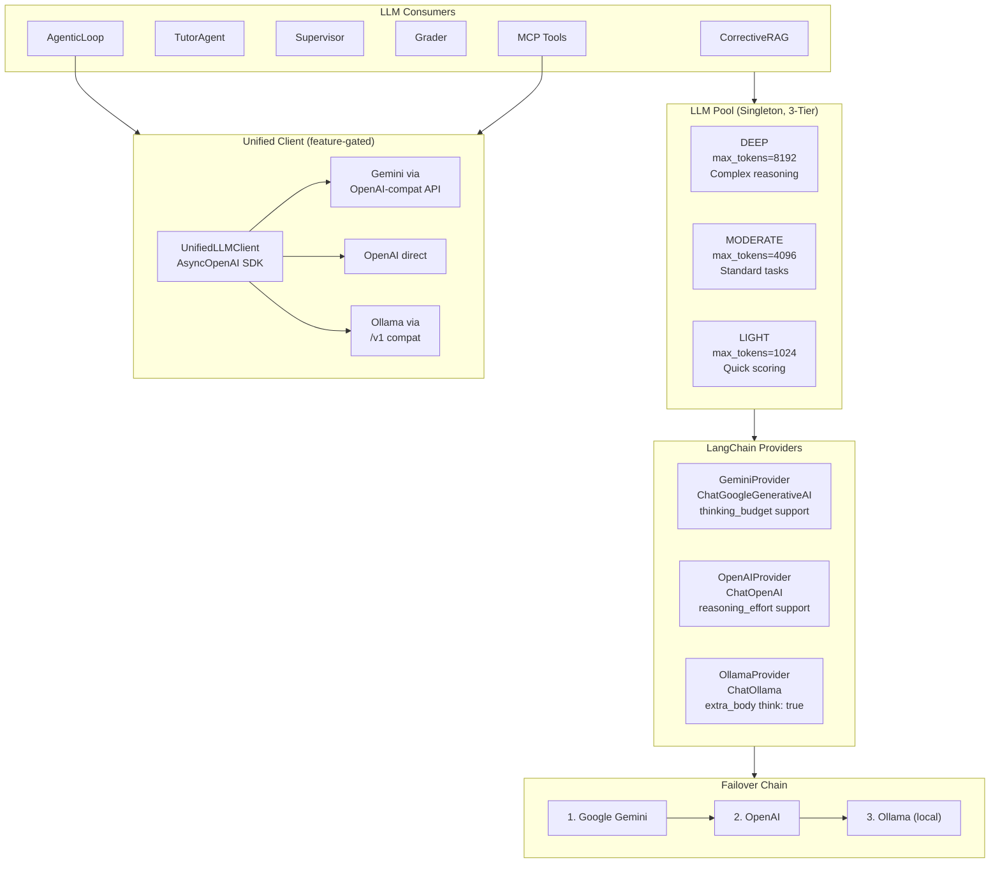
```mermaid
flowchart TB
    subgraph Consumers["LLM Consumers"]
        CRAG_C["CorrectiveRAG"]
        TUTOR_C["TutorAgent"]
        SUPER_C["Supervisor"]
        GRADE_C["Grader"]
        LOOP_C["AgenticLoop"]
        MCP_C["MCP Tools"]
    end

    subgraph Pool["LLM Pool (Singleton, 3-Tier)"]
        DEEP["DEEP<br/>max_tokens=8192<br/>Complex reasoning"]
        MOD["MODERATE<br/>max_tokens=4096<br/>Standard tasks"]
        LIGHT["LIGHT<br/>max_tokens=1024<br/>Quick scoring"]
    end

    subgraph LangChain["LangChain Providers"]
        GEM_LC["GeminiProvider<br/>ChatGoogleGenerativeAI<br/>thinking_budget support"]
        OAI_LC["OpenAIProvider<br/>ChatOpenAI<br/>reasoning_effort support"]
        OLL_LC["OllamaProvider<br/>ChatOllama<br/>extra_body think: true"]
    end

    subgraph Unified["Unified Client (feature-gated)"]
        UC["UnifiedLLMClient<br/>AsyncOpenAI SDK"]
        UC --> GEM_OAI["Gemini via<br/>OpenAI-compat API"]
        UC --> OAI_OAI["OpenAI direct"]
        UC --> OLL_OAI["Ollama via<br/>/v1 compat"]
    end

    subgraph Failover["Failover Chain"]
        F1["1. Google Gemini"] --> F2["2. OpenAI"]
        F2 --> F3["3. Ollama (local)"]
    end

    Consumers --> Pool
    Pool --> LangChain
    LOOP_C --> Unified
    MCP_C --> Unified
    LangChain --> Failover
```

**Provider Configuration:**
| Provider | Default Model (Deep) | Thinking Support | Endpoint |
|----------|---------------------|------------------|----------|
| Gemini | `gemini-2.0-flash` | `thinking_budget` | Vertex AI / OpenAI-compat |
| OpenAI | `gpt-4o` | `reasoning_effort` | api.openai.com |
| Ollama | `qwen3:8b` | `extra_body: {think: true}` | localhost:11434 |

**Thinking-Capable Ollama Models:**
- `qwen3` (any size: 0.6b, 1.7b, 4b, 8b, 14b, 30b, 32b)
- `deepseek-r1` (any size)
- `qwq` (any size)

---

## 11. MCP Integration

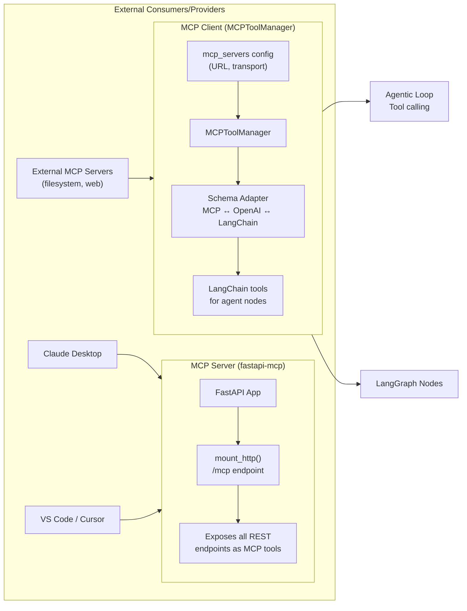
```mermaid
flowchart LR
    subgraph Server["MCP Server (fastapi-mcp)"]
        FAPI["FastAPI App"] --> MOUNT["mount_http()<br/>/mcp endpoint"]
        MOUNT --> EXPOSE["Exposes all REST<br/>endpoints as MCP tools"]
    end

    subgraph Client["MCP Client (MCPToolManager)"]
        CONFIG["mcp_servers config<br/>(URL, transport)"] --> MGR["MCPToolManager"]
        MGR --> ADAPT["Schema Adapter<br/>MCP ↔ OpenAI ↔ LangChain"]
        ADAPT --> TOOLS["LangChain tools<br/>for agent nodes"]
    end

    subgraph External["External Consumers/Providers"]
        CLAUDE["Claude Desktop"] --> Server
        VSCODE["VS Code / Cursor"] --> Server
        EXT_MCP["External MCP Servers<br/>(filesystem, web)"] --> Client
    end

    Client --> ALOOP["Agentic Loop<br/>Tool calling"]
    Client --> GRAPH["LangGraph Nodes"]
```

**MCP Transport:** Streamable HTTP (2026 standard). SSE transport deprecated.

**Feature Flags:**
- `enable_mcp_server=False` — Expose Wiii tools via MCP at `/mcp`
- `enable_mcp_client=False` — Connect to external MCP servers

---

## 12. Proactive Agent System

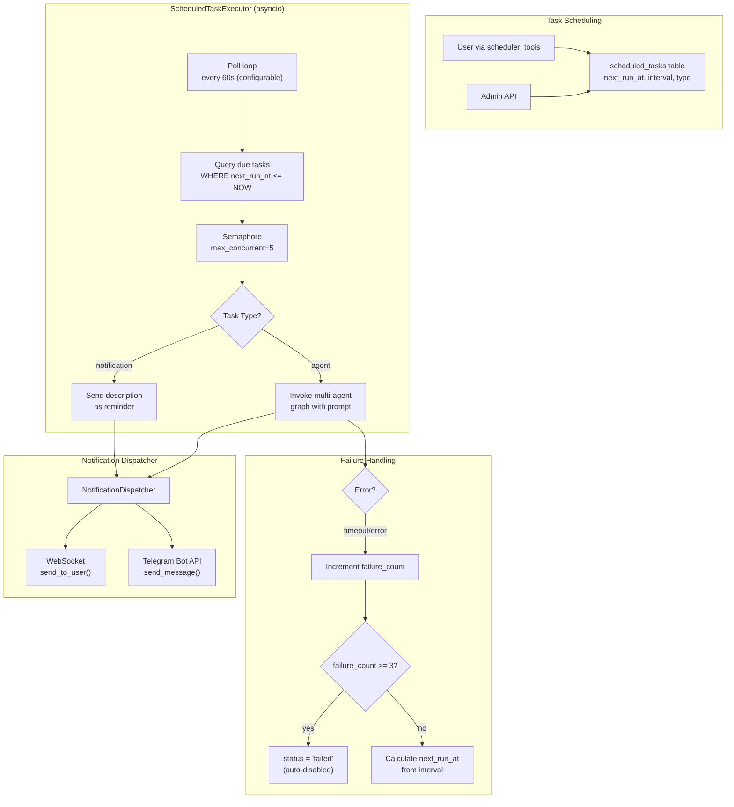
```mermaid
flowchart TB
    subgraph Schedule["Task Scheduling"]
        USER["User via scheduler_tools"] --> DB["scheduled_tasks table<br/>next_run_at, interval, type"]
        ADMIN["Admin API"] --> DB
    end

    subgraph Executor["ScheduledTaskExecutor (asyncio)"]
        POLL["Poll loop<br/>every 60s (configurable)"] --> QUERY["Query due tasks<br/>WHERE next_run_at <= NOW"]
        QUERY --> SEM["Semaphore<br/>max_concurrent=5"]

        SEM --> TYPE{"Task Type?"}
        TYPE -->|notification| NOTIFY["Send description<br/>as reminder"]
        TYPE -->|agent| INVOKE["Invoke multi-agent<br/>graph with prompt"]
    end

    subgraph Dispatch["Notification Dispatcher"]
        NOTIFY & INVOKE --> DISP["NotificationDispatcher"]
        DISP --> WS_OUT["WebSocket<br/>send_to_user()"]
        DISP --> TG_OUT["Telegram Bot API<br/>send_message()"]
    end

    subgraph Failure["Failure Handling"]
        INVOKE --> FAIL{"Error?"}
        FAIL -->|timeout/error| COUNT["Increment failure_count"]
        COUNT --> CHECK{"failure_count >= 3?"}
        CHECK -->|yes| DISABLE["status = 'failed'<br/>(auto-disabled)"]
        CHECK -->|no| NEXT["Calculate next_run_at<br/>from interval"]
    end
```

**Scheduler Configuration:**
| Setting | Default | Range | Description |
|---------|---------|-------|-------------|
| `enable_scheduler` | `false` | - | Feature gate |
| `scheduler_poll_interval` | 60s | 10-3600s | DB poll frequency |
| `scheduler_max_concurrent` | 5 | 1-20 | Max parallel executions |
| `scheduler_agent_timeout` | 120s | - | Per-task timeout |

---

## 13. Multi-Tenant Architecture

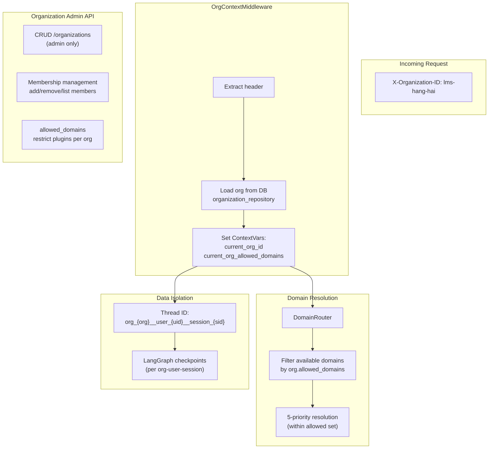
```mermaid
flowchart TB
    subgraph Request["Incoming Request"]
        HDR["X-Organization-ID: lms-hang-hai"]
    end

    subgraph Middleware["OrgContextMiddleware"]
        EXTRACT["Extract header"] --> LOAD["Load org from DB<br/>organization_repository"]
        LOAD --> SET["Set ContextVars:<br/>current_org_id<br/>current_org_allowed_domains"]
    end

    subgraph Routing["Domain Resolution"]
        SET --> ROUTER["DomainRouter"]
        ROUTER --> FILTER["Filter available domains<br/>by org.allowed_domains"]
        FILTER --> RESOLVE["5-priority resolution<br/>(within allowed set)"]
    end

    subgraph Isolation["Data Isolation"]
        SET --> THREAD["Thread ID:<br/>org_{org}__user_{uid}__session_{sid}"]
        THREAD --> CHECKPOINT["LangGraph checkpoints<br/>(per org-user-session)"]
    end

    subgraph Admin["Organization Admin API"]
        CRUD["CRUD /organizations<br/>(admin only)"]
        MEMBERS["Membership management<br/>add/remove/list members"]
        DOMAINS["allowed_domains<br/>restrict plugins per org"]
    end
```

**Feature-Gated:** `enable_multi_tenant=False` by default. When disabled, no ContextVar is set and all domains are available.

---

## 14. Desktop Application Flow

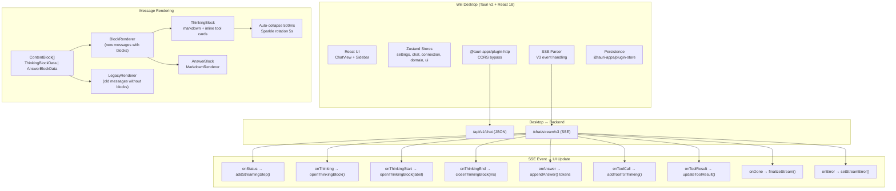
```mermaid
flowchart TB
    subgraph Desktop["Wiii Desktop (Tauri v2 + React 18)"]
        UI["React UI<br/>ChatView + Sidebar"]
        STORES["Zustand Stores<br/>settings, chat, connection, domain, ui"]
        HTTP["@tauri-apps/plugin-http<br/>CORS bypass"]
        SSE_P["SSE Parser<br/>V3 event handling"]
        PERSIST["Persistence<br/>@tauri-apps/plugin-store"]
    end

    subgraph Communication["Desktop ↔ Backend"]
        HTTP --> REST_C["/api/v1/chat (JSON)"]
        SSE_P --> SSE_C["/chat/stream/v3 (SSE)"]
    end

    subgraph Events["SSE Event → UI Update"]
        SSE_C --> ON_S["onStatus → addStreamingStep()"]
        SSE_C --> ON_T["onThinking → openThinkingBlock()"]
        SSE_C --> ON_TS["onThinkingStart → openThinkingBlock(label)"]
        SSE_C --> ON_TE["onThinkingEnd → closeThinkingBlock(ms)"]
        SSE_C --> ON_A["onAnswer → appendAnswer() tokens"]
        SSE_C --> ON_TC["onToolCall → addToolToThinking()"]
        SSE_C --> ON_TR["onToolResult → updateToolResult()"]
        SSE_C --> ON_D["onDone → finalizeStream()"]
        SSE_C --> ON_E["onError → setStreamError()"]
    end

    subgraph Rendering["Message Rendering"]
        BLOCKS["ContentBlock[]<br/>ThinkingBlockData | AnswerBlockData"]
        BLOCKS --> BR["BlockRenderer<br/>(new messages with blocks)"]
        BLOCKS --> LR["LegacyRenderer<br/>(old messages without blocks)"]
        BR --> TB["ThinkingBlock<br/>markdown + inline tool cards"]
        BR --> AB["AnswerBlock<br/>MarkdownRenderer"]
        TB --> COLLAPSE["Auto-collapse 500ms<br/>Sparkle rotation 5s"]
    end
```

**Desktop Store Persistence:**
| Store | Storage | Events |
|-------|---------|--------|
| `settings-store` | `@tauri-apps/plugin-store` | Save on change |
| `chat-store` | `@tauri-apps/plugin-store` | Immediate: create/delete/rename/finalize. Debounced 2s: addUserMessage |

---

## 15. Application Startup Sequence

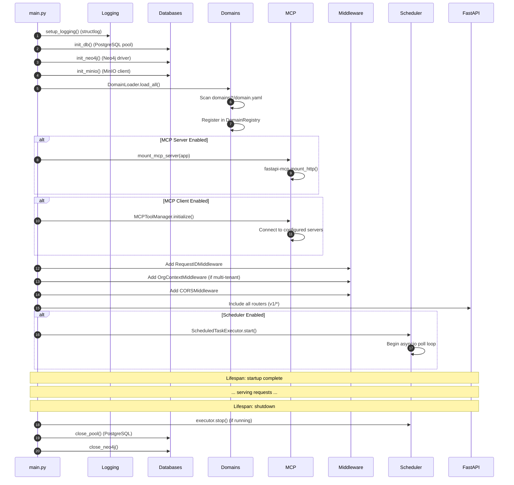
```mermaid
sequenceDiagram
    autonumber
    participant M as main.py
    participant LOG as Logging
    participant DB as Databases
    participant DOM as Domains
    participant MCP as MCP
    participant MW as Middleware
    participant SCHED as Scheduler
    participant APP as FastAPI

    M->>LOG: setup_logging() (structlog)
    M->>DB: init_db() (PostgreSQL pool)
    M->>DB: init_neo4j() (Neo4j driver)
    M->>DB: init_minio() (MinIO client)
    M->>DOM: DomainLoader.load_all()
    DOM->>DOM: Scan domains/*/domain.yaml
    DOM->>DOM: Register in DomainRegistry

    alt MCP Server Enabled
        M->>MCP: mount_mcp_server(app)
        MCP->>MCP: fastapi-mcp mount_http()
    end

    alt MCP Client Enabled
        M->>MCP: MCPToolManager.initialize()
        MCP->>MCP: Connect to configured servers
    end

    M->>MW: Add RequestIDMiddleware
    M->>MW: Add OrgContextMiddleware (if multi-tenant)
    M->>MW: Add CORSMiddleware
    M->>APP: Include all routers (v1/*)

    alt Scheduler Enabled
        M->>SCHED: ScheduledTaskExecutor.start()
        SCHED->>SCHED: Begin asyncio poll loop
    end

    Note over M,APP: Lifespan: startup complete

    Note over M,APP: ... serving requests ...

    Note over M,APP: Lifespan: shutdown
    M->>SCHED: executor.stop() (if running)
    M->>DB: close_pool() (PostgreSQL)
    M->>DB: close_neo4j()
```

---

## 16. Component Status (Feb 2026, Post-Sprint 124)

| Component | Status | Notes |
|-----------|--------|-------|
| ChatOrchestrator | Active | 6-stage pipeline, pronoun dedup fix |
| InputProcessor | Active | Parallel memory/history retrieval |
| DomainRouter | Active | 5-priority with org-aware filtering |
| Supervisor | Active | **LLM-first routing** (Sprint 103): `RoutingDecision` structured output, keyword guardrails as fallback |
| Guardian Agent | Active | Fail-open, content safety, structured outputs |
| RAG Agent | Active | CorrectiveRAG + LLM fallback |
| Tutor Agent | Active | ReAct with domain tools |
| Memory Agent | Active | Semantic memory retrieval |
| Direct Response | Active | 8 tools (character, datetime, 4x web search) |
| Grader Agent | Active | Score 1-10, early exit at >= 0.85, structured outputs |
| Synthesizer | Active | Vietnamese formatting, thinking extraction |
| CorrectiveRAG | Active | 6-step with tiered grading |
| SemanticCache | Active | 3-tier TTL, asyncio.Lock protected |
| HybridSearch | Active | Dense + Sparse + RRF |
| GraphRAG | Active | Neo4j entity enrichment |
| Character System | Active | Living character card, reflection loop, 3 LangChain tools |
| Structured Outputs | Active | `enable_structured_outputs=True` (Sprint 103 default) |
| Domain Plugins | Active | maritime, traffic_law |
| Multi-Tenant | Gated | `enable_multi_tenant=False` default |
| MCP Server | Gated | `enable_mcp_server=False` default |
| MCP Client | Gated | `enable_mcp_client=False` default |
| Unified Client | Gated | `enable_unified_client=False` default |
| Agentic Loop | Gated | `enable_agentic_loop=False` default |
| Scheduler | Gated | `enable_scheduler=False` default |
| WebSocket | Gated | `enable_websocket=False` default |
| Telegram | Gated | `enable_telegram=False` default |
| SSE V3 Streaming | Active | Full event lifecycle |
| Rate Limiting | Active | All endpoints, per-category limits |
| Auth (API Key + JWT) | Active | Timing-safe, ownership checks |
| Desktop App | Active | Tauri v2, 190 tests passing |

---

## 17. Key Files Reference

| Layer | File | Purpose |
|-------|------|---------|
| **API** | `app/api/v1/chat.py` | REST chat endpoint |
| **API** | `app/api/v1/chat_stream.py` | SSE V1/V2/V3 streaming |
| **API** | `app/api/v1/websocket.py` | WebSocket endpoint |
| **API** | `app/api/v1/webhook.py` | Telegram webhook |
| **API** | `app/api/v1/admin.py` | Admin operations (ingest, domains) |
| **API** | `app/api/v1/threads.py` | Thread CRUD |
| **API** | `app/api/v1/organizations.py` | Multi-tenant org management |
| **API** | `app/api/deps.py` | Auth dependencies (RequireAuth, RequireAdmin) |
| **Core** | `app/core/config.py` | Pydantic Settings (80+ fields) |
| **Core** | `app/core/security.py` | API Key + JWT auth |
| **Core** | `app/core/rate_limit.py` | slowapi limiter setup |
| **Core** | `app/core/middleware.py` | RequestID + OrgContext middleware |
| **Core** | `app/core/org_context.py` | Multi-tenant ContextVars |
| **Core** | `app/core/database.py` | PostgreSQL + Neo4j connections |
| **Service** | `app/services/chat_orchestrator.py` | 6-stage pipeline |
| **Service** | `app/services/input_processor.py` | Context building |
| **Service** | `app/services/output_processor.py` | Response formatting |
| **Service** | `app/services/session_manager.py` | Session lifecycle |
| **Service** | `app/services/hybrid_search_service.py` | Dense + Sparse search |
| **Service** | `app/services/scheduled_task_executor.py` | Proactive agent |
| **Service** | `app/services/notification_dispatcher.py` | WS/Telegram dispatch |
| **Agent** | `app/engine/multi_agent/graph.py` | LangGraph definition |
| **Agent** | `app/engine/multi_agent/graph_streaming.py` | SSE event emission |
| **Agent** | `app/engine/multi_agent/agents/supervisor.py` | LLM-first routing (RoutingDecision) |
| **Agent** | `app/engine/multi_agent/agents/tutor_node.py` | Teaching agent |
| **Agent** | `app/engine/multi_agent/agents/rag_node.py` | RAG agent |
| **Agent** | `app/engine/multi_agent/agents/guardian.py` | Safety filter |
| **Agent** | `app/engine/multi_agent/agent_loop.py` | Generalized ReAct |
| **RAG** | `app/engine/agentic_rag/corrective_rag.py` | CRAG pipeline |
| **RAG** | `app/engine/agentic_rag/retrieval_grader.py` | Tiered grading |
| **RAG** | `app/engine/agentic_rag/rag_agent.py` | RAG generation |
| **RAG** | `app/engine/agentic_rag/hybrid_search.py` | Search orchestration |
| **Cache** | `app/cache/semantic_cache.py` | Query caching |
| **Memory** | `app/engine/semantic_memory/memory_engine.py` | Memory orchestration |
| **Memory** | `app/repositories/semantic_memory_repository.py` | Memory persistence |
| **Domain** | `app/domains/base.py` | DomainPlugin ABC + YamlDomainPlugin |
| **Domain** | `app/domains/registry.py` | Singleton registry |
| **Domain** | `app/domains/router.py` | 5-priority resolution |
| **Domain** | `app/domains/loader.py` | Auto-discovery |
| **MCP** | `app/mcp/server.py` | MCP Server (fastapi-mcp) |
| **MCP** | `app/mcp/client.py` | MCP Client (MCPToolManager) |
| **MCP** | `app/mcp/adapter.py` | Schema conversion |
| **LLM** | `app/engine/llm_pool.py` | 3-tier LLM singleton |
| **LLM** | `app/engine/llm_providers/unified_client.py` | AsyncOpenAI SDK |
| **LLM** | `app/engine/llm_providers/gemini_provider.py` | Gemini provider |
| **LLM** | `app/engine/llm_providers/openai_provider.py` | OpenAI provider |
| **LLM** | `app/engine/llm_providers/ollama_provider.py` | Ollama provider |
| **Channel** | `app/channels/websocket_adapter.py` | WebSocket handler |
| **Channel** | `app/channels/telegram_adapter.py` | Telegram handler |
| **Prompt** | `app/prompts/prompt_loader.py` | YAML persona loader |
| **Config** | `app/prompts/agents/tutor.yaml` | Tutor persona |
| **Config** | `app/domains/maritime/domain.yaml` | Maritime domain config |
| **Desktop** | `wiii-desktop/src/stores/chat-store.ts` | Chat state + persistence |
| **Desktop** | `wiii-desktop/src/hooks/useSSEStream.ts` | SSE V3 parser |
| **Desktop** | `wiii-desktop/src/components/chat/ThinkingBlock.tsx` | AI thinking + tool cards |

---

## 18. Test Coverage

**Backend:** 5501 unit tests, 0 failures (Sprint 124)
**Desktop:** 479 Vitest tests, 0 failures (Sprint 120)

```bash
# Backend tests (Windows)
cd maritime-ai-service
set PYTHONIOENCODING=utf-8 && .venv\Scripts\python.exe -m pytest tests/unit/ -v -p no:capture --tb=short

# Desktop tests
cd wiii-desktop && npx vitest run
```

**Test Infrastructure:**
- `tests/unit/conftest.py` — Autouse fixture disabling slowapi rate limiter (prevents cross-test pollution)
- `tests/conftest.py` — Hypothesis profile, sample fixtures
- All API tests use `_make_request()` helper for real `starlette.requests.Request` objects (required by rate-limited endpoints)
