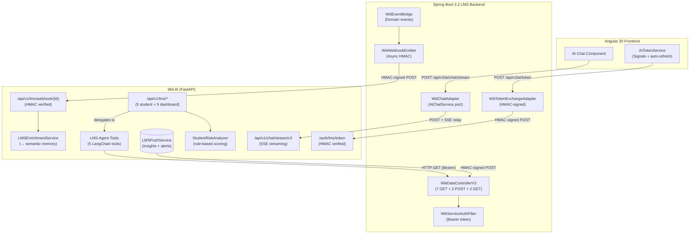
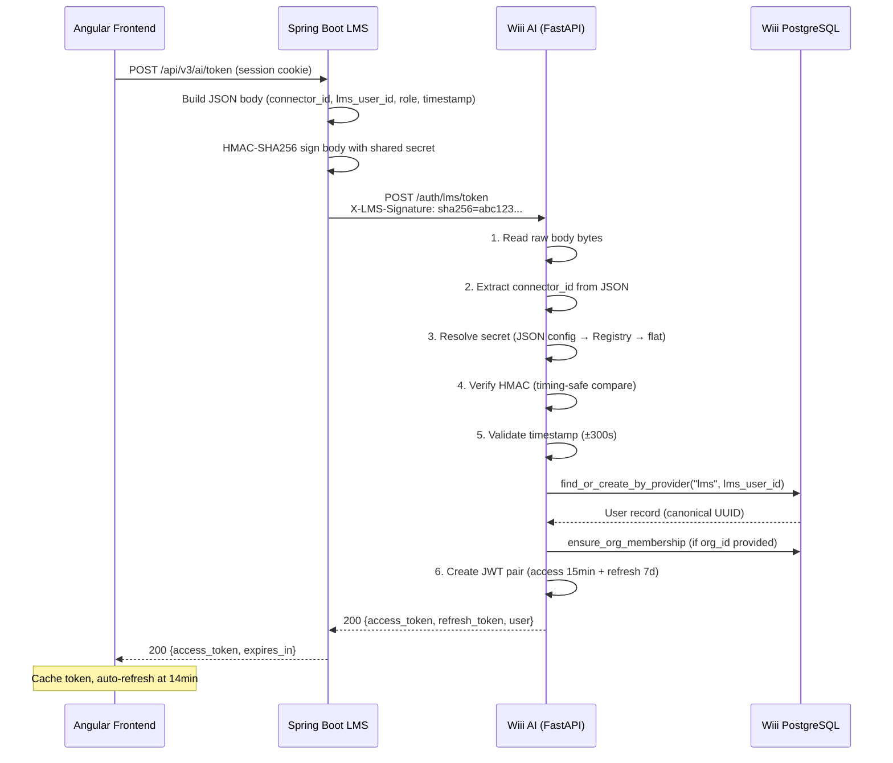

# Wiii AI x LMS Integration — API Contract & Architecture

> **Version:** 2.0.0
> **Last Updated:** 2026-02-23
> **Sprint:** 175 "Cắm Phích Cắm"
> **For:** Cả hai đội (Wiii AI Team + LMS Team)
> **Status:** Phase 1-4 Complete, Phase 5 (Production Hardening) Planned

---

## Mục lục

1. [Tổng quan kiến trúc](#1-tổng-quan-kiến-trúc)
2. [API Contract theo flow direction](#2-api-contract-theo-flow-direction)
   - 2.1 [Frontend → LMS Backend (proxy)](#21-frontend--lms-backend-proxy-endpoints)
   - 2.2 [LMS → Wiii Token Exchange](#22-lms--wiii-token-exchange)
   - 2.3 [LMS → Wiii Chat (SSE)](#23-lms--wiii-chat-sse-streaming)
   - 2.4 [LMS → Wiii Webhooks](#24-lms--wiii-webhooks)
   - 2.5 [Wiii → LMS Data Pull](#25-wiii--lms-data-pull-7-get-endpoints)
   - 2.6 [Wiii → LMS Push](#26-wiii--lms-push-2-post-endpoints)
   - 2.7 [Wiii Dashboard API](#27-wiii-dashboard-api-5-endpoints)
3. [Security Architecture](#3-security-architecture)
4. [Configuration Mapping](#4-configuration-mapping)
5. [Database Schema](#5-database-schema)
6. [AI Agent Tools](#6-ai-agent-tools)
7. [Error Codes](#7-error-codes)
8. [Known Gaps & Roadmap](#8-known-gaps--roadmap)

---

## 1. Tổng quan kiến trúc



### Data Flow Summary

| # | Direction | Protocol | Auth | Purpose |
|---|-----------|----------|------|---------|
| 1 | Frontend → LMS | REST | Session cookie | Chat proxy, token exchange |
| 2 | LMS → Wiii | REST + SSE | HMAC-SHA256 | Token exchange, chat relay |
| 3 | LMS → Wiii | REST | HMAC-SHA256 | Webhook events (5 types) |
| 4 | Wiii → LMS | REST | Bearer token | Data pull (7 GET endpoints) |
| 5 | Wiii → LMS | REST | Bearer + HMAC | Push insights & alerts |

---

## 2. API Contract theo flow direction

### 2.1 Frontend → LMS Backend (proxy endpoints)

These are LMS-side endpoints. The Angular frontend calls them, and LMS proxies to Wiii.

#### POST `/api/v3/ai/token` — Get Wiii JWT for frontend

**Controller**: `AiTokenControllerV3.java`

```http
POST /api/v3/ai/token HTTP/1.1
Content-Type: application/json
Cookie: JSESSIONID=...  (LMS session auth)
```

**Response (200)**:
```json
{
  "access_token": "eyJ...",
  "token_type": "bearer",
  "expires_in": 840
}
```

The LMS backend internally calls Wiii's `/auth/lms/token` with HMAC signing.

#### POST `/api/v3/ai/chat/stream` — Proxy SSE chat

**Controller**: `AiAssistantControllerV3.java`

```http
POST /api/v3/ai/chat/stream HTTP/1.1
Content-Type: application/json
Cookie: JSESSIONID=...

{
  "message": "Giải thích Rule 15 COLREG"
}
```

**Response**: SSE stream (proxied from Wiii `/api/v1/chat/stream/v3`).

---

### 2.2 LMS → Wiii Token Exchange

**Endpoint**: `POST /api/v1/auth/lms/token`
**Auth**: HMAC-SHA256 signed request body
**Rate Limit**: 10 requests/minute per IP
**Wiii File**: `app/auth/lms_auth_router.py`

#### Request

```http
POST /api/v1/auth/lms/token HTTP/1.1
Content-Type: application/json
X-LMS-Signature: sha256=a1b2c3d4e5f6...

{
  "connector_id": "maritime-lms",
  "lms_user_id": "SV12345",
  "email": "sv12345@vimaru.edu.vn",
  "name": "Nguyễn Văn A",
  "role": "student",
  "organization_id": "maritime-lms",
  "timestamp": 1708700000
}
```

| Field | Type | Required | Description |
|-------|------|----------|-------------|
| `connector_id` | string | **Yes** | LMS connector identifier (e.g. `"maritime-lms"`) |
| `lms_user_id` | string | **Yes** | Student/teacher ID in LMS system |
| `email` | string | No | User email (for identity federation) |
| `name` | string | No | Display name |
| `role` | string | No | LMS role: `student`, `instructor`, `admin`, etc. |
| `organization_id` | string | No | Wiii organization ID (auto-assigns org membership) |
| `timestamp` | integer | **Prod: Yes** | Unix epoch seconds (replay protection ±300s) |

#### Response (200)

```json
{
  "access_token": "eyJhbGciOiJIUzI1NiIs...",
  "refresh_token": "eyJhbGciOiJIUzI1NiIs...",
  "token_type": "bearer",
  "expires_in": 900,
  "user": {
    "id": "uuid-generated-by-wiii",
    "email": "sv12345@vimaru.edu.vn",
    "name": "Nguyễn Văn A",
    "role": "student"
  }
}
```

#### Role Mapping

| LMS Role | Wiii Role |
|----------|-----------|
| `student`, `learner` | `student` |
| `instructor`, `professor`, `lecturer`, `ta`, `teaching_assistant`, `teacher` | `teacher` |
| `admin`, `administrator`, `manager` | `admin` |
| *(unknown)* | `student` (default) |

#### Token Refresh

```http
POST /api/v1/auth/lms/token/refresh HTTP/1.1
Content-Type: application/json

{
  "refresh_token": "eyJhbGciOiJIUzI1NiIs..."
}
```

**Response**: Same format as token exchange (new access + refresh tokens).

#### Health Check

```http
GET /api/v1/auth/lms/health HTTP/1.1
```

**Response**:
```json
{
  "status": "ok",
  "enabled": true,
  "connectors": ["maritime-lms"],
  "has_flat_secret": true
}
```

---

### 2.3 LMS → Wiii Chat (SSE Streaming)

**Endpoint**: `POST /api/v1/chat/stream/v3`
**Auth**: `X-API-Key` header (or JWT `Authorization: Bearer`)
**Wiii File**: `app/api/v1/chat_v3.py`

#### Request

```http
POST /api/v1/chat/stream/v3 HTTP/1.1
Content-Type: application/json
X-API-Key: your-api-key
X-User-ID: uuid-from-token-exchange
X-Session-ID: session-abc
X-Role: student
X-Organization-ID: maritime-lms

{
  "message": "Giải thích Rule 15 COLREG về tình huống cắt hướng",
  "user_id": "uuid-from-token-exchange",
  "role": "student",
  "domain_id": "maritime",
  "organization_id": "maritime-lms"
}
```

#### SSE Events

| Event Type | Description | Data Schema |
|------------|-------------|-------------|
| `thinking_start` | AI begins reasoning | `{"node": "supervisor"}` |
| `status` | Pipeline progress | `{"content": "Tìm kiếm tài liệu...", "details": {...}}` |
| `thinking_delta` | Reasoning chunk | `{"content": "partial thinking text"}` |
| `thinking_end` | Reasoning complete | `{"node": "tutor"}` |
| `answer_delta` | Answer text chunk | `{"content": "partial answer"}` |
| `sources` | Citation sources | `{"sources": [{node_id, title, snippet, page}]}` |
| `tool_call` | Tool invocation | `{"tool": "tool_name", "args": {...}}` |
| `tool_result` | Tool result | `{"tool": "tool_name", "result": "..."}` |
| `metadata` | Response metadata | `{"session_id": "...", "agent_type": "tutor"}` |
| `done` | Stream complete | `{}` |

#### Minimal SSE Consumer (Java)

```java
// In WiiiChatAdapter.java — SSE relay to Angular
public Flux<ServerSentEvent<String>> streamChat(String message, WiiiToken token) {
    return webClient.post()
        .uri("/api/v1/chat/stream/v3")
        .header("Authorization", "Bearer " + token.getAccessToken())
        .header("X-User-ID", token.getUserId())
        .header("X-Role", token.getRole())
        .header("X-Organization-ID", "maritime-lms")
        .bodyValue(Map.of(
            "message", message,
            "domain_id", "maritime",
            "organization_id", "maritime-lms"
        ))
        .retrieve()
        .bodyToFlux(String.class)
        .map(data -> ServerSentEvent.builder(data).build());
}
```

---

### 2.4 LMS → Wiii Webhooks

**Endpoint**: `POST /api/v1/lms/webhook/{connector_id}`
**Auth**: HMAC-SHA256 via `X-LMS-Signature` header
**Wiii File**: `app/api/v1/lms_webhook.py`

#### Event Envelope

```json
{
  "event_type": "grade_saved",
  "timestamp": "2026-02-23T10:30:00Z",
  "payload": { ... },
  "source": "spring_boot_lms"
}
```

#### 5 Event Types

##### `grade_saved`
```json
{
  "event_type": "grade_saved",
  "timestamp": "2026-02-23T10:30:00Z",
  "payload": {
    "student_id": "SV12345",
    "course_id": "NHH101",
    "course_name": "Điều khiển tàu biển 1",
    "grade": 7.5,
    "max_grade": 10.0,
    "assignment_name": "Bài kiểm tra giữa kỳ"
  }
}
```

##### `course_enrolled`
```json
{
  "event_type": "course_enrolled",
  "payload": {
    "student_id": "SV12345",
    "course_id": "NHH101",
    "course_name": "Điều khiển tàu biển 1",
    "semester": "HK2-2025-2026"
  }
}
```

##### `quiz_completed`
```json
{
  "event_type": "quiz_completed",
  "payload": {
    "student_id": "SV12345",
    "quiz_id": "quiz-001",
    "quiz_name": "Trắc nghiệm COLREG Chapter 2",
    "course_id": "NHH101",
    "course_name": "Điều khiển tàu biển 1",
    "score": 8.0,
    "max_score": 10.0,
    "duration_minutes": 25
  }
}
```

##### `assignment_submitted`
```json
{
  "event_type": "assignment_submitted",
  "payload": {
    "student_id": "SV12345",
    "assignment_id": "asgn-001",
    "assignment_name": "Bài tập SOLAS Chapter III",
    "course_id": "NHH101",
    "course_name": "Điều khiển tàu biển 1",
    "submitted_at": "2026-02-23T14:30:00Z"
  }
}
```

##### `attendance_marked`
```json
{
  "event_type": "attendance_marked",
  "payload": {
    "student_id": "SV12345",
    "course_id": "NHH101",
    "course_name": "Điều khiển tàu biển 1",
    "date": "2026-02-23",
    "status": "present"
  }
}
```

**Status values**: `"present"` | `"absent"` | `"late"`

#### Webhook Response

```json
{
  "status": "accepted",
  "event_type": "grade_saved",
  "facts_created": 2,
  "message": "Enrichment complete"
}
```

#### HMAC Signing (Java sender)

```java
// WiiiWebhookEmitter.java
private String sign(String payload) {
    Mac mac = Mac.getInstance("HmacSHA256");
    mac.init(new SecretKeySpec(
        webhookSecret.getBytes(StandardCharsets.UTF_8), "HmacSHA256"
    ));
    byte[] hash = mac.doFinal(payload.getBytes(StandardCharsets.UTF_8));
    return "sha256=" + HexFormat.of().formatHex(hash);
}

// Send webhook
HttpHeaders headers = new HttpHeaders();
headers.set("X-LMS-Signature", sign(jsonPayload));
headers.setContentType(MediaType.APPLICATION_JSON);
restTemplate.postForEntity(
    wiiiBaseUrl + "/api/v1/lms/webhook/" + connectorId,
    new HttpEntity<>(jsonPayload, headers),
    Map.class
);
```

---

### 2.5 Wiii → LMS Data Pull (7 GET endpoints)

**Base Path**: `{lms_base_url}/api/v3/integration`
**Auth**: `Authorization: Bearer {service_token}`
**LMS File**: `WiiiDataControllerV3.java`
**Wiii Consumer**: `SpringBootLMSAdapter` (`app/integrations/lms/connectors/spring_boot.py`)

| # | Method | Path | Description | Response |
|---|--------|------|-------------|----------|
| 1 | GET | `/students/{id}/profile` | Student profile | `LMSStudentProfile` |
| 2 | GET | `/students/{id}/grades` | All grades | `LMSGrade[]` |
| 3 | GET | `/students/{id}/assignments/upcoming` | Upcoming assignments | `LMSUpcomingAssignment[]` |
| 4 | GET | `/students/{id}/enrollments` | Course enrollments | `dict[]` |
| 5 | GET | `/students/{id}/quiz-history` | Quiz attempts | `dict[]` |
| 6 | GET | `/courses/{id}/students` | Course student roster | `dict[]` |
| 7 | GET | `/courses/{id}/stats` | Course statistics | `dict` |

#### Response Schemas

**LMSStudentProfile**:
```json
{
  "id": "SV12345",
  "name": "Nguyễn Văn A",
  "email": "sv12345@vimaru.edu.vn",
  "class_name": "ĐKTB K62A",
  "program": "Điều khiển tàu biển",
  "enrolled_courses": ["NHH101", "NHH201"]
}
```

**LMSGrade**:
```json
{
  "course_id": "NHH101",
  "course_name": "Điều khiển tàu biển 1",
  "grade": 7.5,
  "max_grade": 10.0,
  "date": "2026-02-20"
}
```

**LMSUpcomingAssignment**:
```json
{
  "assignment_id": "asgn-001",
  "assignment_name": "Bài tập SOLAS Chapter III",
  "course_id": "NHH101",
  "course_name": "Điều khiển tàu biển 1",
  "due_date": "2026-03-01T23:59:00Z"
}
```

**Course Stats**:
```json
{
  "students_count": 45,
  "avg_grade": 6.8,
  "completion_rate": 72,
  "active_last_7d": 38,
  "at_risk_count": 5
}
```

#### Circuit Breaker

Wiii uses per-platform circuit breaker on all LMS API calls:
- **Threshold**: 5 consecutive failures
- **Recovery**: 120 seconds
- **Timeout**: Configurable via `lms_api_timeout` (default 10s, range 3-60s)

---

### 2.6 Wiii → LMS Push (2 POST endpoints)

**Wiii Sender**: `LMSPushService` (`app/integrations/lms/push_service.py`)
**LMS Receiver**: `WiiiDataControllerV3.java`
**Auth**: Bearer token + HMAC signature (`X-Wiii-Signature`)

#### POST `/api/v3/integration/insights` — Push student insight

```json
{
  "student_id": "SV12345",
  "insight_type": "recommendation",
  "content": "Sinh viên cần ôn tập thêm về COLREG Rule 13-17. Điểm kiểm tra gần đây thấp ở phần crossing situations.",
  "source": "wiii_ai",
  "timestamp": "2026-02-23T10:30:00Z",
  "metadata": {
    "confidence": 0.85,
    "topics": ["colreg", "crossing_situations"]
  }
}
```

**Insight types**: `"recommendation"` | `"alert"` | `"summary"`

#### POST `/api/v3/integration/alerts` — Push class alert

```json
{
  "course_id": "NHH101",
  "alert_type": "at_risk_student",
  "content": "3 sinh viên có nguy cơ cao trong lớp NHH101: điểm dưới TB, xu hướng giảm.",
  "student_ids": ["SV12345", "SV12346", "SV12347"],
  "source": "wiii_ai",
  "timestamp": "2026-02-23T10:30:00Z"
}
```

**Alert types**: `"at_risk_student"` | `"low_engagement"` | `"content_gap"`

#### LMS Database Tables (V45 Migration)

```sql
-- ai_insights
CREATE TABLE ai_insights (
    id          BIGSERIAL PRIMARY KEY,
    student_id  VARCHAR(255) NOT NULL,
    insight_type VARCHAR(50) NOT NULL,
    content     TEXT NOT NULL,
    source      VARCHAR(50) DEFAULT 'wiii_ai',
    metadata    JSONB DEFAULT '{}',
    created_at  TIMESTAMP DEFAULT NOW()
);

-- ai_alerts
CREATE TABLE ai_alerts (
    id          BIGSERIAL PRIMARY KEY,
    course_id   VARCHAR(255) NOT NULL,
    alert_type  VARCHAR(50) NOT NULL,
    content     TEXT NOT NULL,
    student_ids TEXT[] DEFAULT '{}',
    source      VARCHAR(50) DEFAULT 'wiii_ai',
    created_at  TIMESTAMP DEFAULT NOW()
);
```

---

### 2.7 Wiii Dashboard API (5 endpoints)

**Base Path**: `/api/v1/lms/dashboard`
**Auth**: `X-API-Key` + `X-Role: teacher|admin`
**Wiii File**: `app/api/v1/lms_dashboard.py`

| # | Method | Path | Rate Limit | Access | Description |
|---|--------|------|------------|--------|-------------|
| 1 | GET | `/courses/{id}/overview` | 20/min | teacher, admin | Student count, avg grade, completion |
| 2 | GET | `/courses/{id}/at-risk` | 10/min | teacher, admin | At-risk student list with risk scores |
| 3 | GET | `/courses/{id}/grade-distribution` | 20/min | teacher, admin | A/B/C/D/F distribution |
| 4 | POST | `/courses/{id}/ai-report` | 5/min | teacher, admin | AI-generated weekly class report (Vietnamese) |
| 5 | GET | `/org/overview` | 10/min | admin only | Organization-level overview |

#### Common Headers

```http
X-API-Key: your-api-key
X-User-ID: teacher-001
X-Role: teacher
X-LMS-Connector: maritime-lms  (optional, default: maritime-lms)
```

#### Response: Course Overview

```json
{
  "course_id": "NHH101",
  "students_count": 45,
  "avg_grade": 6.8,
  "completion_rate": 72,
  "active_last_7d": 38,
  "at_risk_count": 5
}
```

#### Response: At-Risk Students

```json
{
  "course_id": "NHH101",
  "at_risk": [
    {
      "student_id": "SV12345",
      "name": "Nguyễn Văn A",
      "risk_score": 0.82,
      "risk_level": "critical",
      "reasons": ["Điểm rất thấp (35%)", "Xu hướng giảm điểm"]
    }
  ],
  "count": 5
}
```

#### Response: Grade Distribution

```json
{
  "course_id": "NHH101",
  "distribution": {"A": 8, "B": 15, "C": 12, "D": 7, "F": 3},
  "avg": 68.5,
  "count": 45
}
```

#### Response: AI Report

```json
{
  "course_id": "NHH101",
  "report": "## Báo cáo tuần — Lớp NHH101\n\n### Tổng quan\n...",
  "stats": { "students_count": 45, "avg_grade": 6.8, ... },
  "at_risk_count": 5
}
```

#### Response: Org Overview (Admin)

```json
{
  "connector_id": "maritime-lms",
  "display_name": "Maritime University LMS",
  "backend_type": "spring_boot",
  "enabled": true,
  "base_url_configured": true
}
```

---

## 3. Security Architecture

### 3.1 HMAC-SHA256 Signing

All inter-service communication uses HMAC-SHA256 for request integrity.

#### Signing Algorithm

```
signature = "sha256=" + HMAC-SHA256(secret, request_body_bytes)
```

#### Python (Wiii — verification)

```python
import hashlib
import hmac

def verify_hmac_sha256(payload_bytes: bytes, signature: str, secret: str) -> bool:
    expected = hmac.new(
        secret.encode("utf-8"),
        payload_bytes,
        hashlib.sha256,
    ).hexdigest()
    expected_sig = f"sha256={expected}"
    return hmac.compare_digest(expected_sig, signature)  # timing-safe
```

#### Java (LMS — signing)

```java
import javax.crypto.Mac;
import javax.crypto.spec.SecretKeySpec;
import java.nio.charset.StandardCharsets;
import java.util.HexFormat;

public String sign(String payload, String secret) {
    Mac mac = Mac.getInstance("HmacSHA256");
    mac.init(new SecretKeySpec(
        secret.getBytes(StandardCharsets.UTF_8), "HmacSHA256"
    ));
    byte[] hash = mac.doFinal(payload.getBytes(StandardCharsets.UTF_8));
    return "sha256=" + HexFormat.of().formatHex(hash);
}
```

### 3.2 Token Exchange Sequence



### 3.3 Service-to-Service Auth (Bearer Token)

Wiii → LMS data pull uses a shared service token:

```
Authorization: Bearer {LMS_SERVICE_TOKEN}
```

LMS verifies via `WiiiServiceAuthFilter.java` (non-Spring Security, simple filter).

### 3.4 Replay Protection

| Setting | Default | Range | Description |
|---------|---------|-------|-------------|
| `lms_token_exchange_max_age` | 300 | 30-600 | Max timestamp drift in seconds |

- **Development**: `timestamp` field is optional (warning logged)
- **Production**: `timestamp` field is **required** (400 error if missing)
- Both future and past timestamps are rejected if drift > max_age

### 3.5 Rate Limits

| Endpoint | Limit | Source |
|----------|-------|--------|
| `POST /auth/lms/token` | 10/minute/IP | `lms_auth_router.py` |
| `POST /auth/lms/token/refresh` | 30/minute/IP | `lms_auth_router.py` |
| `GET /lms/students/*/profile` | 30/minute/IP | `lms_data.py` |
| `GET /lms/students/*/grades` | 30/minute/IP | `lms_data.py` |
| `GET /lms/students/*/enrollments` | 30/minute/IP | `lms_data.py` |
| `GET /lms/students/*/assignments` | 30/minute/IP | `lms_data.py` |
| `GET /lms/students/*/quiz-history` | 30/minute/IP | `lms_data.py` |
| `GET /dashboard/courses/*/overview` | 20/minute/IP | `lms_dashboard.py` |
| `GET /dashboard/courses/*/at-risk` | 10/minute/IP | `lms_dashboard.py` |
| `POST /dashboard/courses/*/ai-report` | 5/minute/IP | `lms_dashboard.py` |

### 3.6 RBAC Summary

| Role | Student data (own) | Student data (others) | Course dashboard | AI report | Org overview |
|------|-------------------|-----------------------|------------------|-----------|--------------|
| `student` | Read | Denied (403) | Denied | Denied | Denied |
| `teacher` | Read | Read (own courses) | Read | Generate | Denied |
| `admin` | Read | Read (any) | Read | Generate | Read |

---

## 4. Configuration Mapping

### 4.1 Wiii `.env` ↔ LMS `application.yml`

| Purpose | Wiii `.env` | LMS `application.yml` |
|---------|-------------|----------------------|
| Feature flag | `ENABLE_LMS_INTEGRATION=true` | — (always enabled on LMS side) |
| Token exchange | `ENABLE_LMS_TOKEN_EXCHANGE=true` | — |
| Multi-tenant | `ENABLE_MULTI_TENANT=true` | — |
| HMAC secret (webhooks) | `LMS_WEBHOOK_SECRET=xxx` | `wiii.webhook.secret=xxx` |
| Service token | — (validates incoming Bearer) | `wiii.service-token=xxx` |
| LMS base URL | `LMS_BASE_URL=http://lms:8080/api/v3` | — |
| Wiii base URL | — | `wiii.base-url=http://wiii:8000/api/v1` |
| API key | `API_KEY=xxx` | — (uses token exchange instead) |
| CORS origins | `CORS_ORIGINS=["https://lms.vimaru.edu.vn"]` | — |
| Timestamp tolerance | `LMS_TOKEN_EXCHANGE_MAX_AGE=300` | — |
| Connector JSON | `LMS_CONNECTORS=[{...}]` | — |

### 4.2 Shared Secrets Table

| Secret | Generated By | Stored At (Wiii) | Stored At (LMS) |
|--------|-------------|------------------|------------------|
| HMAC Webhook Secret | Either team | `LMS_WEBHOOK_SECRET` | `wiii.webhook.secret` |
| Service Token | LMS team | Validated by Wiii API key | `wiii.service-token` |
| JWT Secret | Wiii team | `JWT_SECRET_KEY` | Not shared |

**Generate secrets**:
```bash
openssl rand -hex 32
```

### 4.3 LMS Connectors JSON (`LMS_CONNECTORS`)

```json
[
  {
    "id": "maritime-lms",
    "display_name": "LMS Hang Hai",
    "backend_type": "spring_boot",
    "base_url": "http://localhost:8080/api/v3",
    "service_token": "your-service-token",
    "webhook_secret": "your-hmac-secret",
    "api_timeout": 10,
    "extra": {
      "api_prefix": "api/v3/integration"
    }
  }
]
```

### 4.4 Angular `environment.ts`

```typescript
export const environment = {
  production: false,
  aiServiceUrl: 'http://localhost:8088/api/v3/ai',  // proxied through LMS
  // Direct Wiii connection (future):
  // wiiiDirectUrl: 'http://localhost:8000/api/v1',
};
```

---

## 5. Database Schema

### 5.1 Wiii Side — Migration 021

Seeds the `maritime-lms` organization record:

```sql
INSERT INTO organizations (id, name, display_name, description, allowed_domains, default_domain, settings)
VALUES (
  'maritime-lms',
  'LMS Hang Hai',
  'Trường Đại học Hàng Hải',
  'Hệ thống quản lý học tập Hàng Hải — tích hợp Wiii AI',
  ARRAY['maritime'],
  'maritime',
  '{
    "branding": {"name": "Wiii Hàng Hải", "welcome_message": "..."},
    "features": {"enable_product_search": false, "enable_browser_scraping": false},
    "ai_config": {"persona_prompt_overlay": "Bạn đang hỗ trợ sinh viên Trường Đại học Hàng Hải..."}
  }'
)
ON CONFLICT (id) DO UPDATE SET display_name = EXCLUDED.display_name, ...;
```

### 5.2 LMS Side — V45 Migration

```sql
-- ai_insights: stores AI-generated student insights from Wiii
CREATE TABLE ai_insights (
    id          BIGSERIAL PRIMARY KEY,
    student_id  VARCHAR(255) NOT NULL,
    insight_type VARCHAR(50) NOT NULL,  -- recommendation, alert, summary
    content     TEXT NOT NULL,
    source      VARCHAR(50) DEFAULT 'wiii_ai',
    metadata    JSONB DEFAULT '{}',
    created_at  TIMESTAMP DEFAULT NOW()
);
CREATE INDEX idx_ai_insights_student ON ai_insights(student_id);
CREATE INDEX idx_ai_insights_type ON ai_insights(insight_type);

-- ai_alerts: stores AI-generated class alerts from Wiii
CREATE TABLE ai_alerts (
    id          BIGSERIAL PRIMARY KEY,
    course_id   VARCHAR(255) NOT NULL,
    alert_type  VARCHAR(50) NOT NULL,  -- at_risk_student, low_engagement, content_gap
    content     TEXT NOT NULL,
    student_ids TEXT[] DEFAULT '{}',
    source      VARCHAR(50) DEFAULT 'wiii_ai',
    created_at  TIMESTAMP DEFAULT NOW()
);
CREATE INDEX idx_ai_alerts_course ON ai_alerts(course_id);
CREATE INDEX idx_ai_alerts_type ON ai_alerts(alert_type);
```

---

## 6. AI Agent Tools

5 LangChain tools bound to Direct Response and Tutor agents when `enable_lms_integration=True`.

**File**: `app/engine/tools/lms_tools.py`

| # | Tool Name | Access | Description |
|---|-----------|--------|-------------|
| 1 | `tool_check_student_grades` | all roles | Check student grades from LMS |
| 2 | `tool_list_upcoming_assignments` | all roles | List upcoming deadlines |
| 3 | `tool_check_course_progress` | all roles | Grades + assignments + quizzes for one course |
| 4 | `tool_get_class_overview` | teacher, admin | Course statistics summary |
| 5 | `tool_find_at_risk_students` | teacher, admin | Identify at-risk students (rule-based scoring) |

### Risk Scoring Algorithm

`StudentRiskAnalyzer` uses rule-based scoring (no LLM cost):

| Factor | Weight | Score Range |
|--------|--------|-------------|
| Grade performance | equal | 0.0 (≥70%) → 1.0 (<40%) |
| Grade trend | equal | 0.0 (stable) → 0.8 (declining >15%) |
| Assignment completion | equal | 0.0 → 0.5 (>5 overdue) |
| Quiz performance | equal | 0.0 (≥55%) → 0.9 (<40%) |

**Risk levels**: `critical` (≥0.75) → `high` (≥0.50) → `medium` (≥0.30) → `low` (<0.30)

---

## 7. Error Codes

| HTTP | Error | Cause | Action |
|------|-------|-------|--------|
| 400 | `Invalid JSON body` | Malformed request | Fix request JSON |
| 400 | `connector_id is required` | Missing field | Add connector_id to body |
| 400 | `timestamp is required in production` | No timestamp in prod | Add Unix timestamp to body |
| 400 | `Request timestamp too far from server time` | Clock skew >300s | Sync server clocks (NTP) |
| 401 | `Invalid HMAC signature` | Wrong secret or tampered body | Verify shared secret matches |
| 401 | `Missing signature` | No X-LMS-Signature header | Add HMAC signature header |
| 401 | `Invalid or expired refresh token` | Expired JWT | Re-authenticate via token exchange |
| 403 | `Bạn chỉ có thể xem dữ liệu của chính mình` | Student accessing other's data | Use own student_id |
| 403 | `Chỉ giảng viên và quản trị viên` | Student accessing dashboard | Requires teacher/admin role |
| 404 | `LMS integration disabled` | Feature flag off | Set `ENABLE_LMS_INTEGRATION=true` |
| 404 | `LMS connector not found` | Wrong connector_id | Check configured connectors |
| 404 | `Student profile not found` | Invalid student_id | Verify student exists in LMS |
| 429 | Rate limited | Too many requests | Respect rate limits (see §3.5) |
| 500 | `Token exchange failed` | Internal error | Check Wiii logs, retry |

---

## 8. Known Gaps & Roadmap

### Current Gaps

| # | Gap | Priority | Target |
|---|-----|----------|--------|
| 1 | LMS JUnit tests for integration layer | Medium | LMS team |
| 2 | End-to-end integration test (both systems) | High | Both teams |
| 3 | LMS domain event wiring (`StudentEnrolledEvent`, `AssignmentSubmittedEvent`) | Medium | LMS team |
| 4 | Angular SSE direct connection (bypass proxy) | Low | Future sprint |
| 5 | CORS production domain configuration | High | DevOps |

### Phase 5: Production Hardening (Planned)

| Item | Description | Owner |
|------|-------------|-------|
| HMAC key rotation | Rolling secret update without downtime | Both teams |
| Student data pseudonymization | De-identify before AI processing | Wiii team |
| Mutual TLS | Certificate-based service auth | DevOps |
| Webhook retry queue | Dead-letter queue for failed webhooks | LMS team |
| Audit logging | All cross-system API calls logged | Both teams |
| xAPI integration | Experience API for learning analytics | Both teams |

---

*Document generated by Wiii AI LEADER Agent — Sprint 175*
*For questions: contact the respective team leads*
